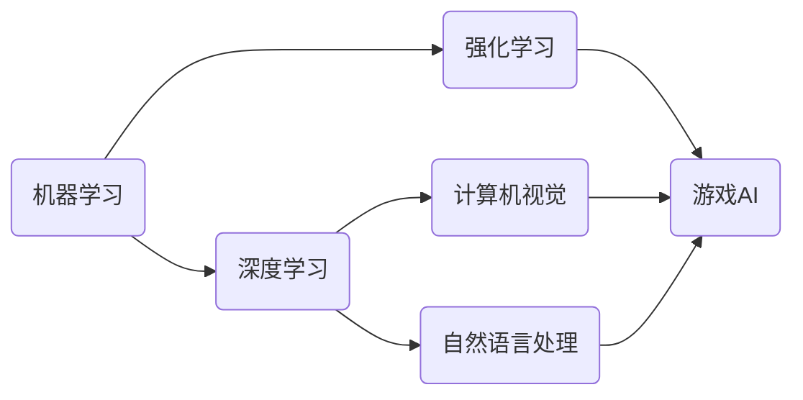

# 一切皆是映射：AI在游戏开发中的应用

## 1. 背景介绍
随着人工智能技术的飞速发展，AI已经成为游戏开发中不可或缺的一部分。从基础的NPC行为编程到复杂的游戏环境生成，AI技术的应用范围日益广泛。在这个过程中，我们将看到数据、算法和用户体验之间的映射关系如何塑造现代游戏开发的面貌。

## 2. 核心概念与联系
在游戏开发中，AI的核心概念包括但不限于：机器学习、深度学习、自然语言处理、计算机视觉和强化学习。这些技术之间的联系在于它们共同构建了一个能够理解、学习和适应玩家行为的智能系统。



## 3. 核心算法原理具体操作步骤
以强化学习为例，其核心算法原理包括代理(agent)、环境(environment)、状态(state)、动作(action)和奖励(reward)。操作步骤通常包括：

1. 初始化环境和代理状态。
2. 代理根据当前状态选择动作。
3. 环境根据动作给出下一个状态和奖励。
4. 代理更新其策略以最大化长期奖励。
5. 重复步骤2-4直至满足结束条件。

## 4. 数学模型和公式详细讲解举例说明
以Q学习(Q-Learning)为例，其核心公式为：

$$ Q(s, a) = Q(s, a) + \alpha [r + \gamma \max_{a'} Q(s', a') - Q(s, a)] $$

其中，$s$ 和 $s'$ 分别代表当前状态和下一个状态，$a$ 是当前动作，$r$ 是即时奖励，$\alpha$ 是学习率，$\gamma$ 是折扣因子。

## 5. 项目实践：代码实例和详细解释说明
以Python编写的简单Q学习算法实例：

```python
import numpy as np

# 初始化Q表
Q = np.zeros((状态数量, 动作数量))

# Q学习过程
for episode in range(总回合数):
    state = 初始化状态()
    done = False
    
    while not done:
        action = 选择动作(state, Q)
        next_state, reward, done = 环境反馈(action)
        old_value = Q[state, action]
        next_max = np.max(Q[next_state])
        
        # 更新Q值
        Q[state, action] = old_value + 学习率 * (reward + 折扣因子 * next_max - old_value)
        state = next_state
```

## 6. 实际应用场景
AI在游戏开发中的应用场景包括：

- 动态游戏内容生成
- 玩家行为分析
- 游戏测试和质量保证
- NPC行为编程
- 游戏平衡调整

## 7. 工具和资源推荐
- TensorFlow和PyTorch：深度学习框架
- OpenAI Gym：强化学习环境
- Unity ML-Agents：游戏开发和AI研究平台

## 8. 总结：未来发展趋势与挑战
AI在游戏开发中的未来趋势包括更加智能的NPC、更丰富的游戏体验和更高效的开发流程。挑战则在于如何平衡AI的复杂性和游戏的可玩性，以及如何处理大量数据和隐私问题。

## 9. 附录：常见问题与解答
- Q: AI如何影响游戏设计？
- A: AI可以帮助设计更复杂的游戏机制和更真实的游戏世界。

- Q: 强化学习在游戏中的应用有哪些？
- A: 强化学习可以用于NPC的决策制定、游戏测试和游戏内容生成等。

作者：禅与计算机程序设计艺术 / Zen and the Art of Computer Programming