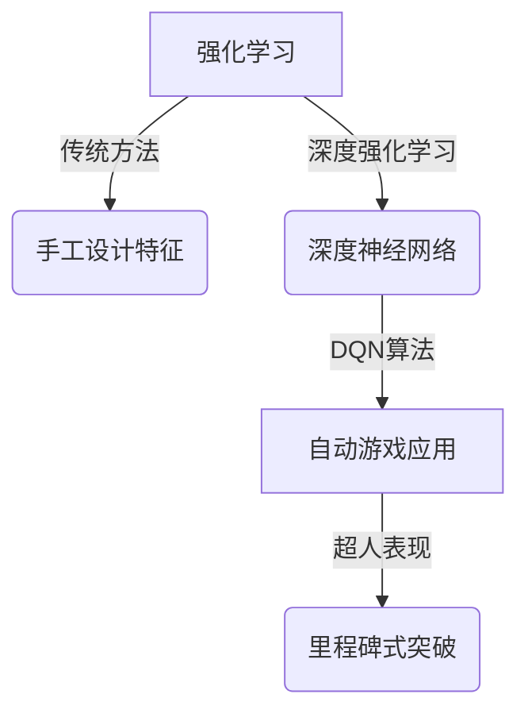
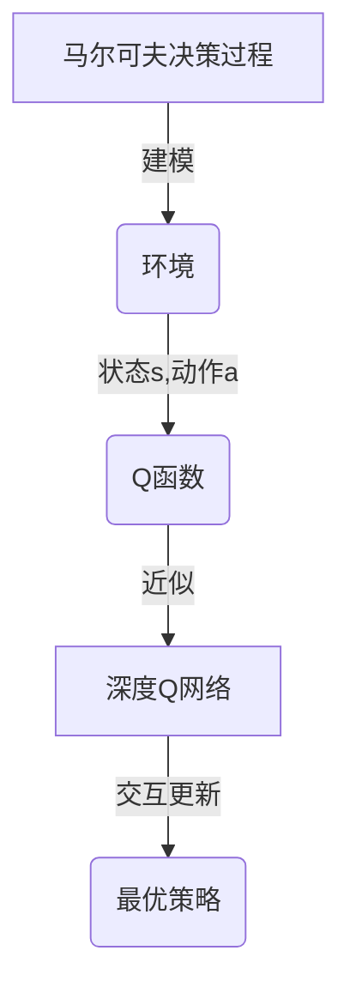
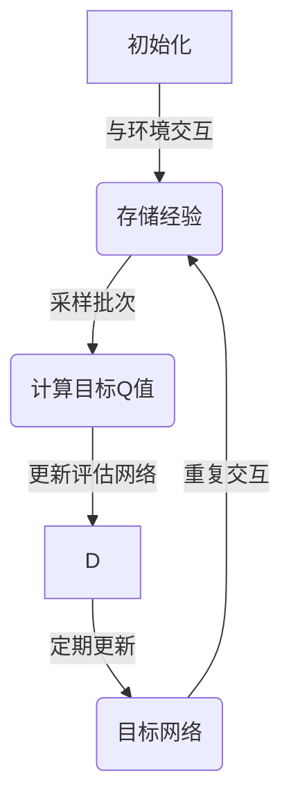

# 一切皆是映射：DQN在自动游戏中的应用：挑战与解决方案

## 1.背景介绍

### 1.1 强化学习与自动游戏

强化学习是机器学习的一个重要分支,它旨在让智能体(agent)通过与环境的交互来学习如何采取最优策略,以期获得最大的累积奖励。在过去几年中,强化学习取得了令人瞩目的进展,尤其是在自动游戏领域的应用。自动游戏为强化学习提供了一个理想的试验场,因为游戏具有明确的规则、奖惩机制和目标。

### 1.2 深度强化学习的兴起

传统的强化学习算法依赖于手工设计的特征,这使得它们难以应用于高维观测空间和连续动作空间。而深度神经网络的出现为强化学习带来了新的契机,使得智能体能够直接从原始输入(如图像和声音)中学习有用的特征表示,从而大大扩展了强化学习的应用范围。这种结合深度学习和强化学习的方法被称为深度强化学习(Deep Reinforcement Learning, DRL)。

### 1.3 DQN算法的重要性

在深度强化学习领域,深度Q网络(Deep Q-Network, DQN)算法是一个里程碑式的突破。DQN算法成功地将深度神经网络应用于强化学习,并在多个经典的Atari视频游戏中展现出超人的表现。DQN算法的出现不仅推动了深度强化学习的发展,也激发了研究人员对于在更加复杂的环境中应用强化学习的兴趣。



## 2.核心概念与联系

### 2.1 马尔可夫决策过程

在强化学习中,环境通常被建模为一个马尔可夫决策过程(Markov Decision Process, MDP)。MDP由以下几个要素组成:

- 状态空间 $\mathcal{S}$: 环境所有可能状态的集合
- 动作空间 $\mathcal{A}$: 智能体可以采取的所有可能动作的集合
- 转移概率 $\mathcal{P}_{ss'}^a = \mathbb{P}(s'|s,a)$: 在状态 $s$ 下采取动作 $a$ 后,转移到状态 $s'$ 的概率
- 奖励函数 $\mathcal{R}_s^a$: 在状态 $s$ 下采取动作 $a$ 后获得的即时奖励

智能体的目标是学习一个策略 $\pi: \mathcal{S} \rightarrow \mathcal{A}$,使得在该策略下的期望累积奖励最大化。

### 2.2 Q-Learning与Q函数

Q-Learning是一种基于价值函数的强化学习算法,它通过估计Q函数来学习最优策略。Q函数 $Q^{\pi}(s,a)$ 表示在状态 $s$ 下采取动作 $a$,然后按照策略 $\pi$ 继续执行所能获得的期望累积奖励。最优Q函数 $Q^*(s,a)$ 对应于最优策略 $\pi^*$,它满足下式:

$$Q^*(s,a) = \mathbb{E}_{s' \sim \mathcal{P}_{ss'}^a}\left[R_s^a + \gamma \max_{a'} Q^*(s',a')\right]$$

其中 $\gamma \in [0,1)$ 是折现因子,用于权衡即时奖励和未来奖励的重要性。

### 2.3 深度Q网络

深度Q网络(DQN)是将Q-Learning与深度神经网络相结合的算法。DQN使用一个神经网络 $Q(s,a;\theta)$ 来近似最优Q函数 $Q^*(s,a)$,其中 $\theta$ 是网络参数。网络的输入是当前状态 $s$,输出是所有可能动作的Q值 $Q(s,a;\theta)$。通过与环境交互并不断更新网络参数 $\theta$,DQN算法可以逐步学习最优Q函数,从而获得最优策略。



## 3.核心算法原理具体操作步骤

DQN算法的核心思想是使用经验回放(Experience Replay)和目标网络(Target Network)来稳定训练过程,从而实现有效的Q函数近似。算法的具体步骤如下:

1. **初始化**:
   - 初始化评估网络 $Q(s,a;\theta)$ 和目标网络 $Q'(s,a;\theta')$,两个网络的参数初始相同
   - 初始化经验回放池 $\mathcal{D}$ 为空

2. **与环境交互并存储经验**:
   - 从环境初始状态 $s_0$ 开始
   - 对于每个时间步 $t$:
     - 根据当前状态 $s_t$,使用 $\epsilon$-贪婪策略从评估网络 $Q(s_t,a;\theta)$ 中选择动作 $a_t$
     - 执行动作 $a_t$,观测到下一个状态 $s_{t+1}$ 和即时奖励 $r_t$
     - 将经验 $(s_t,a_t,r_t,s_{t+1})$ 存储到经验回放池 $\mathcal{D}$ 中

3. **从经验回放池中采样并更新网络**:
   - 从经验回放池 $\mathcal{D}$ 中随机采样一个批次的经验 $(s_j,a_j,r_j,s_{j+1})$
   - 计算目标Q值 $y_j = r_j + \gamma \max_{a'} Q'(s_{j+1},a';\theta')$
   - 更新评估网络参数 $\theta$ 以最小化损失函数 $\mathcal{L}(\theta) = \mathbb{E}_{(s_j,a_j) \sim \rho(\cdot)}\left[(y_j - Q(s_j,a_j;\theta))^2\right]$,其中 $\rho(\cdot)$ 是经验回放池中的状态-动作分布

4. **更新目标网络**:
   - 每隔一定步数,将评估网络的参数 $\theta$ 复制到目标网络 $\theta' \leftarrow \theta$

5. **重复步骤2-4**,直到收敛或达到最大训练步数

经验回放的作用是打破经验之间的相关性,从而提高数据的利用效率和算法的稳定性。目标网络的作用是提供一个稳定的目标Q值,避免由于评估网络的不断更新而导致的不稳定性。



## 4.数学模型和公式详细讲解举例说明

### 4.1 Q-Learning更新规则

在Q-Learning算法中,Q函数的更新规则如下:

$$Q(s_t,a_t) \leftarrow Q(s_t,a_t) + \alpha \left[r_t + \gamma \max_{a} Q(s_{t+1},a) - Q(s_t,a_t)\right]$$

其中:

- $\alpha$ 是学习率,控制了每次更新的步长
- $r_t$ 是在状态 $s_t$ 下采取动作 $a_t$ 后获得的即时奖励
- $\gamma$ 是折现因子,用于权衡即时奖励和未来奖励的重要性
- $\max_{a} Q(s_{t+1},a)$ 是在下一个状态 $s_{t+1}$ 下,所有可能动作的最大Q值,代表了最优的期望累积奖励

这个更新规则的目标是使Q函数逼近最优Q函数 $Q^*(s,a)$,从而获得最优策略。

### 4.2 DQN损失函数

在DQN算法中,我们使用一个神经网络 $Q(s,a;\theta)$ 来近似最优Q函数 $Q^*(s,a)$,其中 $\theta$ 是网络参数。为了训练这个网络,我们需要定义一个损失函数,使得网络输出的Q值尽可能接近目标Q值。

DQN的损失函数定义如下:

$$\mathcal{L}(\theta) = \mathbb{E}_{(s_j,a_j,r_j,s_{j+1}) \sim \mathcal{D}}\left[(y_j - Q(s_j,a_j;\theta))^2\right]$$

其中:

- $\mathcal{D}$ 是经验回放池,$(s_j,a_j,r_j,s_{j+1})$ 是从中采样的一个经验
- $y_j = r_j + \gamma \max_{a'} Q'(s_{j+1},a';\theta')$ 是目标Q值,使用了目标网络 $Q'$ 进行计算
- $Q(s_j,a_j;\theta)$ 是评估网络在状态 $s_j$ 下对动作 $a_j$ 的Q值预测

通过最小化这个损失函数,我们可以使评估网络的输出Q值逼近目标Q值,从而逼近最优Q函数。

### 4.3 $\epsilon$-贪婪策略

在训练过程中,DQN算法需要在探索(exploration)和利用(exploitation)之间达成平衡。$\epsilon$-贪婪策略就是一种常用的探索-利用权衡方法。

具体而言,在每个时间步 $t$,智能体根据当前状态 $s_t$ 选择动作 $a_t$ 的方式如下:

- 以概率 $\epsilon$ 选择一个随机动作(探索)
- 以概率 $1-\epsilon$ 选择评估网络 $Q(s_t,a;\theta)$ 输出的最大Q值对应的动作(利用)

$\epsilon$ 是一个超参数,通常会在训练过程中逐渐减小,以实现从探索到利用的平滑过渡。

例如,在训练初期,我们可以设置 $\epsilon=1.0$,完全随机探索;在训练后期,我们可以设置 $\epsilon=0.1$,更多地利用已学习的Q函数。

### 4.4 折现因子 $\gamma$

折现因子 $\gamma \in [0,1)$ 是一个重要的超参数,它控制了即时奖励和未来奖励在Q函数中的权重。具体而言,在Q函数的更新规则中:

$$Q(s_t,a_t) \leftarrow Q(s_t,a_t) + \alpha \left[r_t + \gamma \max_{a} Q(s_{t+1},a) - Q(s_t,a_t)\right]$$

- 当 $\gamma=0$ 时,智能体只关注即时奖励,忽略未来奖励
- 当 $\gamma \approx 1$ 时,智能体更加重视未来的累积奖励

通常情况下,我们会选择一个接近于1但小于1的 $\gamma$ 值,例如 $\gamma=0.99$。这样可以确保智能体在追求长期目标的同时,也不会完全忽略当前的即时奖励。

## 5.项目实践：代码实例和详细解释说明

为了更好地理解DQN算法,我们将通过一个简单的示例来实现它。在这个示例中,我们将训练一个智能体在经典游戏"CartPole"中学会平衡杆。

"CartPole"是一个非常简单但具有挑战性的环境。它包含一个小车和一根杆,小车可以在一条无限长的轨道上左右移动,而杆则可以在小车上自由摆动。智能体的目标是通过向左或向右施加力,使杆保持在垂直状态尽可能长的时间。

### 5.1 导入必要的库

```python
import gym
import math
import random
import numpy as np
import matplotlib.pyplot as plt
from collections import namedtuple, deque

import torch
import torch.nn as nn
import torch.optim as optim
import torch.nn.functional as F
```

我们将使用PyTorch作为深度学习框架,并导入OpenAI Gym来模拟"CartPole"环境。

### 5.2 定义经验回放池

```python
Transition = namedtuple('Transition', ('state', 'action', 'next_state', 'reward'))

class ReplayMemory(object):