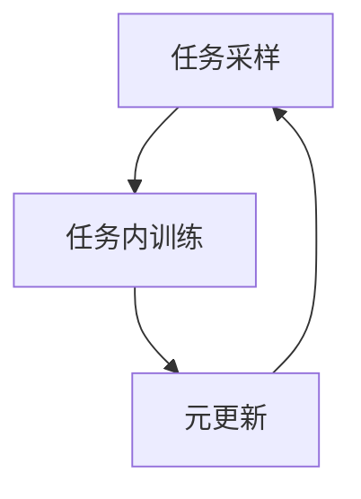
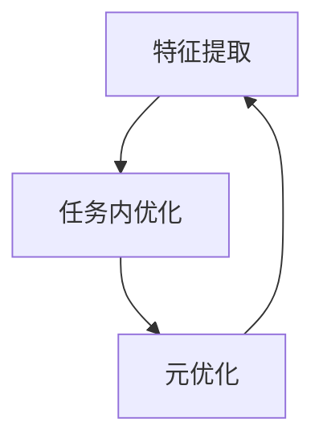

# 一切皆是映射：模型无关的元学习与模型依赖的元学习

## 1.背景介绍

元学习（Meta-Learning）是机器学习领域的一个重要分支，旨在通过学习如何学习来提高模型的泛化能力。元学习的核心思想是利用先前的学习经验来加速新任务的学习过程。元学习可以分为两大类：模型无关的元学习（Model-Agnostic Meta-Learning, MAML）和模型依赖的元学习（Model-Specific Meta-Learning）。本文将深入探讨这两种元学习方法的核心概念、算法原理、数学模型、实际应用以及未来发展趋势。

## 2.核心概念与联系

### 2.1 元学习的定义

元学习是一种通过学习多个任务来提高模型在新任务上的表现的方法。其目标是通过元模型（Meta-Model）来捕捉任务间的共性，从而在面对新任务时能够快速适应。

### 2.2 模型无关的元学习

模型无关的元学习（MAML）是一种通用的元学习方法，不依赖于特定的模型结构。其核心思想是通过优化初始参数，使得模型在少量梯度更新后能够在新任务上表现良好。

### 2.3 模型依赖的元学习

模型依赖的元学习则是针对特定模型结构进行优化。它利用模型的特性来设计更高效的元学习算法，从而在特定任务上取得更好的效果。

### 2.4 两者的联系

尽管MAML和模型依赖的元学习在实现细节上有所不同，但它们的目标是一致的：通过学习多个任务来提高模型在新任务上的表现。两者都强调了任务间的共性，并利用这些共性来加速新任务的学习过程。

## 3.核心算法原理具体操作步骤

### 3.1 MAML的操作步骤

MAML的核心算法可以分为以下几个步骤：

1. **任务采样**：从任务分布中采样一批任务。
2. **任务内训练**：对于每个任务，使用当前模型参数进行少量梯度更新。
3. **元更新**：使用更新后的模型参数计算损失，并通过反向传播更新初始模型参数。

以下是MAML的Mermaid流程图：



### 3.2 模型依赖的元学习操作步骤

模型依赖的元学习的操作步骤因具体模型而异，但一般包括以下几个步骤：

1. **特征提取**：利用特定模型结构提取任务特征。
2. **任务内优化**：根据提取的特征进行任务内优化。
3. **元优化**：利用任务间的共性进行元优化。

以下是模型依赖的元学习的Mermaid流程图：



## 4.数学模型和公式详细讲解举例说明

### 4.1 MAML的数学模型

MAML的目标是找到一个初始参数 $\theta$，使得在少量梯度更新后，模型在新任务上的损失最小。其数学表达式为：

$$
\min_{\theta} \sum_{T_i \sim p(T)} L_{T_i} ( \theta - \alpha \nabla_{\theta} L_{T_i} (\theta) )
$$

其中，$T_i$ 表示从任务分布 $p(T)$ 中采样的任务，$L_{T_i}$ 表示任务 $T_i$ 的损失函数，$\alpha$ 是学习率。

### 4.2 模型依赖的元学习数学模型

模型依赖的元学习的数学模型因具体模型而异。以基于神经网络的元学习为例，其目标是通过优化网络结构和参数，使得在新任务上的表现最佳。其数学表达式为：

$$
\min_{\theta, \phi} \sum_{T_i \sim p(T)} L_{T_i} ( f_{\theta, \phi} (x) )
$$

其中，$\theta$ 表示网络参数，$\phi$ 表示网络结构参数，$f_{\theta, \phi}$ 表示神经网络模型。

## 5.项目实践：代码实例和详细解释说明

### 5.1 MAML的代码实例

以下是一个简单的MAML实现示例，使用Python和PyTorch：

```python
import torch
import torch.nn as nn
import torch.optim as optim

class SimpleModel(nn.Module):
    def __init__(self):
        super(SimpleModel, self).__init__()
        self.fc = nn.Linear(1, 1)

    def forward(self, x):
        return self.fc(x)

def maml_step(model, loss_fn, optimizer, x, y, alpha):
    # 任务内训练
    y_pred = model(x)
    loss = loss_fn(y_pred, y)
    grads = torch.autograd.grad(loss, model.parameters(), create_graph=True)
    updated_params = [p - alpha * g for p, g in zip(model.parameters(), grads)]
    
    # 元更新
    y_pred_updated = model(x)
    loss_updated = loss_fn(y_pred_updated, y)
    optimizer.zero_grad()
    loss_updated.backward()
    optimizer.step()

# 初始化模型和优化器
model = SimpleModel()
optimizer = optim.SGD(model.parameters(), lr=0.01)
loss_fn = nn.MSELoss()

# 示例数据
x = torch.tensor([[1.0], [2.0], [3.0]])
y = torch.tensor([[2.0], [4.0], [6.0]])

# MAML训练步骤
maml_step(model, loss_fn, optimizer, x, y, alpha=0.01)
```

### 5.2 模型依赖的元学习代码实例

以下是一个基于神经网络的模型依赖元学习示例：

```python
import torch
import torch.nn as nn
import torch.optim as optim

class MetaNetwork(nn.Module):
    def __init__(self):
        super(MetaNetwork, self).__init__()
        self.fc1 = nn.Linear(1, 10)
        self.fc2 = nn.Linear(10, 1)

    def forward(self, x):
        x = torch.relu(self.fc1(x))
        return self.fc2(x)

def meta_learning_step(model, loss_fn, optimizer, x, y):
    # 特征提取
    features = model.fc1(x)
    
    # 任务内优化
    y_pred = model.fc2(features)
    loss = loss_fn(y_pred, y)
    
    # 元优化
    optimizer.zero_grad()
    loss.backward()
    optimizer.step()

# 初始化模型和优化器
model = MetaNetwork()
optimizer = optim.Adam(model.parameters(), lr=0.001)
loss_fn = nn.MSELoss()

# 示例数据
x = torch.tensor([[1.0], [2.0], [3.0]])
y = torch.tensor([[2.0], [4.0], [6.0]])

# 元学习训练步骤
meta_learning_step(model, loss_fn, optimizer, x, y)
```

## 6.实际应用场景

### 6.1 图像分类

元学习在图像分类任务中表现出色，特别是在小样本学习（Few-Shot Learning）场景下。通过学习多个图像分类任务，元学习模型能够在少量样本的情况下快速适应新分类任务。

### 6.2 自然语言处理

在自然语言处理（NLP）领域，元学习被广泛应用于文本分类、情感分析等任务。通过学习多个文本任务，元学习模型能够在新任务上快速取得良好表现。

### 6.3 强化学习

元学习在强化学习（Reinforcement Learning）中也有重要应用。通过学习多个环境，元学习模型能够在新环境中快速找到最优策略。

## 7.工具和资源推荐

### 7.1 开源框架

- **PyTorch**：一个广泛使用的深度学习框架，支持动态计算图，非常适合元学习研究。
- **TensorFlow**：另一个流行的深度学习框架，提供了丰富的工具和资源。

### 7.2 研究论文

- **Model-Agnostic Meta-Learning for Fast Adaptation of Deep Networks**：MAML的开创性论文，详细介绍了MAML的算法原理和实验结果。
- **Meta-Learning: A Survey**：一篇综述性论文，全面介绍了元学习的研究进展和应用。

### 7.3 在线课程

- **Coursera**：提供了多门关于元学习和深度学习的在线课程，适合初学者和进阶学习者。
- **edX**：同样提供了丰富的机器学习和元学习课程资源。

## 8.总结：未来发展趋势与挑战

元学习作为机器学习领域的前沿研究方向，具有广阔的应用前景。然而，元学习也面临着诸多挑战，如如何在大规模数据集上高效训练元模型、如何设计更通用的元学习算法等。未来，随着计算资源的提升和算法的不断优化，元学习有望在更多实际应用中发挥重要作用。

## 9.附录：常见问题与解答

### 9.1 什么是元学习？

元学习是一种通过学习多个任务来提高模型在新任务上的表现的方法。

### 9.2 MAML和模型依赖的元学习有什么区别？

MAML是一种通用的元学习方法，不依赖于特定的模型结构；而模型依赖的元学习则是针对特定模型结构进行优化。

### 9.3 元学习的实际应用有哪些？

元学习在图像分类、自然语言处理和强化学习等领域有广泛应用。

### 9.4 如何选择元学习算法？

选择元学习算法时，应根据具体任务和数据特点来决定。MAML适用于通用场景，而模型依赖的元学习则适用于特定任务。

### 9.5 元学习的未来发展趋势是什么？

元学习未来的发展趋势包括更高效的训练算法、更通用的模型结构以及更广泛的实际应用。

---

作者：禅与计算机程序设计艺术 / Zen and the Art of Computer Programming