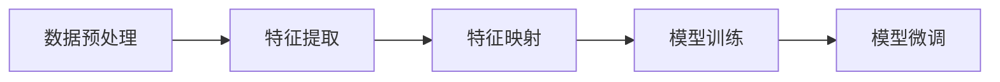

## 1. 背景介绍

随着人工智能的飞速发展，我们已经见证了其在各个领域的广泛应用，从图像识别到自然语言处理，再到复杂的决策系统。然而，一个核心问题始终存在：如何将在一个领域学到的知识迁移到另一个领域？这就是迁移学习的研究课题。迁移学习试图解决的是如何利用已有的数据和模型在新的、但相关的任务上进行学习和预测。本文将深入探讨迁移学习的核心概念、算法原理、数学模型，并通过项目实践和实际应用场景来展示其强大的能力。

## 2. 核心概念与联系

迁移学习的核心在于找到不同领域之间的共性，即映射关系。这些映射关系可以是特征空间的相似性、数据分布的一致性或任务目标的关联性。理解这些概念及其联系是掌握迁移学习的关键。

### 2.1 源域与目标域
源域（Source Domain）是我们已经有大量数据和模型的领域，而目标域（Target Domain）则是我们希望应用知识的新领域。迁移学习的目的是利用源域的知识来提高目标域任务的性能。

### 2.2 映射学习
映射学习（Mapping Learning）是迁移学习中的一个重要概念，它指的是找到一种方法将源域的知识转化为对目标域有用的形式。这通常涉及到特征转换或领域适应技术。

### 2.3 领域适应
领域适应（Domain Adaptation）是迁移学习中的一个子领域，专注于调整模型以适应新领域的数据分布。这通常需要一些无监督的学习方法，因为目标域的标签数据可能很少或根本不存在。

## 3. 核心算法原理具体操作步骤

迁移学习的核心算法原理可以分为几个步骤：数据预处理、特征提取、特征映射、模型训练和微调。下面是这些步骤的Mermaid流程图：



### 3.1 数据预处理
数据预处理包括数据清洗、归一化和标准化等，以确保数据质量。

### 3.2 特征提取
特征提取是从原始数据中提取有用信息的过程，这些信息可以是手工设计的特征或通过深度学习模型自动学习的特征。

### 3.3 特征映射
特征映射是将源域特征转换为目标域可以理解的形式。这可能涉及到降维、核方法或神经网络。

### 3.4 模型训练
模型训练是在源域数据上训练模型，以学习任务相关的知识。

### 3.5 模型微调
模型微调是在目标域数据上调整模型参数，以更好地适应新领域。

## 4. 数学模型和公式详细讲解举例说明

迁移学习的数学模型通常涉及到优化问题，其中目标函数设计为最小化源域和目标域之间的差异。以下是一个简化的迁移学习数学模型：

$$
\min_{\theta} \mathcal{L}_{source}(\theta) + \lambda \mathcal{D}(P_{source}, P_{target})
$$

其中，$\mathcal{L}_{source}(\theta)$ 是在源域数据上的损失函数，$\mathcal{D}(P_{source}, P_{target})$ 是源域和目标域数据分布之间的距离，$\lambda$ 是一个调节两者重要性的超参数。

## 5. 项目实践：代码实例和详细解释说明

在本节中，我们将通过一个简单的迁移学习项目来展示如何实际应用这些概念。由于篇幅限制，这里只提供一个高层次的代码概述。

```python
# 数据预处理
source_data = preprocess(source_raw_data)
target_data = preprocess(target_raw_data)

# 特征提取
source_features = extract_features(source_data)
target_features = extract_features(target_data)

# 特征映射
mapped_features = map_features(source_features, target_features)

# 模型训练
model = train_model(mapped_features, source_labels)

# 模型微调
fine_tuned_model = fine_tune_model(model, target_data, target_labels)
```

## 6. 实际应用场景

迁移学习已经在多个领域得到了成功的应用，例如在医疗影像分析中，可以将在一个数据集上训练的模型迁移到另一个数据集上；在自然语言处理中，可以将在一个语言上训练的模型迁移到另一种语言的处理上。

## 7. 工具和资源推荐

对于迁移学习的实践，有多种工具和资源可以使用，例如TensorFlow和PyTorch等深度学习框架，以及专门的迁移学习库如Transfer-Learning-Library。

## 8. 总结：未来发展趋势与挑战

迁移学习作为一种强大的机器学习方法，其未来的发展趋势是向着更加自动化和泛化的方向发展。然而，如何选择合适的源域和目标域、如何设计有效的映射函数等问题仍然是挑战。

## 9. 附录：常见问题与解答

Q1: 迁移学习适用于哪些类型的任务？
A1: 迁移学习适用于数据量不足或者任务相似性较高的场景。

Q2: 如何评估迁移学习的效果？
A2: 通常通过在目标域上的性能提升来评估迁移学习的效果。

作者：禅与计算机程序设计艺术 / Zen and the Art of Computer Programming