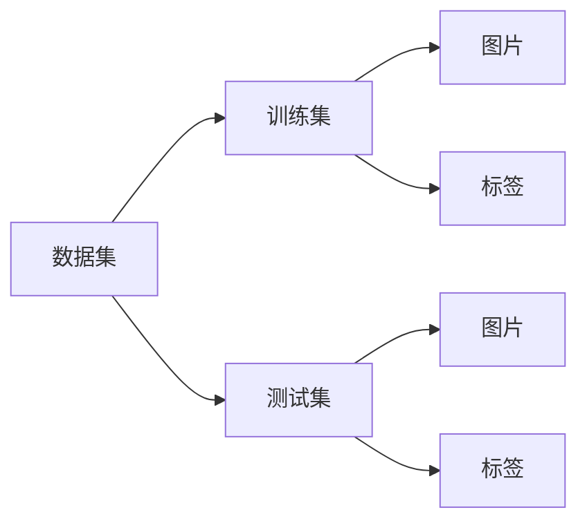

# 从零开始大模型开发与微调：MNIST数据集的特征和标签介绍

## 1. 背景介绍

在人工智能的黄金时代，深度学习已经成为了一项不可或缺的技术。其中，图像识别作为深度学习应用的重要领域，一直是研究者们关注的焦点。MNIST数据集，作为最经典的手写数字识别数据集，已经成为了入门深度学习的“Hello World”项目。本文将深入探讨MNIST数据集的特征和标签，并指导读者如何从零开始开发和微调一个大模型来处理这一数据集。

## 2. 核心概念与联系

MNIST数据集包含了70000张28x28像素的手写数字图片，其中60000张用于训练，10000张用于测试。每张图片都对应一个0-9的数字标签。在这个数据集上训练的模型需要能够准确识别出图片中的数字。

### 2.1 数据集结构



### 2.2 特征与标签

- **特征（Features）**: 图片的像素值，每个像素点作为一个特征输入。
- **标签（Labels）**: 图片所代表的数字，作为模型输出的预测目标。

## 3. 核心算法原理具体操作步骤

在处理MNIST数据集时，我们通常采用卷积神经网络（CNN）模型。以下是构建和训练CNN模型的步骤：

1. 数据预处理：标准化输入特征，将标签转换为独热编码。
2. 模型构建：设计CNN架构，包括卷积层、池化层和全连接层。
3. 损失函数选择：通常使用交叉熵损失函数。
4. 优化算法选择：如SGD、Adam等。
5. 训练模型：使用训练集数据进行模型训练。
6. 模型评估：使用测试集数据评估模型性能。

## 4. 数学模型和公式详细讲解举例说明

### 4.1 卷积层

卷积层通过滤波器在输入图像上滑动，计算滤波器与图像的局部区域的点积，生成特征图（Feature Map）。

$$
F_{ij} = \sum_{m}\sum_{n}I_{(i+m)(j+n)}K_{mn}
$$

其中，$F_{ij}$ 是特征图上的一个元素，$I$ 是输入图像，$K$ 是滤波器的权重矩阵，$m$ 和 $n$ 是滤波器的尺寸。

### 4.2 池化层

池化层用于降低特征图的维度，常见的池化操作有最大池化和平均池化。

$$
P_{ij} = \max_{a,b \in W_{ij}}F_{ab}
$$

$P_{ij}$ 是池化后的特征图上的一个元素，$W_{ij}$ 是以 $(i, j)$ 为中心的池化窗口，$F_{ab}$ 是原特征图上的元素。

### 4.3 全连接层

全连接层将前一层的输出展平后，通过矩阵乘法和加偏置操作，实现特征到类别的映射。

$$
O = \sigma(W \cdot F + b)
$$

$O$ 是输出向量，$\sigma$ 是激活函数，$W$ 是权重矩阵，$F$ 是展平后的特征向量，$b$ 是偏置向量。

## 5. 项目实践：代码实例和详细解释说明

以下是使用Python和TensorFlow实现的MNIST数据集上的CNN模型代码示例：

```python
import tensorflow as tf
from tensorflow.keras import datasets, layers, models

# 加载数据集并进行预处理
(train_images, train_labels), (test_images, test_labels) = datasets.mnist.load_data()
train_images = train_images.reshape((60000, 28, 28, 1)).astype('float32') / 255
test_images = test_images.reshape((10000, 28, 28, 1)).astype('float32') / 255
train_labels = tf.keras.utils.to_categorical(train_labels)
test_labels = tf.keras.utils.to_categorical(test_labels)

# 构建CNN模型
model = models.Sequential()
model.add(layers.Conv2D(32, (3, 3), activation='relu', input_shape=(28, 28, 1)))
model.add(layers.MaxPooling2D((2, 2)))
model.add(layers.Conv2D(64, (3, 3), activation='relu'))
model.add(layers.MaxPooling2D((2, 2)))
model.add(layers.Conv2D(64, (3, 3), activation='relu'))
model.add(layers.Flatten())
model.add(layers.Dense(64, activation='relu'))
model.add(layers.Dense(10, activation='softmax'))

# 编译和训练模型
model.compile(optimizer='adam',
              loss='categorical_crossentropy',
              metrics=['accuracy'])
model.fit(train_images, train_labels, epochs=5, batch_size=64)

# 评估模型
test_loss, test_acc = model.evaluate(test_images, test_labels)
print(f"Test accuracy: {test_acc}")
```

## 6. 实际应用场景

MNIST数据集的模型不仅用于教学和研究，还可以应用于邮政编码识别、银行支票处理等实际场景。

## 7. 工具和资源推荐

- TensorFlow和Keras：用于构建和训练深度学习模型的强大库。
- PyTorch：另一个流行的深度学习框架。
- Google Colab：提供免费GPU资源的在线Jupyter笔记本环境。

## 8. 总结：未来发展趋势与挑战

随着技术的发展，更大规模的数据集和更复杂的模型正在被开发。未来的挑战包括提高模型的泛化能力、减少计算资源的消耗以及保护数据隐私。

## 9. 附录：常见问题与解答

Q1: MNIST数据集的图片大小是多少？
A1: 每张图片是28x28像素的灰度图。

Q2: 如何提高模型在MNIST数据集上的准确率？
A2: 可以尝试使用更深的网络结构、数据增强或超参数调优。

作者：禅与计算机程序设计艺术 / Zen and the Art of Computer Programming