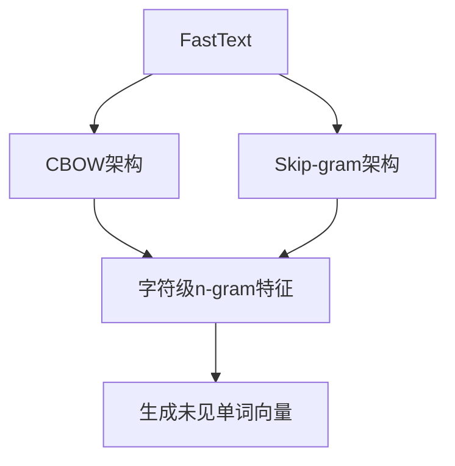
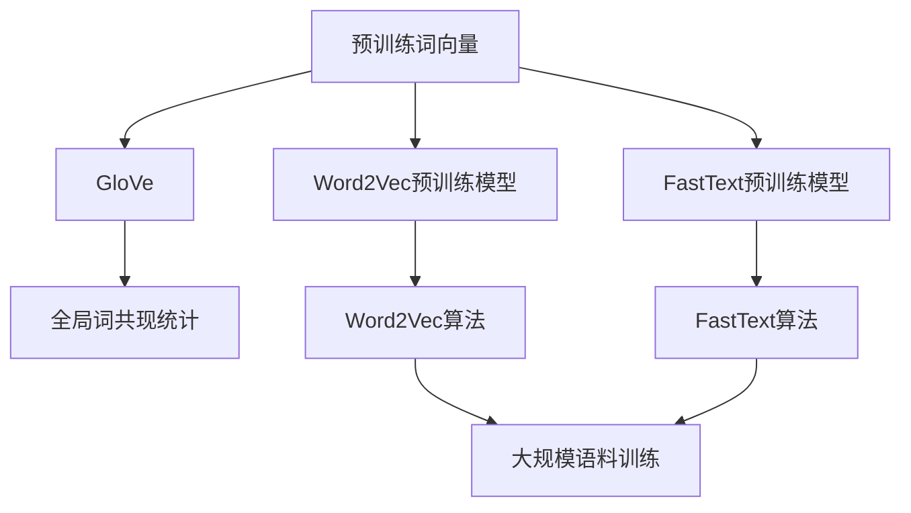

# 从零开始大模型开发与微调：更多的词嵌入方法—FastText和预训练词向量

## 1.背景介绍

### 1.1 词嵌入的重要性

在自然语言处理(NLP)领域,词嵌入(Word Embedding)是一种将单词映射到连续向量空间的技术,使得具有相似语义的单词在向量空间中彼此靠近。它是深度学习在NLP任务中取得卓越表现的关键因素之一。高质量的词嵌入能够为模型提供有价值的语义信息,从而提高模型的性能。

### 1.2 Word2Vec的局限性

Word2Vec是一种流行的词嵌入技术,它通过神经网络模型来学习单词向量表示。然而,Word2Vec存在一些局限性:

1. 词构成盲视(Out-of-Vocabulary)问题:Word2Vec无法为语料库中未出现的单词生成向量表示。
2. 对单词内部结构缺乏利用:Word2Vec将每个单词视为一个原子符号,无法利用单词的内部结构信息(如词缀、词根等)。

### 1.3 FastText和预训练词向量的优势

为了解决Word2Vec的局限,FastText和预训练词向量(Pre-trained Word Vectors)应运而生。FastText能够利用单词的内部结构生成词嵌入,从而缓解词构成盲视问题。预训练词向量则是基于大规模语料库预先训练好的高质量词嵌入模型,可以直接应用于下游NLP任务,节省了从头训练词嵌入的时间和计算资源。

## 2.核心概念与联系

### 2.1 FastText

FastText是Facebook AI研究院开发的一种高效的词嵌入模型,它基于Word2Vec的CBOW(Continuous Bag-of-Words)和Skip-gram架构,但增加了对字符级别n-gram特征的支持。这使得FastText能够为语料库中未出现的单词生成向量表示,缓解了词构成盲视问题。



### 2.2 预训练词向量

预训练词向量是基于大规模语料库(如Wikipedia、新闻语料等)预先训练好的高质量词嵌入模型。常见的预训练词向量有:

- **GloVe**(Global Vectors for Word Representation):利用全局词共现统计信息训练词向量。
- **Word2Vec预训练模型**:基于Word2Vec算法在大规模语料上训练得到的词向量模型。
- **FastText预训练模型**:基于FastText算法在大规模语料上训练得到的词向量模型。

这些预训练词向量能够捕捉单词之间的语义和语法关系,可以直接用于下游NLP任务,提高模型性能并节省训练时间。



## 3.核心算法原理具体操作步骤

### 3.1 FastText算法原理

FastText的核心思想是将每个单词看作是字符级n-gram的组合。对于一个单词$w$,FastText会生成它的所有字符级n-gram(通常$n$取3到6),然后将这些n-gram的向量相加作为该单词的词向量表示。

设单词$w$由字符$\{c_1, c_2, ..., c_V\}$组成,其中$V$是单词的长度。对于n-gram等于$n$,FastText会生成$V-n+1$个不同的n-gram,即$\{g_1, g_2, ..., g_{V-n+1}\}$。单词$w$的向量表示为:

$$\mathbf{v}_w = \frac{1}{V-n+1}\sum_{g=1}^{V-n+1}\mathbf{v}_g^{\prime}$$

其中$\mathbf{v}_g^{\prime}$是n-gram $g$的向量表示。

在训练过程中,FastText会最小化CBOW或Skip-gram的目标函数,同时学习每个n-gram的向量表示。这样,即使一个单词在训练语料中从未出现过,FastText也能根据该单词的字符级n-gram生成其词向量表示。

### 3.2 FastText训练步骤

1. **准备训练语料**:收集大量语料文本数据,可以是来自网页、书籍、文章等不同来源。
2. **构建字符级n-gram集合**:遍历语料库中的每个单词,提取其所有字符级n-gram(通常$n$取3到6)。
3. **初始化模型参数**:为每个n-gram和目标单词随机初始化向量表示。
4. **模型训练**:使用CBOW或Skip-gram架构,最小化目标函数,迭代更新n-gram和目标单词的向量表示。
5. **生成词向量**:对于一个新单词,将其所有字符级n-gram的向量相加,得到该单词的词向量表示。

### 3.3 预训练词向量的使用

使用预训练词向量的一般步骤如下:

1. **下载预训练模型**:从开源库(如GloVe、FastText官方等)下载所需的预训练词向量模型。
2. **加载预训练模型**:使用相应的Python库(如gensim、fasttext等)加载预训练词向量模型。
3. **获取词向量**:对于给定的单词,从预训练模型中查询并获取其对应的词向量表示。
4. **应用于下游任务**:将获取的词向量作为输入特征,整合到NLP模型中,用于文本分类、序列标注、机器翻译等下游任务。

## 4.数学模型和公式详细讲解举例说明

### 4.1 Word2Vec的CBOW和Skip-gram模型

FastText算法是基于Word2Vec的CBOW和Skip-gram架构,因此我们先介绍一下Word2Vec中的这两个模型。

#### 4.1.1 CBOW(Continuous Bag-of-Words)模型

CBOW模型的目标是根据上下文词$w_{t-c},...,w_{t-1},w_{t+1},...,w_{t+c}$来预测当前词$w_t$,其中$c$是上下文窗口大小。具体来说,我们最大化目标函数:

$$\frac{1}{T}\sum_{t=1}^{T}\log P(w_t|w_{t-c},...,w_{t-1},w_{t+1},...,w_{t+c})$$

其中$T$是语料库中的词数。上下文词的词向量通过求平均后,与当前词的词向量计算softmax概率:

$$P(w_t|w_{t-c},...,w_{t-1},w_{t+1},...,w_{t+c})=\frac{e^{\mathbf{v}_{w_t}^{\top}\mathbf{v}_c}}{\sum_{i=1}^{V}e^{\mathbf{v}_{w_i}^{\top}\mathbf{v}_c}}$$

其中$\mathbf{v}_{w_t}$是词$w_t$的词向量,$\mathbf{v}_c$是上下文词向量的平均值,V是词汇表大小。

#### 4.1.2 Skip-gram模型

与CBOW相反,Skip-gram模型的目标是根据当前词$w_t$来预测它的上下文词$w_{t-c},...,w_{t-1},w_{t+1},...,w_{t+c}$。我们最大化目标函数:

$$\frac{1}{T}\sum_{t=1}^{T}\sum_{-c\leq j\leq c,j\neq 0}\log P(w_{t+j}|w_t)$$

其中$c$是上下文窗口大小。当前词的词向量与上下文词的词向量计算softmax概率:

$$P(w_{t+j}|w_t)=\frac{e^{\mathbf{v}_{w_{t+j}}^{\top}\mathbf{v}_{w_t}}}{\sum_{i=1}^{V}e^{\mathbf{v}_{w_i}^{\top}\mathbf{v}_{w_t}}}$$

通过最大化上述目标函数,我们可以获得能够很好地表示词语语义关系的词向量。

### 4.2 FastText的n-gram模型

FastText在Word2Vec的基础上,引入了字符级n-gram特征,从而能够生成未见单词的词向量表示。对于一个单词$w$,我们将其看作是字符级n-gram的组合,即:

$$\mathbf{v}_w = \frac{1}{|G_w|}\sum_{g\in G_w}\mathbf{v}_g$$

其中$G_w$是单词$w$的所有字符级n-gram的集合,$\mathbf{v}_g$是n-gram $g$的向量表示。在训练过程中,FastText会同时学习每个n-gram和目标单词的向量表示。

例如,对于单词"where",假设我们取$n=3$,那么它的字符级3-gram集合为$G_{\text{where}}=\{\langle\text{wh},\text{her},\text{ere},\text{re}\rangle\}$。我们将这些3-gram的向量相加,得到"where"的词向量表示。

通过这种方式,即使一个单词在训练语料中从未出现过,只要我们知道它的字符级n-gram,就能够为其生成词向量表示。这极大地缓解了词构成盲视问题。

## 5.项目实践:代码实例和详细解释说明

在这一部分,我们将使用Python中的fasttext库,实现FastText词嵌入模型的训练和应用。同时,我们也将展示如何使用预训练的词向量模型。

### 5.1 安装fasttext库

我们首先需要安装fasttext库,可以使用pip进行安装:

```bash
pip install fasttext
```

### 5.2 使用FastText训练词嵌入模型

下面是一个使用FastText在自定义语料库上训练词嵌入模型的示例:

```python
import fasttext

# 构建FastText模型
model = fasttext.train_unsupervised(
    input='data.txt',  # 训练语料
    model='skipgram',  # 使用Skip-gram模型
    dim=100,           # 词向量维度
    ws=5,              # 上下文窗口大小
    min_count=5,       # 最小词频
    minn=3,            # 最小字符n-gram长度
    maxn=6,            # 最大字符n-gram长度
    thread=4           # 使用4个线程进行训练
)

# 保存模型
model.save_model('model.bin')

# 获取单词"apple"的词向量
apple_vector = model.get_word_vector('apple')
print(apple_vector)
```

在上面的示例中,我们使用`fasttext.train_unsupervised`函数构建FastText模型。`input`参数指定训练语料的路径,`model`参数指定使用Skip-gram模型,`dim`参数设置词向量的维度,`ws`参数设置上下文窗口大小,`min_count`参数过滤掉低频词,`minn`和`maxn`参数设置字符n-gram的最小和最大长度。

训练完成后,我们可以使用`save_model`函数保存模型,使用`get_word_vector`函数获取某个单词的词向量表示。

### 5.3 使用预训练词向量模型

fasttext库也支持加载和使用预训练的词向量模型,下面是一个示例:

```python
import fasttext

# 加载预训练模型
model = fasttext.load_model('cc.en.300.bin')

# 获取单词"apple"的词向量
apple_vector = model.get_word_vector('apple')
print(apple_vector)

# 获取最相似的10个单词
similar_words = model.most_similar('apple', topn=10)
print(similar_words)
```

在上面的示例中,我们使用`fasttext.load_model`函数加载一个预训练的词向量模型。这个模型是基于Common Crawl语料库训练的,词向量维度为300。

加载完成后,我们可以使用`get_word_vector`函数获取某个单词的词向量表示,使用`most_similar`函数获取与某个单词最相似的其他单词列表。

### 5.4 使用预训练词向量进行文本分类

下面是一个使用预训练词向量进行文本分类的示例:

```python
import fasttext
import pandas as pd
from sklearn.model_selection import train_test_split

# 加载数据集
data = pd.read_csv('data.csv')
X = data['text']
y = data['label']

# 划分训练集和测试集
X_train, X_test, y_train, y_test = train_test_split(X, y, test_size=0.2, random_state=42