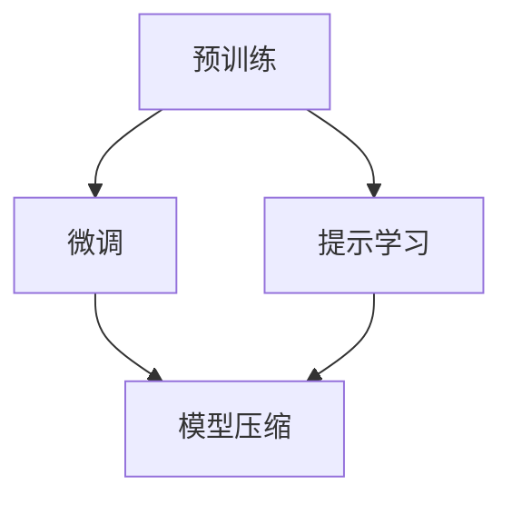

# 从零开始大模型开发与微调：更多的预训练模型

## 1.背景介绍

随着人工智能技术的不断发展,大型语言模型在自然语言处理(NLP)领域取得了令人瞩目的成就。这些模型通过在海量文本数据上进行预训练,学习到了丰富的语言知识和上下文理解能力,为下游任务提供了强大的基础。

然而,训练这些大型模型需要消耗大量的计算资源,对于普通开发者和研究人员来说,从头开始训练一个全新的大型语言模型是一个巨大的挑战。幸运的是,越来越多的预训练模型被开源和共享,为大模型的开发和微调提供了便利。

### 1.1 预训练模型的重要性

预训练模型在自然语言处理领域扮演着关键角色,主要有以下几个原因:

1. **计算资源节省**:训练一个大型语言模型需要大量的计算资源和时间,而使用预训练模型可以直接利用已有的模型权重,节省了昂贵的训练成本。

2. **数据效率提高**:预训练模型已经在海量文本数据上学习到了通用的语言知识,在下游任务上只需要使用相对较少的数据进行微调,就可以获得良好的性能。

3. **迁移学习能力强**:预训练模型具有强大的迁移学习能力,可以将在大规模语料上学习到的知识迁移到各种下游任务中,提高模型的泛化性能。

4. **促进模型共享和复用**:开源共享预训练模型有助于推动模型复用和知识传播,降低了重复工作的成本,促进了整个社区的发展。

### 1.2 预训练模型的类型

目前,常见的预训练模型可以分为以下几种类型:

1. **掩码语言模型(Masked Language Model, MLM)**:代表模型有BERT、RoBERTa等。这类模型通过随机掩码部分输入词元,并训练模型预测被掩码的词元,学习到双向的语境表示。

2. **自回归语言模型(Autoregressive Language Model, ALM)**:代表模型有GPT、OPT等。这类模型基于自回归机制,通过预测下一个词元的方式,学习到单向的语境表示。

3. **序列到序列模型(Sequence-to-Sequence Model, Seq2Seq)**:代表模型有T5、BART等。这类模型将输入和输出都视为文本序列,可以处理各种序列到序列的任务,如机器翻译、文本摘要等。

4. **视觉语言模型(Vision-Language Model, VLM)**:代表模型有CLIP、ALIGN等。这类模型同时对图像和文本进行编码,学习到跨模态的表示,可以应用于图像描述、图文问答等任务。

5. **多模态模型(Multimodal Model)**:代表模型有GPT-3、PaLM等。这类模型在预训练阶段融合了多种模态数据,如文本、图像、视频等,旨在学习到统一的跨模态表示。

不同类型的预训练模型擅长于不同的下游任务,开发者可以根据具体需求选择合适的模型进行微调和部署。

## 2.核心概念与联系

在探讨大模型开发与微调之前,我们需要了解一些核心概念及其相互关系。

### 2.1 预训练(Pretraining)

预训练是指在大规模无标注数据上训练模型,使其学习到通用的表示能力。常见的预训练目标包括:

- **掩码语言模型(MLM)**:随机掩码部分输入词元,预测被掩码的词元。
- **下一句预测(Next Sentence Prediction, NSP)**:判断两个句子是否相邻。
- **自回归语言模型(ALM)**:基于自回归机制,预测下一个词元。
- **去噪自编码(Denoising Autoencoder)**:从损坏或噪声版本的输入中重建原始输入。

预训练过程通常需要消耗大量的计算资源,但可以学习到通用的语言表示,为下游任务提供强大的基础。

### 2.2 微调(Fine-tuning)

微调是指在特定下游任务的数据上,继续训练预训练模型的部分或全部参数,使其适应该任务。微调过程通常包括以下步骤:

1. **加载预训练模型权重**:从预训练模型中加载已经学习到的权重作为初始化。
2. **构建任务特定的输入输出**:根据下游任务的需求,设计合适的输入和输出表示。
3. **添加任务特定的头部**:在预训练模型的顶部添加一个新的头部层,用于预测下游任务的输出。
4. **微调模型参数**:在下游任务的数据上,微调预训练模型的部分或全部参数,使其适应该任务。

微调过程相对于从头训练模型更加高效,可以在较少的数据和计算资源下获得良好的性能。

### 2.3 提示学习(Prompt Learning)

提示学习是一种新兴的范式,它通过设计合适的提示(prompt),将下游任务转化为预训练模型熟悉的形式,从而无需微调模型参数,直接利用预训练模型进行推理。

提示学习的关键在于设计高质量的提示,使预训练模型能够理解并正确地完成下游任务。常见的提示设计方法包括:

- **手工设计提示**:人工设计合适的提示模板,指导模型完成任务。
- **自动提示搜索**:使用搜索算法自动生成高质量的提示。
- **基于规则的提示生成**:根据任务的语义和结构,设计规则生成提示。

提示学习的优势在于无需微调模型参数,可以快速适应新任务,并且具有更好的可解释性和可控性。但它也面临着提示质量的挑战,需要进一步的研究和探索。

### 2.4 模型压缩(Model Compression)

大型预训练模型通常包含数十亿甚至上百亿的参数,在实际部署时面临着计算资源和内存限制的挑战。为了解决这个问题,模型压缩技术应运而生。

常见的模型压缩方法包括:

- **量化(Quantization)**:将浮点数参数转换为低精度的定点数表示,降低模型大小和计算成本。
- **剪枝(Pruning)**:移除模型中不重要的权重,降低模型复杂度。
- **知识蒸馏(Knowledge Distillation)**:使用一个小模型去学习一个大模型的行为,获得接近的性能。
- **低秩分解(Low-Rank Factorization)**:将参数矩阵分解为低秩的形式,减小参数数量。

通过模型压缩技术,可以在保持模型性能的同时,显著降低模型的计算和存储开销,从而更好地部署在资源受限的环境中。

### 2.5 核心概念关系

上述核心概念之间存在着密切的联系,如下图所示:

1. 预训练是大模型开发的基础,为下游任务提供了强大的语言表示能力。
2. 微调是在预训练模型的基础上,针对特定任务进行进一步训练的过程。
3. 提示学习则是一种无需微调的范式,通过设计合适的提示,直接利用预训练模型进行推理。
4. 无论是微调还是提示学习,都可以结合模型压缩技术,降低模型的计算和存储开销,实现高效部署。

这些概念和技术相互关联、相辅相成,共同推动了大模型在自然语言处理领域的发展和应用。

## 3.核心算法原理具体操作步骤

在本节,我们将详细介绍大模型开发与微调的核心算法原理和具体操作步骤。

### 3.1 预训练算法

预训练算法的目标是在大规模无标注数据上训练模型,使其学习到通用的语言表示能力。常见的预训练算法包括:

#### 3.1.1 掩码语言模型(Masked Language Modeling, MLM)

MLM算法的核心思想是随机掩码部分输入词元,并训练模型预测被掩码的词元。具体操作步骤如下:

1. 从语料库中随机采样一个序列作为输入。
2. 随机选择一部分词元进行掩码,通常使用特殊的[MASK]标记替换这些词元。
3. 将掩码后的序列输入到模型中,模型需要预测被掩码的词元。
4. 计算预测值与真实值之间的损失函数,例如交叉熵损失。
5. 使用优化算法(如Adam)反向传播并更新模型参数,最小化损失函数。

MLM算法可以学习到双向的语境表示,是训练BERT、RoBERTa等模型的核心算法。

#### 3.1.2 自回归语言模型(Autoregressive Language Modeling, ALM)

ALM算法基于自回归机制,通过预测下一个词元的方式,学习到单向的语境表示。具体操作步骤如下:

1. 从语料库中随机采样一个序列作为输入。
2. 将输入序列逐个词元输入到模型中,模型需要预测下一个词元。
3. 计算预测值与真实值之间的损失函数,例如交叉熵损失。
4. 使用优化算法反向传播并更新模型参数,最小化损失函数。

ALM算法可以捕捉到单向的语境信息,是训练GPT、OPT等模型的核心算法。

#### 3.1.3 序列到序列预训练(Sequence-to-Sequence Pretraining)

序列到序列预训练算法将输入和输出都视为文本序列,可以处理各种序列到序列的任务。常见的算法包括:

- **去噪自编码(Denoising Autoencoder)**:从损坏或噪声版本的输入中重建原始输入。
- **跨语言掩码(Cross-lingual Masked LM)**:在多语言数据上进行掩码语言模型预训练。
- **文本生成(Text Generation)**:根据给定的提示生成连贯的文本序列。

这些算法可以训练出具有强大序列到序列能力的模型,如T5、BART等。

### 3.2 微调算法

微调算法的目标是在特定下游任务的数据上,继续训练预训练模型的部分或全部参数,使其适应该任务。常见的微调算法包括:

#### 3.2.1 discriminative微调

discriminative微调算法适用于分类、序列标注等discriminative任务。具体操作步骤如下:

1. 加载预训练模型权重作为初始化。
2. 根据下游任务的需求,设计合适的输入和输出表示。
3. 在预训练模型的顶部添加一个新的头部层,用于预测下游任务的输出。
4. 在下游任务的数据上,微调预训练模型的部分或全部参数,使其适应该任务。
5. 使用适当的损失函数(如交叉熵损失)和优化算法(如Adam)进行训练。

discriminative微调算法通常只需要微调预训练模型的部分参数,可以在较少的数据和计算资源下获得良好的性能。

#### 3.2.2 生成式微调

生成式微调算法适用于机器翻译、文本摘要等生成任务。具体操作步骤如下:

1. 加载预训练模型权重作为初始化。
2. 根据下游任务的需求,设计合适的输入和输出表示。
3. 在预训练模型的顶部添加一个新的头部层,用于生成下游任务的输出序列。
4. 在下游任务的数据上,微调预训练模型的部分或全部参数,使其适应该任务。
5. 使用适当的损失函数(如交叉熵损失)和优化算法(如Adam)进行训练。

生成式微调算法通常需要微调预训练模型的大部分参数,以捕捉下游任务的语言特征和生成规律。

#### 3.2.3 多任务微调

多任务微调算法同时在多个相关任务的数据上进行训练,旨在提高模型的泛化能力和鲁棒性。具体操作步骤如下:

1. 加载预训练模型权重作为初始化。
2. 为每个下游任务设计合适的输入和输出表示,以及任