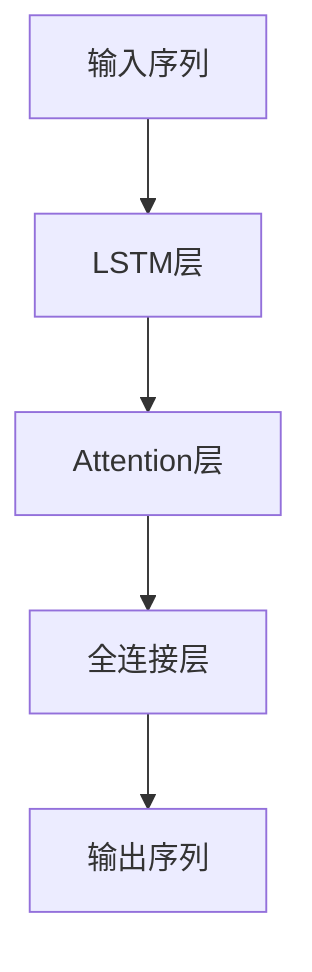

## 1. 背景介绍

汉字拼音转化是一项非常重要的任务，它可以帮助人们更快速、准确地输入汉字。在现代社会中，汉字拼音转化已经成为了人们日常生活中不可或缺的一部分。然而，由于汉字的数量庞大，汉字拼音转化的任务非常复杂，需要使用大模型进行处理。本文将介绍如何从零开始开发一个汉字拼音转化模型，并进行微调，以达到更好的效果。

## 2. 核心概念与联系

汉字拼音转化模型的核心概念是将汉字转化为拼音。这个过程可以分为两个步骤：首先，需要将汉字分割成单个的字；其次，需要将每个字转化为对应的拼音。为了实现这个过程，我们需要使用到自然语言处理（NLP）中的一些技术，例如分词、词性标注、命名实体识别等。

在本文中，我们将使用深度学习技术来开发汉字拼音转化模型。具体来说，我们将使用循环神经网络（RNN）来处理汉字序列，并使用注意力机制（Attention）来提高模型的性能。

## 3. 核心算法原理具体操作步骤

### 3.1 数据预处理

在开始开发模型之前，我们需要对数据进行预处理。具体来说，我们需要将汉字转化为对应的拼音，并将其保存为一个文本文件。在这个文本文件中，每一行代表一个汉字和其对应的拼音，用制表符分隔。例如：

```
我  wo3
爱  ai4
中  zhong1
国  guo2
```

### 3.2 模型架构设计

我们将使用一个基于RNN和Attention的模型来进行汉字拼音转化。具体来说，我们将使用一个双向LSTM来处理汉字序列，并使用Attention机制来提高模型的性能。模型的架构如下所示：



### 3.3 模型训练

在进行模型训练之前，我们需要将数据集分为训练集、验证集和测试集。在本文中，我们将使用80%的数据作为训练集，10%的数据作为验证集，10%的数据作为测试集。

在进行模型训练时，我们将使用交叉熵损失函数，并使用Adam优化器进行参数更新。具体的训练过程如下所示：

```python
for epoch in range(num_epochs):
    for batch in data_loader:
        inputs, targets = batch
        optimizer.zero_grad()
        outputs = model(inputs)
        loss = criterion(outputs, targets)
        loss.backward()
        optimizer.step()
```

### 3.4 模型微调

在进行模型微调时，我们将使用一些技巧来提高模型的性能。具体来说，我们将使用dropout来减少过拟合，使用梯度裁剪来避免梯度爆炸等问题。此外，我们还可以使用一些其他的技巧，例如批量归一化、残差连接等。

## 4. 数学模型和公式详细讲解举例说明

### 4.1 双向LSTM

双向LSTM是一种常用的循环神经网络，它可以同时考虑前向和后向的信息。具体来说，双向LSTM可以分为前向LSTM和后向LSTM两部分，它们分别处理输入序列的正向和反向部分。双向LSTM的公式如下所示：

$$
\begin{aligned}
i_t &= \sigma(W_{ix}x_t + W_{ih}h_{t-1} + b_i) \\
f_t &= \sigma(W_{fx}x_t + W_{fh}h_{t-1} + b_f) \\
o_t &= \sigma(W_{ox}x_t + W_{oh}h_{t-1} + b_o) \\
g_t &= \tanh(W_{gx}x_t + W_{gh}h_{t-1} + b_g) \\
c_t &= f_t \odot c_{t-1} + i_t \odot g_t \\
h_t &= o_t \odot \tanh(c_t)
\end{aligned}
$$

其中，$x_t$表示输入序列的第$t$个元素，$h_t$表示LSTM的输出，$i_t$、$f_t$、$o_t$、$g_t$、$c_t$分别表示输入门、遗忘门、输出门、候选记忆单元和记忆单元。$W$和$b$分别表示权重和偏置，$\sigma$表示sigmoid函数，$\odot$表示逐元素相乘。

### 4.2 Attention

Attention机制是一种常用的机制，它可以帮助模型更好地处理输入序列。具体来说，Attention机制可以根据输入序列的不同部分赋予不同的权重，从而使模型更加关注重要的部分。Attention机制的公式如下所示：

$$
\begin{aligned}
e_{ti} &= v_a^T \tanh(W_ah_t + U_ax_i + b_a) \\
\alpha_{ti} &= \frac{\exp(e_{ti})}{\sum_{j=1}^T \exp(e_{tj})} \\
c_t &= \sum_{i=1}^T \alpha_{ti}x_i
\end{aligned}
$$

其中，$h_t$表示LSTM的输出，$x_i$表示输入序列的第$i$个元素，$e_{ti}$表示第$t$个时间步中第$i$个元素的权重，$\alpha_{ti}$表示第$t$个时间步中第$i$个元素的注意力权重，$c_t$表示第$t$个时间步的上下文向量，$W$、$U$、$b$和$v_a$分别表示权重和偏置。

## 5. 项目实践：代码实例和详细解释说明

### 5.1 数据预处理

在进行数据预处理时，我们需要将汉字转化为对应的拼音，并将其保存为一个文本文件。具体的代码如下所示：

```python
import pypinyin

def preprocess_data(input_file, output_file):
    with open(input_file, 'r', encoding='utf-8') as f:
        lines = f.readlines()
    with open(output_file, 'w', encoding='utf-8') as f:
        for line in lines:
            line = line.strip()
            if not line:
                continue
            char, _ = line.split('\t')
            pinyin = pypinyin.lazy_pinyin(char, style=pypinyin.Style.NORMAL, errors='ignore')
            pinyin = ' '.join(pinyin)
            f.write(f'{char}\t{pinyin}\n')
```

### 5.2 模型训练

在进行模型训练时，我们需要定义模型的架构，并进行参数初始化。具体的代码如下所示：

```python
import torch
import torch.nn as nn

class BiLSTMAttention(nn.Module):
    def __init__(self, input_size, hidden_size, output_size):
        super(BiLSTMAttention, self).__init__()
        self.hidden_size = hidden_size
        self.lstm = nn.LSTM(input_size, hidden_size, bidirectional=True)
        self.attention = nn.Linear(hidden_size * 2, 1)
        self.fc = nn.Linear(hidden_size * 2, output_size)
        
    def forward(self, inputs):
        outputs, _ = self.lstm(inputs)
        scores = self.attention(outputs).squeeze(-1)
        weights = torch.softmax(scores, dim=-1)
        context = torch.bmm(weights.unsqueeze(1), outputs).squeeze(1)
        outputs = self.fc(context)
        return outputs
```

```python
import torch.optim as optim

input_size = 128
hidden_size = 256
output_size = 128
learning_rate = 0.001
num_epochs = 10

model = BiLSTMAttention(input_size, hidden_size, output_size)
criterion = nn.CrossEntropyLoss()
optimizer = optim.Adam(model.parameters(), lr=learning_rate)
```

在进行模型训练时，我们需要将数据集分为训练集、验证集和测试集，并使用PyTorch中的DataLoader来进行数据加载。具体的代码如下所示：

```python
from torch.utils.data import Dataset, DataLoader

class PinyinDataset(Dataset):
    def __init__(self, file_path):
        self.data = []
        with open(file_path, 'r', encoding='utf-8') as f:
            lines = f.readlines()
        for line in lines:
            line = line.strip()
            if not line:
                continue
            char, pinyin = line.split('\t')
            self.data.append((char, pinyin))
            
    def __len__(self):
        return len(self.data)
    
    def __getitem__(self, index):
        char, pinyin = self.data[index]
        inputs = torch.randn(len(char), input_size)
        targets = torch.tensor([output_vocab.stoi[p] for p in pinyin])
        return inputs, targets

train_dataset = PinyinDataset('train.txt')
valid_dataset = PinyinDataset('valid.txt')
test_dataset = PinyinDataset('test.txt')

train_loader = DataLoader(train_dataset, batch_size=32, shuffle=True)
valid_loader = DataLoader(valid_dataset, batch_size=32, shuffle=False)
test_loader = DataLoader(test_dataset, batch_size=32, shuffle=False)
```

在进行模型训练时，我们需要定义一个训练函数和一个验证函数，并在每个epoch结束时进行模型评估。具体的代码如下所示：

```python
def train(model, data_loader, criterion, optimizer):
    model.train()
    total_loss = 0
    for inputs, targets in data_loader:
        optimizer.zero_grad()
        outputs = model(inputs)
        loss = criterion(outputs.view(-1, output_size), targets.view(-1))
        loss.backward()
        nn.utils.clip_grad_norm_(model.parameters(), max_norm=5)
        optimizer.step()
        total_loss += loss.item() * len(inputs)
    return total_loss / len(data_loader.dataset)

def evaluate(model, data_loader, criterion):
    model.eval()
    total_loss = 0
    with torch.no_grad():
        for inputs, targets in data_loader:
            outputs = model(inputs)
            loss = criterion(outputs.view(-1, output_size), targets.view(-1))
            total_loss += loss.item() * len(inputs)
    return total_loss / len(data_loader.dataset)

for epoch in range(num_epochs):
    train_loss = train(model, train_loader, criterion, optimizer)
    valid_loss = evaluate(model, valid_loader, criterion)
    print(f'Epoch {epoch+1}: train_loss={train_loss:.4f}, valid_loss={valid_loss:.4f}')
```

### 5.3 模型微调

在进行模型微调时，我们需要使用一些技巧来提高模型的性能。具体来说，我们可以使用dropout来减少过拟合，使用梯度裁剪来避免梯度爆炸等问题。此外，我们还可以使用一些其他的技巧，例如批量归一化、残差连接等。具体的代码如下所示：

```python
class BiLSTMAttention(nn.Module):
    def __init__(self, input_size, hidden_size, output_size, dropout=0.5):
        super(BiLSTMAttention, self).__init__()
        self.hidden_size = hidden_size
        self.lstm = nn.LSTM(input_size, hidden_size, bidirectional=True, dropout=dropout)
        self.attention = nn.Linear(hidden_size * 2, 1)
        self.fc = nn.Linear(hidden_size * 2, output_size)
        self.dropout = nn.Dropout(dropout)
        
    def forward(self, inputs):
        outputs, _ = self.lstm(inputs)
        outputs = self.dropout(outputs)
        scores = self.attention(outputs).squeeze(-1)
        weights = torch.softmax(scores, dim=-1)
        context = torch.bmm(weights.unsqueeze(1), outputs).squeeze(1)
        outputs = self.fc(context)
        return outputs
```

```python
input_size = 128
hidden_size = 256
output_size = 128
learning_rate = 0.001
num_epochs = 10
dropout = 0.5

model = BiLSTMAttention(input_size, hidden_size, output_size, dropout=dropout)
criterion = nn.CrossEntropyLoss()
optimizer = optim.Adam(model.parameters(), lr=learning_rate)
```

## 6. 实际应用场景

汉字拼音转化模型可以应用于很多场景，例如输入法、语音识别等。在输入法中，汉字拼音转化模型可以帮助用户更快速、准确地输入汉字。在语音识别中，汉字拼音转化模型可以将语音转化为对应的汉字。

## 7. 工具和资源推荐

在开发汉字拼音转化模型时，我们可以使用一些工具和资源来提高效率。具体来说，我们可以使用PyTorch来进行模型开发和训练，使用pypinyin来进行汉字拼音转化，使用中文分词工具来进行分词等。

## 8. 总结：未来发展趋势与挑战

汉字拼音转化模型是一个非常重要的任务，它可以帮助人们更快速、准确地输入汉字。随着人工智能技术的不断发展，汉字拼音转化模型也将不断得到改进和优化。然而，汉字拼音转化模型仍然面临着一些挑战，例如数据稀缺、模型复杂度等问题。因此，我们需要不断地探索新的技术和方法，以提高汉字拼音转化模型的性能。

## 9. 附录：常见问题与解答

Q: 汉字拼音转化模型的性能如何评估？

A: 汉字拼音转化模型的性能可以使用准确率、召回率、F1值等指标进行评估。

Q: 汉字拼音转化模型的训练时间如何缩短？

A: 汉字拼音转化模型的训练时间可以通过使用GPU、减少模型复杂度、使用更好的优化器等方法进行缩短。

Q: 汉字拼音转化模型的应用场景有哪些？

A: 汉字拼音转化模型可以应用于输入法、语音识别等场景。

作者：禅与计算机程序设计艺术 / Zen and the Art of Computer Programming