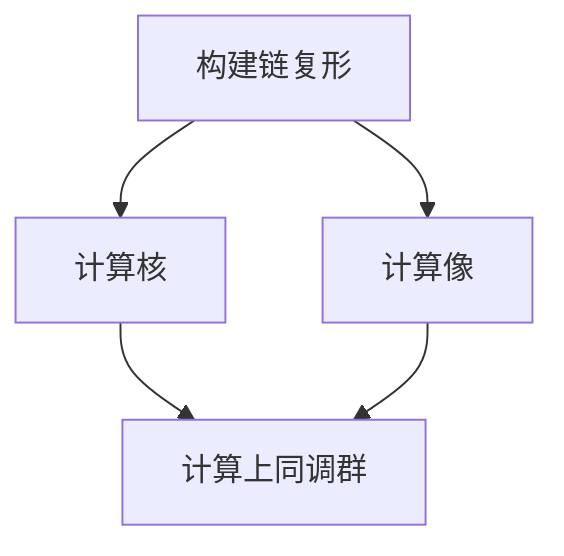

# 代数群引论：B.3 Abel范畴的上同调

## 1.背景介绍

在代数几何和代数拓扑中，上同调理论是一个重要的工具，用于研究拓扑空间和代数结构的性质。特别是，在Abel范畴中，上同调理论提供了一种系统的方法来处理对象和态射之间的关系。Abel范畴是一个具有加法结构的范畴，满足某些特定的性质，使得我们可以在其中定义和研究上同调群。

本文将深入探讨Abel范畴的上同调，介绍其核心概念、算法原理、数学模型和公式，并通过项目实践和实际应用场景来展示其重要性和实用性。我们还将推荐一些工具和资源，帮助读者更好地理解和应用这一理论。

## 2.核心概念与联系

### 2.1 Abel范畴

Abel范畴是一个范畴，其中的对象和态射具有加法结构，并且满足以下性质：
- 零对象：存在一个零对象，使得从任何对象到零对象和从零对象到任何对象的态射都是唯一的。
- 核和上核：每个态射都有一个核和上核。
- 加法结构：态射之间可以进行加法运算，并且这种运算是交换和结合的。

### 2.2 上同调

上同调是一个从链复形到Abel群的函子，通常用于测量某种“缺失”的信息。具体来说，上同调群可以看作是某种“障碍”，它们描述了链复形中的某些态射无法被完全解释的部分。

### 2.3 链复形

链复形是一个对象和态射的序列，其中每个态射的复合为零。形式上，一个链复形 $(C, d)$ 是一个对象序列 $C_n$ 和态射 $d_n: C_n \to C_{n-1}$，满足 $d_{n-1} \circ d_n = 0$。

### 2.4 上同调群

给定一个链复形 $(C, d)$，其上同调群 $H_n(C)$ 定义为：
$$
H_n(C) = \frac{\ker(d_n)}{\text{im}(d_{n+1})}
$$
其中 $\ker(d_n)$ 是 $d_n$ 的核，$\text{im}(d_{n+1})$ 是 $d_{n+1}$ 的像。

## 3.核心算法原理具体操作步骤

### 3.1 构建链复形

首先，我们需要构建一个链复形 $(C, d)$。这包括定义对象序列 $C_n$ 和态射 $d_n$，并确保 $d_{n-1} \circ d_n = 0$。

### 3.2 计算核和像

接下来，我们需要计算每个态射 $d_n$ 的核和 $d_{n+1}$ 的像。这可以通过求解相应的线性方程组来实现。

### 3.3 计算上同调群

最后，我们通过计算 $\ker(d_n)$ 和 $\text{im}(d_{n+1})$ 的商来得到上同调群 $H_n(C)$。

以下是一个Mermaid流程图，展示了这一过程：



## 4.数学模型和公式详细讲解举例说明

### 4.1 链复形的定义

一个链复形 $(C, d)$ 是一个对象序列 $C_n$ 和态射 $d_n: C_n \to C_{n-1}$，满足 $d_{n-1} \circ d_n = 0$。例如，考虑一个简单的链复形：
$$
C_2 \xrightarrow{d_2} C_1 \xrightarrow{d_1} C_0
$$
其中 $d_1 \circ d_2 = 0$。

### 4.2 上同调群的计算

给定链复形 $(C, d)$，其上同调群 $H_n(C)$ 定义为：
$$
H_n(C) = \frac{\ker(d_n)}{\text{im}(d_{n+1})}
$$
例如，假设 $C_2 = \mathbb{Z}$，$C_1 = \mathbb{Z} \oplus \mathbb{Z}$，$C_0 = \mathbb{Z}$，并且态射 $d_2$ 和 $d_1$ 分别为：
$$
d_2 = \begin{pmatrix} 1 \\ 1 \end{pmatrix}, \quad d_1 = (1, -1)
$$
我们可以计算出：
$$
\ker(d_1) = \{(x, x) \mid x \in \mathbb{Z}\}, \quad \text{im}(d_2) = \{(x, x) \mid x \in \mathbb{Z}\}
$$
因此，上同调群 $H_1(C)$ 为零群。

## 5.项目实践：代码实例和详细解释说明

### 5.1 Python代码示例

以下是一个使用Python计算链复形上同调群的示例代码：

```python
import numpy as np

def kernel(matrix):
    """计算矩阵的核"""
    u, s, vh = np.linalg.svd(matrix)
    null_mask = (s <= 1e-10)
    null_space = np.compress(null_mask, vh, axis=0)
    return null_space.T

def image(matrix):
    """计算矩阵的像"""
    u, s, vh = np.linalg.svd(matrix)
    rank = np.sum(s > 1e-10)
    return vh[:rank].T

def homology(kernel_matrix, image_matrix):
    """计算上同调群"""
    ker = kernel(kernel_matrix)
    img = image(image_matrix)
    return ker.shape[1] - img.shape[1]

# 定义链复形
d2 = np.array([[1], [1]])
d1 = np.array([[1, -1]])

# 计算上同调群
H1 = homology(d1, d2)
print(f"H1: {H1}")
```

### 5.2 代码解释

1. `kernel(matrix)` 函数计算给定矩阵的核。
2. `image(matrix)` 函数计算给定矩阵的像。
3. `homology(kernel_matrix, image_matrix)` 函数计算上同调群的维数。
4. 定义链复形的态射矩阵 `d2` 和 `d1`。
5. 计算并输出上同调群 $H_1$。

## 6.实际应用场景

### 6.1 代数几何

在代数几何中，上同调理论用于研究代数簇的性质。例如，Cech上同调和德拉姆上同调是研究代数簇上微分形式的重要工具。

### 6.2 代数拓扑

在代数拓扑中，上同调群用于分类拓扑空间。例如，Betti数是上同调群的秩，用于描述拓扑空间的连通性和洞的数量。

### 6.3 模式识别

在模式识别中，上同调理论用于分析数据的拓扑结构。例如，持久同调是一种用于分析数据集拓扑特征的工具，广泛应用于图像处理和数据挖掘。

## 7.工具和资源推荐

### 7.1 软件工具

- **SageMath**：一个开源数学软件系统，支持代数几何和上同调计算。
- **Macaulay2**：一个专门用于代数几何和同调代数的计算机代数系统。
- **Python**：通过NumPy和SciPy库，可以方便地进行线性代数和上同调计算。

### 7.2 参考书籍

- 《代数几何导论》：Robin Hartshorne
- 《代数拓扑》：Allen Hatcher
- 《同调代数》：Henri Cartan 和 Samuel Eilenberg

### 7.3 在线资源

- [arXiv](https://arxiv.org/)：一个开放获取的学术论文预印本平台，包含大量关于上同调理论的最新研究。
- [MathOverflow](https://mathoverflow.net/)：一个数学研究社区，可以在这里提问和讨论上同调理论相关的问题。

## 8.总结：未来发展趋势与挑战

上同调理论在代数几何和代数拓扑中的应用已经取得了显著的成果，但仍有许多未解之谜和挑战。未来的发展趋势包括：

- **高维上同调**：研究高维代数簇和拓扑空间的上同调性质。
- **计算复杂性**：提高上同调计算的效率，特别是在大规模数据集上的应用。
- **跨学科应用**：将上同调理论应用于更多领域，如物理学、计算机科学和生物信息学。

## 9.附录：常见问题与解答

### 问题1：什么是Abel范畴？

Abel范畴是一个具有加法结构的范畴，满足零对象、核和上核存在以及态射之间的加法运算等性质。

### 问题2：如何计算上同调群？

上同调群通过计算链复形中态射的核和像，并取其商来得到。

### 问题3：上同调理论有哪些实际应用？

上同调理论在代数几何、代数拓扑和模式识别等领域有广泛的应用。

### 问题4：有哪些推荐的工具和资源？

推荐使用SageMath、Macaulay2和Python进行上同调计算，并参考相关书籍和在线资源。

---

作者：禅与计算机程序设计艺术 / Zen and the Art of Computer Programming