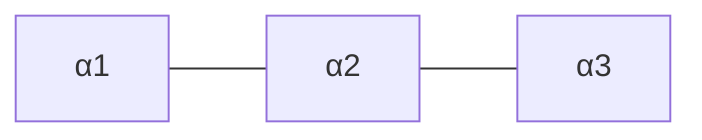

# 代数群引论：第二章 代数群的根系

## 1.背景介绍
### 1.1 代数群的发展历史
代数群是现代数学的重要分支,它的发展可以追溯到19世纪初期。法国数学家Évariste Galois在研究多项式方程的求解问题时,引入了置换群的概念,开创了抽象代数的先河。后来,挪威数学家Sophus Lie将连续变换群的思想引入到微分方程的研究中,创立了李群理论。20世纪中期,法国数学家Claude Chevalley等人将李群理论推广到特征不等于0的域上,创立了代数群理论。

### 1.2 代数群在数学和物理中的应用
代数群在数学和物理学中有着广泛的应用。在数学领域,代数群与李代数、表示论等分支有着密切的联系,在数论、代数几何等领域也有重要应用。在物理学领域,规范场论、弦理论等前沿领域都大量使用了代数群的理论和方法。可以说,代数群已经成为现代数学和理论物理的基础工具之一。

### 1.3 根系的重要性
在代数群的研究中,根系是一个极其重要的概念。它不仅是理解代数群结构的关键,也是研究代数群表示论的基础。通过对根系的分析,我们可以得到代数群的分类定理,揭示不同类型代数群之间的内在联系。同时,根系也是李代数理论的核心概念,在表示论、量子群等领域有着重要应用。因此,深入理解代数群的根系,对于掌握现代数学的许多分支都是十分必要的。

## 2.核心概念与联系
### 2.1 代数群的定义与性质
代数群是一类定义在代数闭域$k$上的仿射代数簇$G$,它同时也是一个群,即乘法运算
$$
\begin{aligned}
\mu:G\times G &\to G \\
(x,y) &\mapsto xy
\end{aligned}
$$
和取逆运算
$$
\begin{aligned}
\iota:G &\to G \\
x &\mapsto x^{-1} 
\end{aligned}
$$
都是正则映射。简单地说,代数群就是多项式函数定义的矩阵群。

代数群有许多重要性质,例如:
- 代数群是光滑的仿射代数簇。
- 代数群的闭子群都是代数群。
- 代数群的商空间(如果群作用是自由的)是仿射代数簇。
- 域扩张不改变代数群的同构类型。

### 2.2 李代数与根系的关系
每一个代数群$G$都有一个对应的李代数$\mathfrak{g}=\mathrm{Lie}(G)$,它是$G$在单位元$e$处的切空间,同时也是一个有限维李代数。事实上,李代数可以看作是代数群的一阶近似,它保留了代数群的许多性质,但结构更加简单。

根系是李代数的一个重要结构。对于半单李代数$\mathfrak{g}$,我们可以选取一组基$\Pi=\{\alpha_1,\cdots,\alpha_l\}$,它们都是$\mathfrak{h}^*$中的元素,满足一定的整数关系(即Cartan矩阵)。基于此,我们可以定义李代数的根系
$$\Phi=\{\alpha\in\mathfrak{h}^*\mid \mathfrak{g}_\alpha\neq 0\},$$
其中$\mathfrak{g}_\alpha$是$\mathfrak{g}$关于$\alpha$的根子空间。

根系反映了李代数的结构,不同类型的李代数有不同类型的根系。通过分析根系,我们可以得到李代数(从而也是代数群)的分类。

### 2.3 Weyl群与根系的关系
Weyl群是与根系密切相关的一个重要群。对于每个根$\alpha\in\Phi$,我们可以定义反射
$$s_\alpha:\mathfrak{h}^*\to\mathfrak{h}^*, \quad s_\alpha(\lambda)=\lambda-\langle\lambda,\alpha^\vee\rangle\alpha,$$
其中$\alpha^\vee=\frac{2\alpha}{\langle\alpha,\alpha\rangle}$是$\alpha$的对偶根。

Weyl群$W$就是由所有反射$s_\alpha$生成的有限群,它是一个重要的反射群。Weyl群在根系上有自然作用,保持根系的内积结构不变。同时,Weyl群也可以看作是代数群的一个商群,反映了代数群的对称性。通过研究Weyl群,我们可以更好地理解根系和代数群的结构。

## 3.核心算法原理具体操作步骤
### 3.1 如何构造代数群的根系
给定一个半单代数群$G$,我们可以通过以下步骤构造它的根系$\Phi$:

1. 取$G$的李代数$\mathfrak{g}=\mathrm{Lie}(G)$,选取一个极大环面$\mathfrak{h}\subset\mathfrak{g}$。
2. 对$\mathfrak{h}^*$中的$\alpha\neq0$,定义根子空间
$$\mathfrak{g}_\alpha=\{x\in\mathfrak{g}\mid [h,x]=\alpha(h)x,\forall h\in\mathfrak{h}\}.$$
3. 定义根系 
$$\Phi=\{\alpha\in\mathfrak{h}^*\setminus\{0\}\mid \mathfrak{g}_\alpha\neq 0\}.$$
4. 选取单根系$\Pi=\{\alpha_1,\cdots,\alpha_l\}\subset\Phi$,使得$\Phi$中任意根$\alpha$都可以唯一表示为
$$\alpha=\sum_{i=1}^l n_i\alpha_i,\quad n_i\in\mathbb{Z}.$$
其中若$\alpha\in\Phi^+$(正根),则$n_i\geq 0$;若$\alpha\in\Phi^-$(负根),则$n_i\leq 0$。
5. 计算Cartan矩阵$(a_{ij})_{l\times l}$,其中
$$a_{ij}=\langle\alpha_i,\alpha_j^\vee\rangle=\frac{2\langle\alpha_i,\alpha_j\rangle}{\langle\alpha_j,\alpha_j\rangle}.$$

这样我们就得到了代数群$G$的根系$\Phi$,以及它的一组基$\Pi$。根据Cartan矩阵的形式,我们可以判断根系的类型,从而确定代数群的结构。

### 3.2 如何计算Weyl群
给定根系$\Phi$,我们可以通过以下步骤计算Weyl群$W$:

1. 对每个根$\alpha\in\Phi$,定义反射
$$s_\alpha(\lambda)=\lambda-\langle\lambda,\alpha^\vee\rangle\alpha,\quad \lambda\in\mathfrak{h}^*.$$
2. Weyl群$W$由所有反射$s_\alpha$生成,因此我们只需要找出所有反射的乘积即可。
3. 为了方便计算,我们通常只考虑单根$\alpha_i\in\Pi$对应的反射$s_i=s_{\alpha_i}$。它们满足以下Coxeter关系:
   - $s_i^2=1$;
   - $(s_is_j)^{m_{ij}}=1$,其中$m_{ij}=2,3,4,6$分别对应$\langle\alpha_i,\alpha_j^\vee\rangle\langle\alpha_j,\alpha_i^\vee\rangle=0,1,2,3$。
4. 根据Coxeter关系,我们可以写出$W$的一个表示,例如
$$W=\langle s_1,\cdots,s_l\mid s_i^2=1, (s_is_j)^{m_{ij}}=1\rangle.$$
5. 利用表示,我们可以计算$W$的元素以及它们在根系上的作用。

Weyl群虽然通常很大,但它的结构却并不复杂。事实上,Weyl群都是某个特殊线性群$\mathrm{SL}(n,\mathbb{C})$的子群,因此有很好的性质。通过分析Weyl群,我们可以得到许多关于根系和代数群的重要信息。

## 4.数学模型和公式详细讲解举例说明
### 4.1 根系的数学定义与性质
根系$\Phi$是欧几里得空间$E$中的一个有限子集,它满足以下性质:

1. $\Phi$关于原点对称,即如果$\alpha\in\Phi$,则$-\alpha\in\Phi$。
2. 对任意$\alpha\in\Phi$,反射$s_\alpha$保持$\Phi$不变。
3. 对任意$\alpha,\beta\in\Phi$,有$\langle\beta,\alpha^\vee\rangle\in\mathbb{Z}$。
4. 如果$\alpha\in\Phi$且$c\alpha\in\Phi$,则$c=\pm1$。

根系有许多重要性质,例如:
- $\Phi$的秩(即单根系的基数)等于$E$的维数。
- $\Phi$中的根长度最多只有两种。
- $\Phi$在Weyl群作用下不变。
- 不同的根系对应不同的Dynkin图。

### 4.2 Cartan矩阵与Dynkin图的联系
Cartan矩阵$A=(a_{ij})_{l\times l}$刻画了单根系$\Pi=\{\alpha_1,\cdots,\alpha_l\}$之间的内积关系,其中
$$a_{ij}=\langle\alpha_i,\alpha_j^\vee\rangle=\frac{2\langle\alpha_i,\alpha_j\rangle}{\langle\alpha_j,\alpha_j\rangle}.$$

我们可以根据Cartan矩阵画出根系的Dynkin图:
- 图中有$l$个节点,分别表示单根$\alpha_1,\cdots,\alpha_l$。
- 如果$a_{ij}a_{ji}=0$,则$\alpha_i$和$\alpha_j$之间没有边相连。
- 如果$a_{ij}a_{ji}=1$,则$\alpha_i$和$\alpha_j$之间有一条单边相连。
- 如果$a_{ij}a_{ji}=2$,则$\alpha_i$和$\alpha_j$之间有一条双边相连。
- 如果$a_{ij}a_{ji}=3$,则$\alpha_i$和$\alpha_j$之间有一条三重边相连。

例如,设$\Phi$的Cartan矩阵为
$$A=\begin{pmatrix}
2 & -1 & 0\\
-1 & 2 & -1\\
0 & -1 & 2
\end{pmatrix},$$
则它的Dynkin图为

这表明$\Phi$是$A_3$型根系。

### 4.3 Weyl群的生成元与Coxeter关系
Weyl群$W$是由根系$\Phi$的所有反射生成的有限群,其生成元满足一定的Coxeter关系。具体地,设$\Pi=\{\alpha_1,\cdots,\alpha_l\}$为$\Phi$的单根系,则$W$有表示
$$W=\langle s_1,\cdots,s_l\mid s_i^2=1, (s_is_j)^{m_{ij}}=1\rangle,$$
其中$s_i=s_{\alpha_i}$是关于$\alpha_i$的反射,$m_{ij}$由$\alpha_i$和$\alpha_j$的夹角决定:
- 如果$\langle\alpha_i,\alpha_j^\vee\rangle\langle\alpha_j,\alpha_i^\vee\rangle=0$,则$m_{ij}=2$。
- 如果$\langle\alpha_i,\alpha_j^\vee\rangle\langle\alpha_j,\alpha_i^\vee\rangle=1$,则$m_{ij}=3$。
- 如果$\langle\alpha_i,\alpha_j^\vee\rangle\langle\alpha_j,\alpha_i^\vee\rangle=2$,则$m_{ij}=4$。
- 如果$\langle\alpha_i,\alpha_j^\vee\rangle\langle\alpha_j,\alpha_i^\vee\rangle=3$,则$m_{ij}=6$。

利用这些Coxeter关系,我们可以方便地计算Weyl群的元素。例如,设$W$是$A_3$型根系的Weyl群,则它有表示
$$W=\langle s_1,s_2,s_3\mid s_i^2=1, (s_1s_2)^3=(s_2s_3)^3=1, s_1s_3=s_3s_1\rangle.$$
我们可以计算
$$s_1s_2s_3s_1s_2=(s_1s_2s_1)(s_1s_2s_3)=(s_2s_1s_2)(s