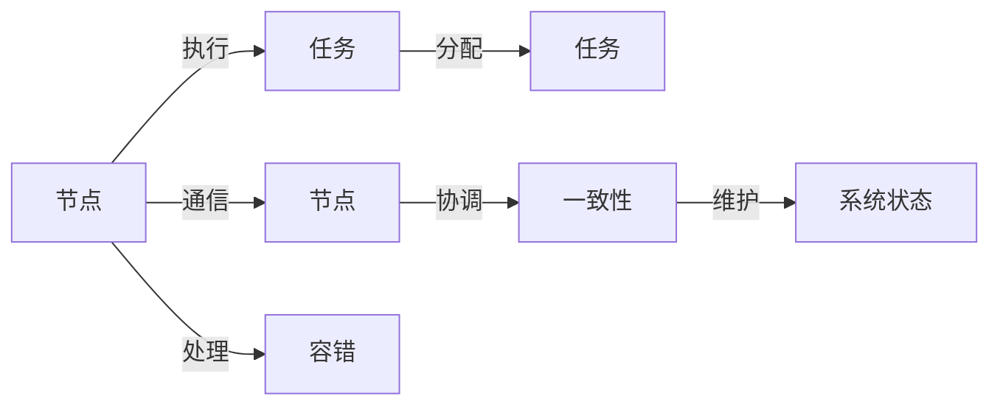

## 1. 背景介绍

随着互联网技术的飞速发展，数据量呈现爆炸性增长，传统的单机计算模式已经无法满足现代计算需求。分布式计算作为一种将计算任务分散到多个处理节点上的技术，有效地解决了这一问题。它不仅提高了计算效率，还增强了系统的可扩展性和容错性。本文将深入探讨分布式计算的原理，并通过代码实战案例，帮助读者更好地理解和应用这一技术。

## 2. 核心概念与联系

分布式计算涉及多个核心概念，包括节点、任务、通信、一致性和容错等。节点是分布式系统中的基本计算单元，任务是需要被执行的工作单元，通信是节点之间交换信息的方式，一致性保证了系统状态的一致，容错则确保系统能够应对部分故障。



## 3. 核心算法原理具体操作步骤

分布式计算中的核心算法包括MapReduce、Paxos、Raft等。以MapReduce为例，其操作步骤分为Map阶段和Reduce阶段。Map阶段对输入数据进行处理，生成中间键值对；Reduce阶段则对中间键值对进行归并操作，得到最终结果。

## 4. 数学模型和公式详细讲解举例说明

分布式计算中的数学模型通常涉及概率论和图论。例如，在分析网络通信模型时，我们可能会使用概率论来估计消息丢失的概率。图论则可以帮助我们理解节点之间的连接关系。

$$ P_{loss} = 1 - (1 - p)^n $$

其中，$P_{loss}$ 表示消息丢失的概率，$p$ 是单次传输失败的概率，$n$ 是重试的次数。

## 5. 项目实践：代码实例和详细解释说明

以一个简单的分布式计算项目为例，我们将实现一个分布式的词频统计程序。代码将使用Python编写，并利用消息队列进行节点间的通信。

```python
# Map函数
def map_function(document):
    word_counts = {}
    for word in document.split():
        word_counts[word] = word_counts.get(word, 0) + 1
    return word_counts

# Reduce函数
def reduce_function(word_counts_list):
    final_counts = {}
    for word_counts in word_counts_list:
        for word, count in word_counts.items():
            final_counts[word] = final_counts.get(word, 0) + count
    return final_counts
```

## 6. 实际应用场景

分布式计算在多个领域都有广泛应用，包括大数据分析、云计算、物联网、人工智能等。例如，在大数据分析中，分布式计算可以处理PB级别的数据集；在云计算中，它可以提供弹性伸缩的服务。

## 7. 工具和资源推荐

在分布式计算的实践中，有多种工具和资源可以使用，包括Hadoop、Spark、Kubernetes等。这些工具提供了丰富的功能，帮助开发者更高效地构建分布式系统。

## 8. 总结：未来发展趋势与挑战

分布式计算的未来发展趋势包括更高的计算效率、更强的容错能力和更好的用户体验。同时，它也面临着数据安全、隐私保护等挑战。

## 9. 附录：常见问题与解答

Q1: 分布式计算和并行计算有什么区别？
A1: 分布式计算强调的是计算任务在不同节点间的分散，而并行计算则侧重于同时执行多个计算任务以提高效率。

Q2: 如何保证分布式系统的一致性？
A2: 可以通过一致性算法如Paxos或Raft来保证分布式系统中各个节点的状态一致。

作者：禅与计算机程序设计艺术 / Zen and the Art of Computer Programming