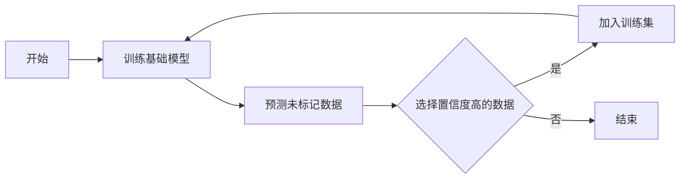

# 半监督学习 原理与代码实例讲解

## 1. 背景介绍
半监督学习是机器学习中的一种重要范式，它介于监督学习和无监督学习之间。在现实世界的数据收集过程中，我们往往能够获得大量的未标记数据，而标记数据则相对稀缺且成本高昂。半监督学习利用未标记数据来提高学习性能，是解决标记数据不足问题的有效方法。

## 2. 核心概念与联系
### 2.1 半监督学习定义
### 2.2 监督学习与半监督学习的比较
### 2.3 半监督学习的适用场景

## 3. 核心算法原理具体操作步骤
### 3.1 自训练（Self-training）
### 3.2 协同训练（Co-training）
### 3.3 图基方法（Graph-based Methods）
### 3.4 生成模型方法（Generative Models）

## 4. 数学模型和公式详细讲解举例说明
### 4.1 概率图模型
### 4.2 标签传播算法
### 4.3 高斯混合模型

## 5. 项目实践：代码实例和详细解释说明
### 5.1 数据准备
### 5.2 环境搭建
### 5.3 自训练算法实现
### 5.4 标签传播算法实现

## 6. 实际应用场景
### 6.1 图像识别
### 6.2 文本分类
### 6.3 生物信息学

## 7. 工具和资源推荐
### 7.1 开源库
### 7.2 数据集资源
### 7.3 学习资源

## 8. 总结：未来发展趋势与挑战
### 8.1 技术发展趋势
### 8.2 面临的挑战
### 8.3 研究方向

## 9. 附录：常见问题与解答
### 9.1 半监督学习的优缺点
### 9.2 如何选择半监督学习算法
### 9.3 半监督学习在小数据集上的表现

---

由于篇幅限制，以下是部分章节的内容示例：

## 1. 背景介绍
在机器学习领域，获取大量高质量的标记数据往往是一项耗时且昂贵的任务。然而，未标记的数据通常更容易获得。半监督学习（Semi-Supervised Learning, SSL）正是在这样的背景下应运而生，它旨在通过利用少量的标记数据和大量的未标记数据来构建更强大的学习模型。

## 2. 核心概念与联系
### 2.1 半监督学习定义
半监督学习是指使用少量标记数据和大量未标记数据进行模型训练的学习方法。它假设未标记数据中蕴含的分布信息可以辅助提高学习算法的性能。

### 2.2 监督学习与半监督学习的比较
监督学习依赖于大量的标记数据，而在半监督学习中，标记数据的数量通常很少。半监督学习的关键挑战在于如何有效地利用未标记数据的信息来提升模型的泛化能力。

### 2.3 半监督学习的适用场景
半监督学习适用于标记数据稀缺但未标记数据丰富的场景，例如，自然语言处理、图像识别和生物信息学等领域。

## 3. 核心算法原理具体操作步骤
### 3.1 自训练（Self-training）
自训练是一种简单的半监督学习方法，它首先使用标记数据训练一个基础模型，然后用该模型对未标记数据进行预测，选择预测置信度高的数据点加入训练集，迭代此过程。



## 5. 项目实践：代码实例和详细解释说明
### 5.1 数据准备
在进行半监督学习之前，我们需要准备标记数据和未标记数据。以下是一个简单的数据准备过程：

```python
from sklearn.datasets import make_classification

# 生成模拟数据
X, y = make_classification(n_samples=1000, n_features=20, n_informative=2, n_redundant=2, n_classes=2, random_state=42)

# 假设只有10%的数据是标记的
num_labeled = int(0.1 * len(y))
labeled_indices = np.random.choice(range(len(y)), num_labeled, replace=False)

X_labeled = X[labeled_indices]
y_labeled = y[labeled_indices]
X_unlabeled = np.delete(X, labeled_indices, axis=0)
```

### 5.3 自训练算法实现
以下是自训练算法的一个简单实现：

```python
from sklearn.svm import SVC

# 初始化分类器
classifier = SVC(probability=True)

# 训练基础模型
classifier.fit(X_labeled, y_labeled)

# 迭代自训练过程
for iteration in range(10):
    # 预测未标记数据的概率
    probs = classifier.predict_proba(X_unlabeled)
    # 选择最有信心的预测
    max_prob_indices = np.argmax(probs, axis=0)
    confident_samples = X_unlabeled[max_prob_indices]
    confident_labels = np.argmax(probs[max_prob_indices], axis=1)
    # 将这些样本加入训练集
    X_labeled = np.vstack((X_labeled, confident_samples))
    y_labeled = np.hstack((y_labeled, confident_labels))
    # 从未标记集中移除这些样本
    X_unlabeled = np.delete(X_unlabeled, max_prob_indices, axis=0)
    # 用新的训练集重新训练模型
    classifier.fit(X_labeled, y_labeled)
```

---

作者：禅与计算机程序设计艺术 / Zen and the Art of Computer Programming