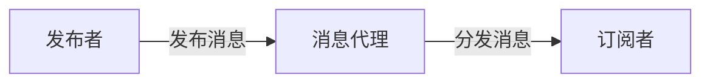

## 1. 背景介绍

在现代软件开发中，系统的解耦是提高代码质量和维护性的关键。发布-订阅模式（Pub/Sub）是一种广泛使用的消息通信模式，它通过消息的发布者和订阅者之间的松耦合来实现这一目标。在分布式系统、事件驱动架构和微服务架构中，Pub/Sub模式扮演着至关重要的角色。

## 2. 核心概念与联系

发布-订阅模式包含三个主要组件：发布者、订阅者和消息代理。发布者负责生成消息并将其发送到消息代理，而订阅者则表达对特定类型消息的兴趣，并从消息代理接收这些消息。消息代理负责存储消息并将其分发给订阅者。



## 3. 核心算法原理具体操作步骤

发布-订阅模式的核心算法涉及消息的发布、订阅管理、消息存储和消息分发四个步骤：

1. 发布者发布消息到消息代理。
2. 消息代理将消息存储在内部数据结构中。
3. 订阅者向消息代理注册其对特定类型消息的兴趣。
4. 消息代理根据订阅信息将消息分发给相应的订阅者。

## 4. 数学模型和公式详细讲解举例说明

在发布-订阅模式中，我们可以使用队列理论中的数学模型来描述消息在系统中的流动。例如，我们可以使用泊松过程来模拟消息的到达过程，使用指数分布来模拟消息服务时间。

$$
P_n(t) = \frac{(\lambda t)^n e^{-\lambda t}}{n!}
$$

其中，$P_n(t)$ 是在时间 $t$ 内有 $n$ 条消息到达的概率，$\lambda$ 是消息到达的平均率。

## 5. 项目实践：代码实例和详细解释说明

以下是一个简单的发布-订阅系统的Python代码实例：

```python
class PubSub:
    def __init__(self):
        self.subscribers = dict()

    def subscribe(self, message_type, handler):
        if message_type not in self.subscribers:
            self.subscribers[message_type] = []
        self.subscribers[message_type].append(handler)

    def publish(self, message_type, message):
        if message_type in self.subscribers:
            for handler in self.subscribers[message_type]:
                handler(message)

# 使用示例
pubsub = PubSub()

def print_message(message):
    print(f"Received message: {message}")

pubsub.subscribe('my_message', print_message)
pubsub.publish('my_message', 'Hello, World!')
```

在这个例子中，`PubSub` 类负责管理订阅者和分发消息。`subscribe` 方法用于注册消息处理器，`publish` 方法用于发布消息。

## 6. 实际应用场景

发布-订阅模式在多个领域都有广泛的应用，例如：

- 实时数据处理系统，如股票交易系统。
- 分布式事件驱动系统，如电子商务平台的订单处理。
- 微服务架构中的服务间通信。

## 7. 工具和资源推荐

- 消息队列服务：RabbitMQ, Apache Kafka, Amazon SNS/SQS。
- 分布式事件流平台：Apache Flink, Apache Storm。
- 监控和日志分析工具：Elasticsearch, Logstash, Kibana (ELK)。

## 8. 总结：未来发展趋势与挑战

发布-订阅模式将继续是分布式系统设计的核心。随着云计算和微服务架构的普及，对于更高效、更可靠的消息传递系统的需求将不断增长。未来的挑战包括提高系统的可扩展性、容错性和安全性。

## 9. 附录：常见问题与解答

Q1: 发布-订阅模式与观察者模式有何不同？
A1: 发布-订阅模式通过消息代理解耦了发布者和订阅者，而观察者模式通常是直接通信。

Q2: 如何保证消息的顺序性？
A2: 可以通过消息代理中的队列和主题的分区来保证消息的顺序性。

Q3: 如何处理消息的重复消费？
A3: 可以通过消息的唯一标识和幂等性处理来避免重复消费。

作者：禅与计算机程序设计艺术 / Zen and the Art of Computer Programming