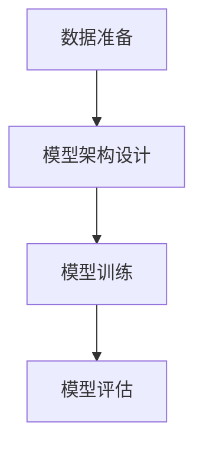

# 基于生成对抗网络的动漫人物绘画风格迁移

## 1.背景介绍

在当今数字艺术和娱乐产业中，动漫人物绘画风格的多样性和创新性是吸引观众的重要因素。传统的绘画风格迁移方法通常依赖于手工设计的特征和规则，耗时且效果有限。生成对抗网络（GANs）的出现为这一领域带来了革命性的变化。GANs通过对抗训练生成逼真的图像，使得风格迁移变得更加自动化和高效。

## 2.核心概念与联系

### 2.1 生成对抗网络（GANs）

生成对抗网络由两个主要部分组成：生成器（Generator）和判别器（Discriminator）。生成器的目标是生成逼真的图像，而判别器的目标是区分真实图像和生成图像。两者通过对抗训练不断提升各自的能力。

### 2.2 风格迁移

风格迁移是指将一种图像的风格应用到另一种图像上，同时保留原图像的内容。常见的应用包括将照片转换为绘画风格、将素描转换为彩色图像等。

### 2.3 动漫人物绘画风格

动漫人物绘画风格具有独特的视觉特征，如线条、色彩和纹理。通过GANs，可以实现不同动漫风格之间的迁移，如从手绘风格到数字风格，从简约风格到复杂风格等。

## 3.核心算法原理具体操作步骤

### 3.1 数据准备

首先，需要准备大量的动漫人物图像数据集。这些数据集应包含多种风格的图像，以便训练生成器和判别器。

### 3.2 模型架构设计

设计一个适合风格迁移任务的GAN架构。常见的选择是CycleGAN，它通过两个生成器和两个判别器实现双向风格迁移。

### 3.3 模型训练

使用对抗训练方法，生成器和判别器交替优化。生成器生成图像，判别器评估图像的真实性，二者通过损失函数不断提升性能。

### 3.4 模型评估

使用定量和定性指标评估模型性能。定量指标包括生成图像的质量和多样性，定性指标包括视觉效果和风格一致性。



## 4.数学模型和公式详细讲解举例说明

### 4.1 生成器和判别器的损失函数

生成器的目标是最小化生成图像与真实图像之间的差异，常用的损失函数是均方误差（MSE）：

$$
L_{G} = \mathbb{E}_{z \sim p_z(z)} [\log(1 - D(G(z)))]
$$

判别器的目标是最大化真实图像和生成图像之间的差异，常用的损失函数是交叉熵损失：

$$
L_{D} = \mathbb{E}_{x \sim p_{data}(x)} [\log D(x)] + \mathbb{E}_{z \sim p_z(z)} [\log(1 - D(G(z)))]
$$

### 4.2 CycleGAN的循环一致性损失

为了确保风格迁移的稳定性，CycleGAN引入了循环一致性损失：

$$
L_{cyc}(G, F) = \mathbb{E}_{x \sim p_{data}(x)} [||F(G(x)) - x||_1] + \mathbb{E}_{y \sim p_{data}(y)} [||G(F(y)) - y||_1]
$$

## 5.项目实践：代码实例和详细解释说明

### 5.1 环境配置

首先，确保安装了必要的库，如TensorFlow或PyTorch。

```bash
pip install tensorflow
pip install matplotlib
```

### 5.2 数据加载

加载动漫人物图像数据集，并进行预处理。

```python
import tensorflow as tf
from tensorflow.keras.preprocessing.image import ImageDataGenerator

datagen = ImageDataGenerator(rescale=1./255)
train_data = datagen.flow_from_directory('path_to_dataset', target_size=(256, 256), batch_size=32, class_mode=None)
```

### 5.3 模型定义

定义生成器和判别器模型。

```python
from tensorflow.keras.layers import Conv2D, UpSampling2D, Input
from tensorflow.keras.models import Model

def build_generator():
    inputs = Input(shape=(256, 256, 3))
    x = Conv2D(64, (3, 3), padding='same', activation='relu')(inputs)
    x = UpSampling2D((2, 2))(x)
    outputs = Conv2D(3, (3, 3), padding='same', activation='tanh')(x)
    return Model(inputs, outputs)

def build_discriminator():
    inputs = Input(shape=(256, 256, 3))
    x = Conv2D(64, (3, 3), padding='same', activation='relu')(inputs)
    outputs = Conv2D(1, (3, 3), padding='same', activation='sigmoid')(x)
    return Model(inputs, outputs)
```

### 5.4 模型训练

使用对抗训练方法训练模型。

```python
generator = build_generator()
discriminator = build_discriminator()

generator.compile(optimizer='adam', loss='binary_crossentropy')
discriminator.compile(optimizer='adam', loss='binary_crossentropy')

for epoch in range(epochs):
    for batch in train_data:
        generated_images = generator.predict(batch)
        real_labels = tf.ones((batch_size, 1))
        fake_labels = tf.zeros((batch_size, 1))
        
        d_loss_real = discriminator.train_on_batch(batch, real_labels)
        d_loss_fake = discriminator.train_on_batch(generated_images, fake_labels)
        
        g_loss = generator.train_on_batch(batch, real_labels)
        
        print(f'Epoch: {epoch}, D Loss: {d_loss_real + d_loss_fake}, G Loss: {g_loss}')
```

## 6.实际应用场景

### 6.1 动漫制作

通过风格迁移技术，可以将手绘草图快速转换为高质量的数字图像，极大地提高了动漫制作的效率。

### 6.2 游戏开发

在游戏开发中，风格迁移可以用于生成不同风格的游戏角色和场景，增加游戏的视觉多样性。

### 6.3 数字艺术

数字艺术家可以利用风格迁移技术，将自己的作品转换为不同的艺术风格，探索更多的创作可能性。

## 7.工具和资源推荐

### 7.1 开源框架

- TensorFlow
- PyTorch

### 7.2 数据集

- Anime Faces Dataset
- Getchu Dataset

### 7.3 在线资源

- GitHub上的开源项目
- 相关的技术博客和论文

## 8.总结：未来发展趋势与挑战

### 8.1 未来发展趋势

随着深度学习技术的不断进步，风格迁移的效果将越来越逼真，应用场景也将更加广泛。未来，可能会出现更加智能和自动化的风格迁移工具，进一步降低创作门槛。

### 8.2 挑战

尽管风格迁移技术已经取得了显著进展，但仍然面临一些挑战，如生成图像的质量和多样性、训练过程的稳定性等。此外，如何在保持风格一致性的同时，保留更多的原始内容信息，也是一个值得研究的问题。

## 9.附录：常见问题与解答

### 9.1 如何选择合适的数据集？

选择数据集时，应考虑数据集的多样性和质量。多样性可以提高模型的泛化能力，质量则直接影响生成图像的效果。

### 9.2 如何提高生成图像的质量？

可以通过调整模型架构、优化损失函数、增加训练数据等方法来提高生成图像的质量。此外，使用预训练模型和迁移学习也是有效的策略。

### 9.3 如何解决训练过程中的不稳定性？

训练过程中的不稳定性可以通过调整学习率、使用梯度惩罚、增加正则化等方法来解决。此外，使用更稳定的GAN变体，如WGAN-GP，也是一种有效的解决方案。

---

作者：禅与计算机程序设计艺术 / Zen and the Art of Computer Programming