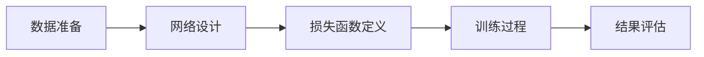

# 基于生成对抗网络的图像风格迁移在教育中的应用模式

## 1. 背景介绍
随着人工智能技术的飞速发展，生成对抗网络（GANs）已经成为了图像处理领域的一项革命性技术。图像风格迁移作为GANs的一个重要应用，能够将一种图像风格转移到另一张图像上，创造出独特且富有创意的视觉效果。在教育领域，这项技术不仅能够激发学生的创造力，还能够帮助教师制作更具吸引力的教学材料，从而提高教学效果。

## 2. 核心概念与联系
生成对抗网络（GANs）由生成器（Generator）和判别器（Discriminator）两部分组成。生成器负责生成图像，而判别器则负责判断图像是否为真实图像。在图像风格迁移中，生成器学习目标风格并将其应用到内容图像上，判别器则确保生成的图像既保留了内容图像的结构，又具有目标风格的特征。

## 3. 核心算法原理具体操作步骤
图像风格迁移的核心算法原理是通过训练GANs学习风格图像的特征，并将这些特征应用到内容图像上。操作步骤通常包括：数据准备、网络设计、损失函数定义、训练过程和结果评估。



## 4. 数学模型和公式详细讲解举例说明
GANs的核心数学模型是一个零和博弈，其中生成器和判别器互相竞争。生成器的目标是最小化与真实图像之间的差异，而判别器的目标是最大化其识别真假图像的能力。数学公式可以表示为：

$$
\min_{G}\max_{D}V(D, G) = \mathbb{E}_{x\sim p_{data}(x)}[\log D(x)] + \mathbb{E}_{z\sim p_{z}(z)}[\log(1 - D(G(z)))]
$$

其中，$G$ 表示生成器，$D$ 表示判别器，$p_{data}$ 是真实图像的分布，$p_{z}$ 是生成器输入的噪声分布。

## 5. 项目实践：代码实例和详细解释说明
在项目实践中，我们通常使用Python和深度学习框架如TensorFlow或PyTorch来实现GANs。以下是一个简单的代码示例，展示了如何构建一个风格迁移模型：

```python
# 伪代码示例
import tensorflow as tf

# 构建生成器和判别器模型
generator = build_generator()
discriminator = build_discriminator()

# 定义损失函数和优化器
g_loss = generator_loss(discriminator(generator(input_noise)))
d_loss = discriminator_loss(discriminator(real_image), discriminator(generator(input_noise)))

g_optimizer = tf.optimizers.Adam(learning_rate)
d_optimizer = tf.optimizers.Adam(learning_rate)

# 训练循环
for epoch in range(epochs):
    for real_image in dataset:
        # 训练判别器
        with tf.GradientTape() as tape:
            loss = d_loss
        gradients = tape.gradient(loss, discriminator.trainable_variables)
        d_optimizer.apply_gradients(zip(gradients, discriminator.trainable_variables))
        
        # 训练生成器
        with tf.GradientTape() as tape:
            loss = g_loss
        gradients = tape.gradient(loss, generator.trainable_variables)
        g_optimizer.apply_gradients(zip(gradients, generator.trainable_variables))
```

## 6. 实际应用场景
在教育领域，图像风格迁移可以用于创造有趣的教学内容，例如将历史人物的肖像转换成不同的艺术风格，或者将抽象的科学概念以更直观的形式展现给学生。

## 7. 工具和资源推荐
对于想要深入学习和实践图像风格迁移的读者，推荐以下工具和资源：
- TensorFlow和PyTorch：两个主流的深度学习框架，提供了丰富的API和社区支持。
- DeepArt.io和Prisma：两个在线图像风格迁移服务，可以快速体验风格迁移效果。
- "Deep Learning" by Ian Goodfellow, Yoshua Bengio, and Aaron Courville：深度学习领域的经典书籍，详细介绍了GANs的原理和应用。

## 8. 总结：未来发展趋势与挑战
图像风格迁移技术仍在不断进步，未来的发展趋势可能包括更高的图像质量、更快的处理速度和更广泛的应用场景。同时，技术的普及也带来了挑战，例如版权问题、伦理问题和技术滥用的风险。

## 9. 附录：常见问题与解答
Q1: 图像风格迁移是否会损害原始图像的版权？
A1: 风格迁移作为一种创造性的表达，可能会涉及版权问题。使用时应尊重原始作品的版权，并在必要时获取授权。

Q2: GANs在训练时是否容易出现不稳定？
A2: 是的，GANs在训练时可能会出现模式崩溃等不稳定现象，需要通过调整网络结构和参数来优化。

作者：禅与计算机程序设计艺术 / Zen and the Art of Computer Programming