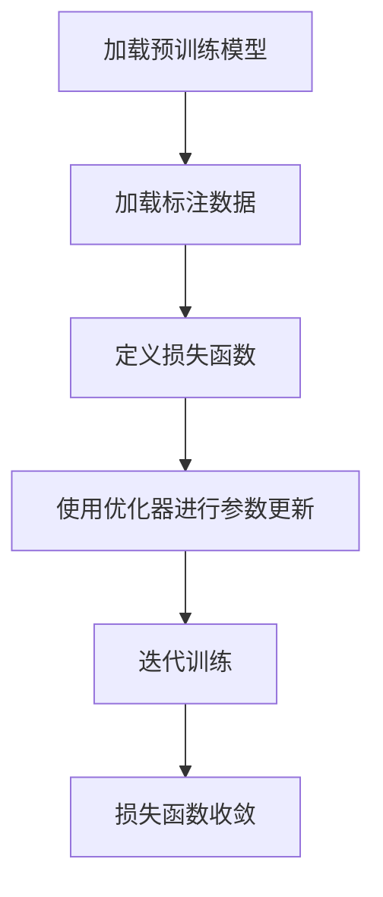
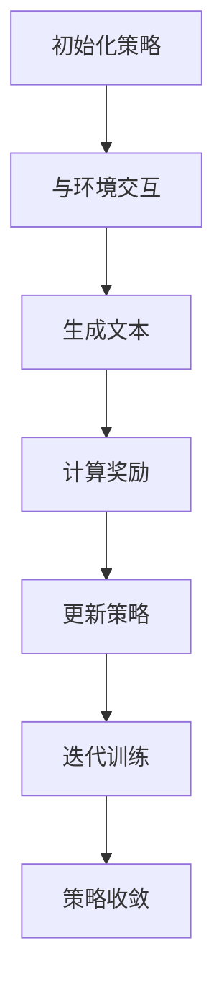

# 大规模语言模型从理论到实践 SFT模型和RL模型评估

## 1.背景介绍

大规模语言模型（Large Language Models, LLMs）近年来在自然语言处理（NLP）领域取得了显著的进展。通过训练海量数据，这些模型能够生成高质量的文本，完成各种复杂的语言任务。本文将深入探讨两种主要的模型评估方法：监督微调（Supervised Fine-Tuning, SFT）和强化学习（Reinforcement Learning, RL），并对其理论基础、算法原理、实际应用和未来发展进行详细分析。

## 2.核心概念与联系

### 2.1 大规模语言模型

大规模语言模型是基于深度学习的模型，通常使用数十亿甚至数百亿参数进行训练。它们能够理解和生成自然语言文本，广泛应用于机器翻译、文本生成、问答系统等领域。

### 2.2 监督微调（SFT）

监督微调是一种通过标注数据对预训练模型进行进一步训练的方法。其目标是使模型在特定任务上表现更好。SFT的核心在于利用已有的标注数据对模型进行微调，从而提升其在特定任务上的性能。

### 2.3 强化学习（RL）

强化学习是一种通过与环境交互来学习策略的机器学习方法。RL模型通过试错法不断优化策略，以最大化累积奖励。在语言模型中，RL可以用于优化生成文本的质量，使其更符合预期目标。

### 2.4 SFT与RL的联系

SFT和RL都是对预训练模型进行优化的方法，但它们的优化目标和方法不同。SFT依赖于标注数据，而RL则通过与环境交互进行优化。两者可以结合使用，以达到更好的模型性能。

## 3.核心算法原理具体操作步骤

### 3.1 监督微调（SFT）

#### 3.1.1 数据准备

首先，需要准备高质量的标注数据。这些数据通常包括输入文本和对应的目标输出。

#### 3.1.2 模型初始化

使用预训练的语言模型作为基础模型。常见的预训练模型包括GPT-3、BERT等。

#### 3.1.3 微调过程

通过标注数据对模型进行微调。具体步骤如下：

1. 加载预训练模型。
2. 加载标注数据。
3. 定义损失函数（如交叉熵损失）。
4. 使用优化器（如Adam）进行参数更新。
5. 迭代训练，直到损失函数收敛。



### 3.2 强化学习（RL）

#### 3.2.1 环境定义

定义模型与之交互的环境。环境可以是一个模拟器，也可以是实际应用场景。

#### 3.2.2 奖励函数设计

设计奖励函数，以指导模型优化策略。奖励函数应能准确反映模型生成文本的质量。

#### 3.2.3 策略优化

通过试错法不断优化策略。具体步骤如下：

1. 初始化策略。
2. 与环境交互，生成文本。
3. 计算奖励。
4. 更新策略。
5. 迭代训练，直到策略收敛。



## 4.数学模型和公式详细讲解举例说明

### 4.1 监督微调（SFT）

在SFT中，目标是最小化损失函数。常用的损失函数是交叉熵损失，其定义如下：

$$
L(\theta) = -\sum_{i=1}^{N} y_i \log(\hat{y}_i)
$$

其中，$y_i$ 是真实标签，$\hat{y}_i$ 是模型预测的概率，$\theta$ 是模型参数。

### 4.2 强化学习（RL）

在RL中，目标是最大化累积奖励。常用的优化方法是策略梯度法，其目标函数定义如下：

$$
J(\theta) = \mathbb{E}_{\tau \sim \pi_\theta} \left[ \sum_{t=0}^{T} r_t \right]
$$

其中，$\tau$ 是轨迹，$\pi_\theta$ 是策略，$r_t$ 是时间步$t$的奖励。

策略梯度的更新公式为：

$$
\nabla_\theta J(\theta) = \mathbb{E}_{\tau \sim \pi_\theta} \left[ \sum_{t=0}^{T} \nabla_\theta \log \pi_\theta(a_t|s_t) R(\tau) \right]
$$

其中，$a_t$ 是时间步$t$的动作，$s_t$ 是时间步$t$的状态，$R(\tau)$ 是轨迹$\tau$的累积奖励。

## 5.项目实践：代码实例和详细解释说明

### 5.1 监督微调（SFT）代码实例

以下是一个使用PyTorch进行监督微调的示例代码：

```python
import torch
import torch.nn as nn
import torch.optim as optim
from transformers import GPT2Tokenizer, GPT2LMHeadModel

# 加载预训练模型和标注数据
tokenizer = GPT2Tokenizer.from_pretrained('gpt2')
model = GPT2LMHeadModel.from_pretrained('gpt2')
data = [("输入文本1", "目标输出1"), ("输入文本2", "目标输出2")]

# 定义损失函数和优化器
criterion = nn.CrossEntropyLoss()
optimizer = optim.Adam(model.parameters(), lr=1e-5)

# 微调过程
for epoch in range(10):
    for input_text, target_text in data:
        inputs = tokenizer(input_text, return_tensors='pt')
        targets = tokenizer(target_text, return_tensors='pt').input_ids
        outputs = model(**inputs, labels=targets)
        loss = outputs.loss
        optimizer.zero_grad()
        loss.backward()
        optimizer.step()
    print(f"Epoch {epoch+1}, Loss: {loss.item()}")
```

### 5.2 强化学习（RL）代码实例

以下是一个使用PyTorch进行强化学习的示例代码：

```python
import torch
import torch.nn as nn
import torch.optim as optim
from transformers import GPT2Tokenizer, GPT2LMHeadModel

# 定义环境和奖励函数
class TextGenerationEnv:
    def __init__(self, model, tokenizer):
        self.model = model
        self.tokenizer = tokenizer

    def step(self, input_text):
        inputs = self.tokenizer(input_text, return_tensors='pt')
        outputs = self.model.generate(**inputs, max_length=50)
        generated_text = self.tokenizer.decode(outputs[0], skip_special_tokens=True)
        reward = self.calculate_reward(generated_text)
        return generated_text, reward

    def calculate_reward(self, generated_text):
        # 自定义奖励函数
        return len(generated_text.split())

# 初始化模型和环境
tokenizer = GPT2Tokenizer.from_pretrained('gpt2')
model = GPT2LMHeadModel.from_pretrained('gpt2')
env = TextGenerationEnv(model, tokenizer)

# 定义策略和优化器
class Policy(nn.Module):
    def __init__(self, model):
        super(Policy, self).__init__()
        self.model = model

    def forward(self, input_text):
        inputs = tokenizer(input_text, return_tensors='pt')
        outputs = self.model.generate(**inputs, max_length=50)
        return outputs

policy = Policy(model)
optimizer = optim.Adam(policy.parameters(), lr=1e-5)

# 强化学习过程
for epoch in range(10):
    input_text = "输入文本"
    generated_text, reward = env.step(input_text)
    loss = -reward  # 负奖励作为损失
    optimizer.zero_grad()
    loss.backward()
    optimizer.step()
    print(f"Epoch {epoch+1}, Reward: {reward}")
```

## 6.实际应用场景

### 6.1 监督微调（SFT）应用场景

1. **机器翻译**：通过标注的平行语料对预训练模型进行微调，提高翻译质量。
2. **文本分类**：利用标注的分类数据对模型进行微调，提升分类准确率。
3. **问答系统**：通过标注的问答对进行微调，增强模型的问答能力。

### 6.2 强化学习（RL）应用场景

1. **对话系统**：通过与用户的交互不断优化对话策略，提高对话质量。
2. **文本生成**：通过奖励函数优化生成文本的连贯性和可读性。
3. **推荐系统**：通过用户反馈优化推荐策略，提高推荐准确率。

## 7.工具和资源推荐

### 7.1 工具

1. **PyTorch**：一个开源的深度学习框架，广泛用于NLP任务。
2. **Transformers**：由Hugging Face提供的预训练模型库，支持多种语言模型。
3. **TensorFlow**：另一个流行的深度学习框架，适用于大规模模型训练。

### 7.2 资源

1. **论文**：阅读相关领域的最新研究论文，如《Attention is All You Need》、《BERT: Pre-training of Deep Bidirectional Transformers for Language Understanding》等。
2. **开源项目**：参与和学习开源项目，如Hugging Face的Transformers库。
3. **在线课程**：参加NLP和深度学习相关的在线课程，如Coursera、edX等平台提供的课程。

## 8.总结：未来发展趋势与挑战

### 8.1 未来发展趋势

1. **多模态学习**：结合文本、图像、音频等多种模态的数据进行训练，提升模型的综合能力。
2. **自监督学习**：通过自监督学习方法，减少对标注数据的依赖，提高模型的泛化能力。
3. **模型压缩**：通过模型压缩技术，降低大规模语言模型的计算和存储成本，使其更易于部署和应用。

### 8.2 挑战

1. **数据隐私**：在训练大规模语言模型时，如何保护用户数据隐私是一个重要挑战。
2. **模型偏见**：大规模语言模型可能会继承训练数据中的偏见，如何消除这些偏见是一个亟待解决的问题。
3. **计算资源**：训练和部署大规模语言模型需要大量的计算资源，如何高效利用资源是一个重要课题。

## 9.附录：常见问题与解答

### 9.1 监督微调（SFT）常见问题

**Q1：如何选择标注数据？**

A1：选择与目标任务相关的高质量标注数据，数据量越大越好。

**Q2：微调过程中如何避免过拟合？**

A2：可以使用正则化技术、早停法和数据增强等方法来避免过拟合。

### 9.2 强化学习（RL）常见问题

**Q1：如何设计奖励函数？**

A1：奖励函数应能准确反映模型生成文本的质量，可以结合多种评价指标进行设计。

**Q2：强化学习过程中的探索与利用如何平衡？**

A2：可以使用ε-贪心策略、UCB算法等方法来平衡探索与利用。

---

作者：禅与计算机程序设计艺术 / Zen and the Art of Computer Programming