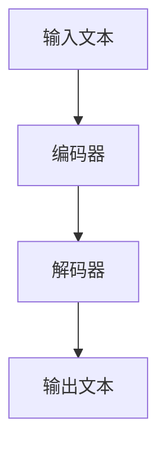

# 大语言模型原理与工程实践：C4

## 1.背景介绍

大语言模型（Large Language Models, LLMs）是近年来人工智能领域的一个重要突破。它们通过处理和生成自然语言文本，展示了前所未有的能力。C4（Colossal Clean Crawled Corpus）是一个用于训练大语言模型的重要数据集。本文将深入探讨大语言模型的原理与工程实践，特别是C4数据集的应用。

### 1.1 大语言模型的兴起

大语言模型的兴起可以追溯到Transformer架构的提出。自从Vaswani等人在2017年提出Transformer以来，基于这一架构的模型如BERT、GPT-3等在自然语言处理（NLP）任务中取得了显著的进展。

### 1.2 C4数据集的背景

C4数据集是由Google Research团队创建的一个大规模、干净的网页文本数据集。它是为了训练T5（Text-To-Text Transfer Transformer）模型而设计的。C4数据集的创建旨在提供一个高质量的文本语料库，以便更好地训练和评估大语言模型。

### 1.3 文章结构

本文将从以下几个方面详细探讨大语言模型的原理与工程实践：
1. 核心概念与联系
2. 核心算法原理具体操作步骤
3. 数学模型和公式详细讲解举例说明
4. 项目实践：代码实例和详细解释说明
5. 实际应用场景
6. 工具和资源推荐
7. 总结：未来发展趋势与挑战
8. 附录：常见问题与解答

## 2.核心概念与联系

### 2.1 Transformer架构

Transformer架构是大语言模型的基础。它通过自注意力机制（Self-Attention Mechanism）来捕捉文本中的长距离依赖关系。Transformer由编码器（Encoder）和解码器（Decoder）组成，每个编码器和解码器包含多个层，每层包括多头自注意力机制和前馈神经网络。



### 2.2 自注意力机制

自注意力机制是Transformer的核心。它通过计算输入序列中每个位置的注意力权重，来捕捉序列中不同位置之间的关系。具体来说，自注意力机制通过以下步骤实现：

1. 计算查询（Query）、键（Key）和值（Value）矩阵。
2. 计算查询和键的点积，并除以缩放因子。
3. 对点积结果进行Softmax操作，得到注意力权重。
4. 将注意力权重与值矩阵相乘，得到最终的输出。

### 2.3 C4数据集

C4数据集是一个大规模的网页文本数据集，包含数百亿个单词。它通过从Common Crawl数据集中提取网页文本，并进行清洗和过滤，去除低质量和重复的内容。C4数据集的创建过程包括以下步骤：

1. 数据收集：从Common Crawl数据集中提取网页文本。
2. 数据清洗：去除HTML标签、广告和其他噪音。
3. 数据过滤：去除低质量和重复的内容。
4. 数据分割：将数据集划分为训练集、验证集和测试集。

## 3.核心算法原理具体操作步骤

### 3.1 数据预处理

在训练大语言模型之前，需要对数据进行预处理。数据预处理的步骤包括：

1. 分词：将文本分割成单词或子词。
2. 编码：将单词或子词转换为向量表示。
3. 序列化：将向量表示转换为固定长度的序列。

### 3.2 模型训练

模型训练是大语言模型的核心步骤。训练过程包括以下步骤：

1. 初始化模型参数：随机初始化模型的权重和偏置。
2. 前向传播：将输入序列通过模型，计算输出序列。
3. 计算损失：比较输出序列和目标序列，计算损失函数。
4. 反向传播：计算损失函数对模型参数的梯度。
5. 更新参数：使用梯度下降算法更新模型参数。

### 3.3 模型评估

模型评估是验证模型性能的重要步骤。评估过程包括以下步骤：

1. 选择评估指标：如准确率、精确率、召回率和F1分数。
2. 计算评估指标：在验证集和测试集上计算评估指标。
3. 比较模型性能：比较不同模型的评估指标，选择最佳模型。

## 4.数学模型和公式详细讲解举例说明

### 4.1 自注意力机制的数学公式

自注意力机制的数学公式如下：

$$
\text{Attention}(Q, K, V) = \text{softmax}\left(\frac{QK^T}{\sqrt{d_k}}\right)V
$$

其中，$Q$ 是查询矩阵，$K$ 是键矩阵，$V$ 是值矩阵，$d_k$ 是键的维度。

### 4.2 损失函数

大语言模型常用的损失函数是交叉熵损失函数。交叉熵损失函数的公式如下：

$$
L = -\sum_{i=1}^{N} y_i \log(\hat{y}_i)
$$

其中，$N$ 是样本数量，$y_i$ 是第 $i$ 个样本的真实标签，$\hat{y}_i$ 是第 $i$ 个样本的预测概率。

### 4.3 梯度下降算法

梯度下降算法是优化模型参数的常用方法。梯度下降算法的更新公式如下：

$$
\theta = \theta - \eta \nabla_\theta L
$$

其中，$\theta$ 是模型参数，$\eta$ 是学习率，$\nabla_\theta L$ 是损失函数对模型参数的梯度。

## 5.项目实践：代码实例和详细解释说明

### 5.1 数据预处理代码示例

以下是一个简单的数据预处理代码示例，使用Python和NLTK库进行分词和编码：

```python
import nltk
from nltk.tokenize import word_tokenize
from sklearn.preprocessing import LabelEncoder

# 下载NLTK数据
nltk.download('punkt')

# 示例文本
text = "大语言模型是人工智能领域的重要突破。"

# 分词
tokens = word_tokenize(text)

# 编码
encoder = LabelEncoder()
encoded_tokens = encoder.fit_transform(tokens)

print("分词结果:", tokens)
print("编码结果:", encoded_tokens)
```

### 5.2 模型训练代码示例

以下是一个简单的模型训练代码示例，使用TensorFlow和Keras库训练一个Transformer模型：

```python
import tensorflow as tf
from tensorflow.keras.layers import Input, Dense, Embedding, MultiHeadAttention, LayerNormalization, Dropout
from tensorflow.keras.models import Model

# 超参数
vocab_size = 10000
max_len = 100
embed_dim = 128
num_heads = 8
ff_dim = 512
num_layers = 4

# 输入层
inputs = Input(shape=(max_len,))

# 嵌入层
embedding = Embedding(input_dim=vocab_size, output_dim=embed_dim)(inputs)

# Transformer编码器层
x = embedding
for _ in range(num_layers):
    x = MultiHeadAttention(num_heads=num_heads, key_dim=embed_dim)(x, x)
    x = LayerNormalization(epsilon=1e-6)(x)
    x = Dense(ff_dim, activation='relu')(x)
    x = Dense(embed_dim)(x)
    x = LayerNormalization(epsilon=1e-6)(x)

# 输出层
outputs = Dense(vocab_size, activation='softmax')(x)

# 构建模型
model = Model(inputs=inputs, outputs=outputs)

# 编译模型
model.compile(optimizer='adam', loss='sparse_categorical_crossentropy', metrics=['accuracy'])

# 打印模型摘要
model.summary()
```

### 5.3 模型评估代码示例

以下是一个简单的模型评估代码示例，使用TensorFlow和Keras库评估模型性能：

```python
# 加载数据集
(x_train, y_train), (x_val, y_val) = tf.keras.datasets.imdb.load_data(num_words=vocab_size)

# 数据预处理
x_train = tf.keras.preprocessing.sequence.pad_sequences(x_train, maxlen=max_len)
x_val = tf.keras.preprocessing.sequence.pad_sequences(x_val, maxlen=max_len)

# 训练模型
model.fit(x_train, y_train, epochs=10, batch_size=32, validation_data=(x_val, y_val))

# 评估模型
loss, accuracy = model.evaluate(x_val, y_val)
print("验证集损失:", loss)
print("验证集准确率:", accuracy)
```

## 6.实际应用场景

### 6.1 机器翻译

大语言模型在机器翻译任务中表现出色。通过训练大规模的双语数据集，模型可以自动将一种语言的文本翻译成另一种语言。

### 6.2 文本生成

大语言模型可以用于生成高质量的文本。例如，GPT-3可以生成新闻文章、故事和诗歌等。

### 6.3 问答系统

大语言模型可以用于构建智能问答系统。通过训练大量的问答对，模型可以自动回答用户的问题。

### 6.4 情感分析

大语言模型可以用于情感分析任务。通过训练带有情感标签的数据集，模型可以自动识别文本的情感倾向。

## 7.工具和资源推荐

### 7.1 TensorFlow

TensorFlow是一个开源的机器学习框架，广泛用于训练和部署大语言模型。它提供了丰富的API和工具，支持分布式训练和模型优化。

### 7.2 PyTorch

PyTorch是另一个流行的开源机器学习框架，具有灵活的动态计算图和强大的GPU加速能力。它在研究和工业界都得到了广泛应用。

### 7.3 Hugging Face Transformers

Hugging Face Transformers是一个开源的NLP库，提供了大量预训练的大语言模型和易于使用的API。它支持多种框架，如TensorFlow和PyTorch。

### 7.4 Common Crawl

Common Crawl是一个开源的网页数据集，包含大量的网页文本。C4数据集就是从Common Crawl数据集中提取和清洗而来的。

## 8.总结：未来发展趋势与挑战

### 8.1 未来发展趋势

大语言模型在未来有望继续发展，主要趋势包括：

1. 更大规模的模型：随着计算能力的提升，未来的大语言模型将更加庞大，能够处理更复杂的任务。
2. 多模态模型：未来的模型将不仅限于文本，还将处理图像、音频等多种模态的数据。
3. 更高效的训练方法：研究人员将继续探索更高效的训练方法，以减少训练时间和资源消耗。

### 8.2 挑战

尽管大语言模型取得了显著的进展，但仍面临一些挑战：

1. 数据隐私：大规模数据集的使用可能涉及用户隐私问题，需要采取措施保护数据隐私。
2. 模型偏见：大语言模型可能会学习到数据中的偏见，需要开发方法来检测和消除这些偏见。
3. 计算资源：训练大语言模型需要大量的计算资源，如何高效利用资源是一个重要挑战。

## 9.附录：常见问题与解答

### 9.1 什么是大语言模型？

大语言模型是通过训练大规模文本数据集，能够生成和理解自然语言文本的模型。它们通常基于Transformer架构，具有强大的语言处理能力。

### 9.2 什么是C4数据集？

C4数据集是一个大规模、干净的网页文本数据集，由Google Research团队创建。它用于训练和评估大语言模型，如T5。

### 9.3 如何训练大语言模型？

训练大语言模型包括数据预处理、模型训练和模型评估等步骤。常用的框架有TensorFlow和PyTorch。

### 9.4 大语言模型有哪些应用场景？

大语言模型可以应用于机器翻译、文本生成、问答系统和情感分析等任务。

### 9.5 大语言模型面临哪些挑战？

大语言模型面临数据隐私、模型偏见和计算资源等挑战。研究人员需要开发方法来应对这些挑战。

---

作者：禅与计算机程序设计艺术 / Zen and the Art of Computer Programming