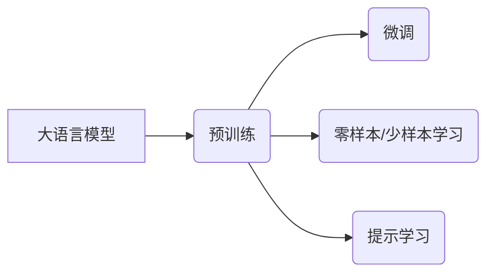

# 大语言模型原理与工程实践：主流评测数据集及基准

## 1. 背景介绍
### 1.1 大语言模型的兴起与发展
近年来,随着深度学习技术的不断进步,自然语言处理(NLP)领域取得了突破性的进展。大语言模型(Large Language Model,LLM)作为NLP的重要分支,在各类语言任务中展现出了强大的性能,受到了学术界和工业界的广泛关注。从ELMo、BERT到GPT系列模型,LLM的参数规模和性能不断刷新记录,推动了NLP技术的快速发展。

### 1.2 评测数据集和基准的重要性
LLM的快速发展离不开评测数据集和基准的支撑。高质量的评测数据集为模型提供了训练和测试的样本,而统一的评测基准则为不同模型的性能比较提供了客观的标准。评测数据集和基准的建立,不仅推动了LLM的技术进步,也为NLP下游任务的应用落地奠定了基础。

### 1.3 本文的主要内容
本文将围绕大语言模型的评测数据集和基准展开讨论。首先,我们将介绍LLM中的核心概念,并阐述它们之间的联系。接着,重点介绍主流的评测数据集,包括它们的来源、规模、特点等。然后,我们将探讨评测基准的设计原则和具体指标。此外,文章还将通过实践案例,展示如何使用代码进行LLM的评测。最后,对LLM评测的发展趋势和面临的挑战进行展望。

## 2. 核心概念与联系
### 2.1 大语言模型(LLM)
大语言模型是以自然语言为建模对象,通过海量文本数据训练得到的语言模型。它能够学习到语言的统计规律和语义信息,具备强大的语言理解和生成能力。LLM通常采用Transformer等神经网络结构,参数规模可达数亿甚至上千亿。代表模型有BERT、GPT-3、PaLM等。

### 2.2 预训练(Pre-training)
预训练是LLM的关键技术之一。它在大规模无标注语料上进行自监督学习,让模型自主学习语言的内在规律。常见的预训练任务包括语言模型、掩码语言模型(MLM)、下一句预测(NSP)等。预训练使得LLM能够学到通用的语言表示,为下游任务提供了良好的初始化。

### 2.3 微调(Fine-tuning) 
微调是将预训练好的LLM应用到具体任务中的过程。通过在下游任务的标注数据上进行监督学习,LLM可以快速适应特定领域,实现端到端的任务求解。微调大大降低了任务的训练成本,提高了模型的泛化能力。

### 2.4 零样本/少样本学习(Zero-shot/Few-shot Learning)
得益于强大的语言理解能力,LLM展现出了优异的零样本和少样本学习能力。零样本学习指模型无需在下游任务上进行微调,直接根据任务描述进行推理。少样本学习则利用少量示例来指导模型完成任务。这极大拓展了LLM的应用范围。

### 2.5 提示学习(Prompt Learning)
提示学习是一种新兴的LLM使用范式。通过设计精巧的提示模板,引导LLM进行任务求解。提示学习将任务转化为语言填空或问答形式,充分发挥了LLM在语言理解和生成方面的优势。代表方法有PET、GPT-3的In-context Learning等。

以下是上述核心概念之间的联系:



## 3. 主流评测数据集
### 3.1 通用语言理解评测(GLUE)
GLUE是一个多任务基准测试,包含9个自然语言理解任务,涵盖了分类、蕴含、相似度判断等多个方面。其中包括语义相似度任务(MRPC、QQP、STS-B)、自然语言推理任务(MNLI、QNLI、RTE)、语言可接受性判断任务(CoLA)等。GLUE的发布推动了LLM在通用NLU任务上的评测与进步。

### 3.2 斯坦福问答数据集(SQuAD)
SQuAD是一个大规模的阅读理解数据集,包含10万个问题和对应的维基百科文章。模型需要根据给定的文章段落,回答相关的问题。SQuAD 2.0进一步引入了未知答案的问题,增加了任务难度。SQuAD已成为LLM阅读理解能力评估的重要基准。

### 3.3 故事完形填空(Story Cloze Test)
Story Cloze Test旨在评测模型对于故事因果理解和逻辑推理的能力。数据集包含数千个五句话的小故事,其中前四句为背景,第五句有两个候选。模型需要根据故事背景,选出最合理的结尾。这一任务考察了LLM在长文本理解和常识推理方面的性能。

### 3.4 Winograd模式挑战(Winograd Schema Challenge)
Winograd模式挑战聚焦于指代消解和常识推理。每个样本包含一个句子和一个问题,句子中存在指代歧义,问题则需要判断指代对象。Winograd模式需要模型结合语境和常识进行推理,是评估LLM语言理解能力的重要任务之一。

### 3.5 SuperGLUE基准
SuperGLUE是GLUE的扩展版,收录了更具挑战性的自然语言理解任务。它包括8个任务:CB、COPA、MultiRC、ReCoRD、RTE、WiC、WSC和BoolQ,覆盖了问答、蕴含、指代消解、词义消歧等多个方面。SuperGLUE进一步拉高了LLM评测的上限。

## 4. 评测基准与指标
### 4.1 评测基准的设计原则
评测基准的设计需要遵循以下原则:
1. 全面性:覆盖语言理解的各个方面,包括语法、语义、语用等不同层面。
2. 多样性:包含不同难度、不同领域、不同形式的任务,全方位考察模型的语言能力。
3. 可解释性:提供清晰的评价指标和解释,便于分析模型的优劣和局限。
4. 公平性:统一评测环境和流程,确保不同模型之间的可比性。
5. 开放性:数据集和评测代码公开,接受社区的检验和贡献。

### 4.2 常用评测指标
1. 准确率(Accuracy):衡量模型预测结果与真实标签的一致性,适用于分类任务。
2. F1值(F1-score):综合考虑精确率和召回率,常用于问答、命名实体识别等任务。
3. 平均准确率(Average Precision):用于排序和推荐任务,衡量排序结果的质量。
4. 平均倒数排名(Mean Reciprocal Rank):用于问答任务,考察正确答案的排名情况。
5. 相关性系数(Correlation Coefficient):衡量预测分数与人工标注分数的相关性,用于语义相似度任务。

不同任务需要选取适当的评测指标。一个优秀的LLM需要在各项指标上取得均衡的表现。

## 5. 代码实践:使用BERT进行SQuAD评测
下面我们通过一个实践案例,演示如何使用BERT模型在SQuAD数据集上进行评测。

### 5.1 环境准备
首先,需要安装必要的Python库,包括PyTorch、Transformers等。
```bash
pip install torch transformers
```

### 5.2 加载预训练模型
使用Hugging Face的Transformers库,我们可以方便地加载预训练的BERT模型。
```python
from transformers import BertForQuestionAnswering, BertTokenizer

model = BertForQuestionAnswering.from_pretrained('bert-base-uncased')
tokenizer = BertTokenizer.from_pretrained('bert-base-uncased')
```

### 5.3 数据预处理
将SQuAD数据集划分为训练集和测试集,并对其进行标记化处理。
```python
train_encodings = tokenizer(train_contexts, train_questions, truncation=True, padding=True)
test_encodings = tokenizer(test_contexts, test_questions, truncation=True, padding=True)
```

### 5.4 微调模型
在训练集上对BERT进行微调,使其适应阅读理解任务。
```python
from transformers import DefaultDataCollator, TrainingArguments, Trainer

data_collator = DefaultDataCollator()

training_args = TrainingArguments(
    output_dir='./results',
    evaluation_strategy='epoch',
    learning_rate=2e-5,
    per_device_train_batch_size=16,
    per_device_eval_batch_size=16,
    num_train_epochs=3,
)

trainer = Trainer(
    model=model,
    args=training_args,
    train_dataset=train_dataset,
    eval_dataset=test_dataset,
    data_collator=data_collator,
    tokenizer=tokenizer,
)

trainer.train()
```

### 5.5 模型评测
在测试集上对微调后的模型进行评测,计算F1值和精确率指标。
```python
from datasets import load_metric

metric = load_metric('squad')

for batch in test_dataloader:
    inputs = {k: v.to(device) for k, v in batch.items() if k != 'offset_mapping'}
    outputs = model(**inputs)
    
    start_logits = outputs.start_logits.cpu().numpy()
    end_logits = outputs.end_logits.cpu().numpy()
    
    predictions = postprocess_qa_predictions(test_examples, test_features, (start_logits, end_logits))
    references = [{'id': ex['id'], 'answers': ex['answers']} for ex in test_examples]
    
    metric.add_batch(predictions=predictions, references=references)

final_score = metric.compute()
print(final_score)
```

通过上述步骤,我们完成了使用BERT在SQuAD数据集上的评测。这一过程也适用于其他LLM和评测任务。

## 6. LLM的实际应用场景
LLM强大的语言理解和生成能力使其在许多领域得到应用,主要包括:

1. 智能客服:LLM可以用于构建对话系统,为用户提供自动化的咨询和问答服务。
2. 语义搜索:通过LLM对文本进行语义表示,实现基于语义相似度的信息检索。
3. 文本摘要:利用LLM自动生成文章的摘要,提取关键信息。
4. 机器翻译:LLM可以作为机器翻译系统的骨干模型,提升翻译质量。
5. 内容生成:使用LLM进行文本续写、文章生成、对联生成等创意性任务。
6. 情感分析:LLM可以判断文本的情感倾向,用于舆情监测和用户评论分析。
7. 知识图谱构建:利用LLM从文本中抽取实体和关系,辅助构建知识图谱。

LLM正在不断拓展其应用边界,为人机交互和知识挖掘带来新的可能。

## 7. 工具和资源推荐
以下是一些实践LLM的常用工具和资源:

1. Hugging Face Transformers:提供了主流LLM的开源实现,API简洁易用。
2. Google BERT:谷歌官方的BERT实现,包含预训练模型和微调代码。
3. OpenAI GPT-3 API:可以通过API接口使用强大的GPT-3模型进行文本生成。
4. Fairseq:Facebook开源的序列建模工具包,支持多种LLM结构。
5. GluonNLP:基于MXNet的自然语言处理工具包,提供了LLM的实现和预训练模型。
6. PaddleNLP:百度开源的NLP工具包,支持多种LLM结构和下游任务。
7. Papers With Code:汇总了NLP领域的前沿论文和代码实现,是了解LLM进展的重要资源。

## 8. 未来发展趋势与挑战
### 8.1 模型规模的持续增长
LLM的参数规模正在从亿级向万亿级跃升。超大规模的语言模型有望进一步提升语言理解和生成的效果,拓展更多应用场景。但同时,训练和推理的计算开销也在急剧增加,亟需新的优化方法和硬件支持。

### 8.2 低资源语言的建模
目前的LLM主要针对英文等高资源语言,对