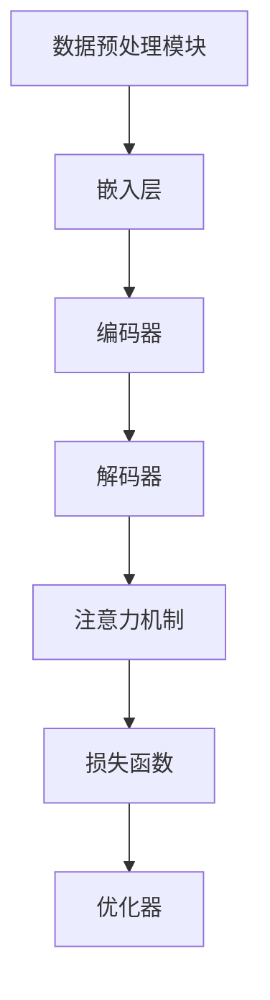

# 大语言模型原理与工程实践：组成模块选型

## 1.背景介绍

大语言模型（Large Language Model, LLM）是近年来人工智能领域的一个重要突破。它们通过大量的文本数据进行训练，能够生成高质量的自然语言文本，完成翻译、对话、文本生成等任务。随着技术的不断进步，LLM在各个行业中的应用越来越广泛。然而，构建一个高效的大语言模型并非易事，需要对其组成模块进行精心选型和设计。

## 2.核心概念与联系

### 2.1 大语言模型的基本组成

大语言模型通常由以下几个核心模块组成：

- **数据预处理模块**：负责清洗和规范化训练数据。
- **嵌入层**：将文本数据转换为向量表示。
- **编码器和解码器**：处理输入数据并生成输出。
- **注意力机制**：提高模型对重要信息的关注度。
- **损失函数**：用于评估模型的性能。
- **优化器**：用于调整模型参数以最小化损失函数。

### 2.2 各模块之间的联系

这些模块相互协作，共同完成语言模型的训练和推理任务。数据预处理模块为嵌入层提供规范化的数据，嵌入层将数据转换为向量表示，编码器和解码器处理这些向量，注意力机制帮助模型关注重要信息，损失函数评估模型性能，优化器则调整模型参数以提高性能。



## 3.核心算法原理具体操作步骤

### 3.1 数据预处理

数据预处理是大语言模型训练的第一步，主要包括以下几个步骤：

- **数据清洗**：去除噪声数据，如HTML标签、特殊字符等。
- **分词**：将文本分割成单词或子词。
- **词频统计**：计算每个词的出现频率。
- **词向量化**：将词转换为向量表示。

### 3.2 嵌入层

嵌入层的主要任务是将文本数据转换为向量表示。常用的方法包括：

- **词嵌入（Word Embedding）**：如Word2Vec、GloVe。
- **子词嵌入（Subword Embedding）**：如BPE、SentencePiece。

### 3.3 编码器和解码器

编码器和解码器是大语言模型的核心组件。常用的架构包括：

- **循环神经网络（RNN）**：如LSTM、GRU。
- **卷积神经网络（CNN）**：用于处理局部特征。
- **Transformer**：基于注意力机制，处理长距离依赖。

### 3.4 注意力机制

注意力机制通过计算输入序列中每个位置的重要性权重，帮助模型更好地关注重要信息。常用的注意力机制包括：

- **自注意力（Self-Attention）**：如Transformer中的多头自注意力。
- **交互注意力（Cross-Attention）**：用于编码器和解码器之间的信息交互。

### 3.5 损失函数

损失函数用于评估模型的性能，常用的损失函数包括：

- **交叉熵损失（Cross-Entropy Loss）**：用于分类任务。
- **均方误差（Mean Squared Error, MSE）**：用于回归任务。

### 3.6 优化器

优化器用于调整模型参数以最小化损失函数，常用的优化器包括：

- **随机梯度下降（SGD）**：基本的优化算法。
- **Adam**：结合了动量和自适应学习率的优化算法。

## 4.数学模型和公式详细讲解举例说明

### 4.1 词嵌入

词嵌入的目标是将词语映射到一个连续的向量空间。假设词汇表大小为 $V$，嵌入维度为 $d$，则词嵌入矩阵 $E \in \mathbb{R}^{V \times d}$。对于一个词 $w_i$，其嵌入向量为 $E[i]$。

### 4.2 注意力机制

注意力机制的核心是计算注意力权重。假设输入序列为 $X = [x_1, x_2, \ldots, x_n]$，则注意力权重 $a_{ij}$ 计算公式为：

$$
a_{ij} = \frac{\exp(e_{ij})}{\sum_{k=1}^{n} \exp(e_{ik})}
$$

其中，$e_{ij}$ 是 $x_i$ 和 $x_j$ 之间的相似度度量，可以通过点积、加性注意力等方式计算。

### 4.3 损失函数

交叉熵损失用于评估分类任务的性能。假设模型的输出为 $y$，真实标签为 $t$，则交叉熵损失 $L$ 计算公式为：

$$
L = -\sum_{i=1}^{C} t_i \log(y_i)
$$

其中，$C$ 为类别数，$t_i$ 和 $y_i$ 分别为第 $i$ 类的真实标签和预测概率。

## 5.项目实践：代码实例和详细解释说明

### 5.1 数据预处理

以下是一个简单的数据预处理示例，使用Python和NLTK库：

```python
import nltk
from nltk.tokenize import word_tokenize
from nltk.corpus import stopwords

# 下载必要的资源
nltk.download('punkt')
nltk.download('stopwords')

# 示例文本
text = "大语言模型是人工智能领域的重要突破。"

# 分词
tokens = word_tokenize(text)

# 去除停用词
filtered_tokens = [word for word in tokens if word not in stopwords.words('chinese')]

print(filtered_tokens)
```

### 5.2 词嵌入

以下是一个使用Gensim库进行词嵌入的示例：

```python
from gensim.models import Word2Vec

# 示例语料
sentences = [["大语言模型", "是", "人工智能", "领域", "的", "重要", "突破"]]

# 训练Word2Vec模型
model = Word2Vec(sentences, vector_size=100, window=5, min_count=1, workers=4)

# 获取词向量
vector = model.wv['大语言模型']
print(vector)
```

### 5.3 编码器和解码器

以下是一个使用PyTorch实现简单RNN编码器和解码器的示例：

```python
import torch
import torch.nn as nn

class EncoderRNN(nn.Module):
    def __init__(self, input_size, hidden_size):
        super(EncoderRNN, self).__init__()
        self.hidden_size = hidden_size
        self.embedding = nn.Embedding(input_size, hidden_size)
        self.gru = nn.GRU(hidden_size, hidden_size)

    def forward(self, input, hidden):
        embedded = self.embedding(input).view(1, 1, -1)
        output, hidden = self.gru(embedded, hidden)
        return output, hidden

    def initHidden(self):
        return torch.zeros(1, 1, self.hidden_size)

class DecoderRNN(nn.Module):
    def __init__(self, hidden_size, output_size):
        super(DecoderRNN, self).__init__()
        self.hidden_size = hidden_size
        self.embedding = nn.Embedding(output_size, hidden_size)
        self.gru = nn.GRU(hidden_size, hidden_size)
        self.out = nn.Linear(hidden_size, output_size)
        self.softmax = nn.LogSoftmax(dim=1)

    def forward(self, input, hidden):
        output = self.embedding(input).view(1, 1, -1)
        output = torch.relu(output)
        output, hidden = self.gru(output, hidden)
        output = self.softmax(self.out(output[0]))
        return output, hidden

    def initHidden(self):
        return torch.zeros(1, 1, self.hidden_size)
```

### 5.4 注意力机制

以下是一个使用PyTorch实现简单注意力机制的示例：

```python
class Attention(nn.Module):
    def __init__(self, hidden_size):
        super(Attention, self).__init__()
        self.hidden_size = hidden_size
        self.attn = nn.Linear(self.hidden_size * 2, hidden_size)
        self.v = nn.Parameter(torch.rand(hidden_size))

    def forward(self, hidden, encoder_outputs):
        timestep = encoder_outputs.size(0)
        h = hidden.repeat(timestep, 1, 1).transpose(0, 1)
        encoder_outputs = encoder_outputs.transpose(0, 1)
        attn_energies = self.score(h, encoder_outputs)
        return torch.softmax(attn_energies, dim=1).unsqueeze(1)

    def score(self, hidden, encoder_outputs):
        energy = torch.tanh(self.attn(torch.cat([hidden, encoder_outputs], 2)))
        energy = energy.transpose(2, 1)
        v = self.v.repeat(encoder_outputs.size(0), 1).unsqueeze(1)
        energy = torch.bmm(v, energy)
        return energy.squeeze(1)
```

## 6.实际应用场景

### 6.1 机器翻译

大语言模型在机器翻译中表现出色。通过训练双语数据集，模型能够自动将一种语言翻译成另一种语言。

### 6.2 对话系统

大语言模型在对话系统中也有广泛应用。通过训练大量对话数据，模型能够生成自然流畅的对话内容。

### 6.3 文本生成

大语言模型可以用于生成高质量的文本内容，如新闻报道、技术文档等。

### 6.4 情感分析

通过训练情感标注数据集，大语言模型能够自动分析文本的情感倾向。

## 7.工具和资源推荐

### 7.1 开源框架

- **TensorFlow**：谷歌开发的深度学习框架，支持大语言模型的训练和推理。
- **PyTorch**：Facebook开发的深度学习框架，广泛应用于研究和工业界。

### 7.2 数据集

- **OpenAI GPT-3**：一个大规模的预训练语言模型，提供API接口。
- **BERT**：谷歌开发的预训练语言模型，支持多种NLP任务。

### 7.3 书籍和文献

- **《深度学习》**：Ian Goodfellow等人编写的经典教材，详细介绍了深度学习的基本原理和应用。
- **《自然语言处理入门》**：详细介绍了自然语言处理的基本概念和技术。

## 8.总结：未来发展趋势与挑战

大语言模型在未来有着广阔的发展前景，但也面临一些挑战。随着数据量和模型规模的不断增加，训练和推理的计算成本也在不断上升。此外，如何提高模型的解释性和可控性也是一个重要的研究方向。

### 8.1 发展趋势

- **更大规模的模型**：未来的大语言模型将会更加庞大，能够处理更复杂的任务。
- **多模态学习**：结合文本、图像、音频等多种模态的数据，提高模型的综合能力。
- **自监督学习**：通过自监督学习方法，减少对标注数据的依赖。

### 8.2 挑战

- **计算成本**：大规模模型的训练和推理需要大量的计算资源。
- **数据隐私**：如何在保护用户隐私的前提下使用数据进行训练。
- **模型解释性**：提高模型的可解释性，帮助用户理解模型的决策过程。

## 9.附录：常见问题与解答

### 9.1 大语言模型的训练需要多长时间？

训练时间取决于数据量、模型规模和计算资源。一般来说，训练一个大规模的语言模型可能需要数周甚至数月的时间。

### 9.2 如何选择合适的嵌入层？

选择嵌入层时需要考虑数据的特点和任务的需求。对于大规模数据，可以选择预训练的词嵌入模型，如Word2Vec、GloVe等。

### 9.3 如何评估大语言模型的性能？

常用的评估指标包括准确率、精确率、召回率、F1值等。对于生成任务，可以使用BLEU、ROUGE等指标。

### 9.4 大语言模型是否可以处理多语言任务？

是的，大语言模型可以通过多语言数据进行训练，从而处理多语言任务。

### 9.5 如何提高大语言模型的训练效率？

可以通过分布式训练、混合精度训练等方法提高训练效率。

---

作者：禅与计算机程序设计艺术 / Zen and the Art of Computer Programming