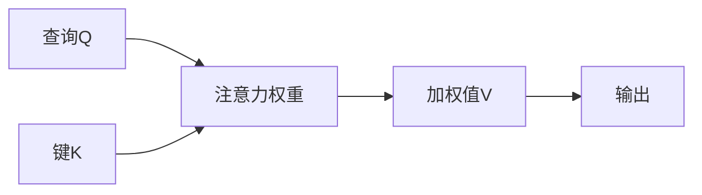
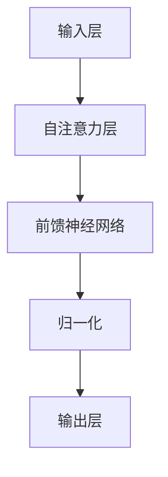

# 大语言模型原理基础与前沿 世界模型

## 1. 背景介绍
随着人工智能技术的飞速发展，大语言模型已经成为了自然语言处理（NLP）领域的一个重要分支。这些模型通过学习海量的文本数据，能够理解和生成人类语言，广泛应用于机器翻译、文本生成、问答系统等多个场景。本文将深入探讨大语言模型的原理基础，以及如何构建一个能够理解和模拟人类认知的“世界模型”。

## 2. 核心概念与联系
大语言模型的核心在于其能够捕捉语言的统计规律，并通过这些规律来预测或生成文本。这些模型通常基于深度学习架构，如循环神经网络（RNN）、长短期记忆网络（LSTM）和最近非常流行的Transformer架构。

### 2.1 语言模型的发展
- 统计语言模型
- 神经网络语言模型
- Transformer模型

### 2.2 Transformer架构
- 自注意力机制
- 多头注意力
- 位置编码

### 2.3 世界模型的概念
- 知识图谱
- 常识推理
- 模拟人类认知

## 3. 核心算法原理具体操作步骤
以Transformer为例，其核心算法原理可以分为以下步骤：

### 3.1 输入编码


### 3.2 自注意力计算


### 3.3 层次结构


## 4. 数学模型和公式详细讲解举例说明
大语言模型的数学基础主要是概率论和线性代数。以自注意力为例，其计算公式如下：

$$
\text{Attention}(Q, K, V) = \text{softmax}\left(\frac{QK^T}{\sqrt{d_k}}\right)V
$$

其中，$Q, K, V$ 分别代表查询（Query）、键（Key）和值（Value），$d_k$ 是键的维度。通过这个公式，模型能够计算出输入序列中每个元素对其他元素的影响权重。

## 5. 项目实践：代码实例和详细解释说明
以PyTorch框架为例，下面是一个简化的Transformer模型的代码实例：

```python
import torch
import torch.nn as nn
import torch.nn.functional as F

class TransformerModel(nn.Module):
    # Transformer模型的初始化
    def __init__(self, ntoken, ninp, nhead, nhid, nlayers, dropout=0.5):
        super(TransformerModel, self).__init__()
        self.model_type = 'Transformer'
        self.src_mask = None
        self.pos_encoder = PositionalEncoding(ninp, dropout)
        encoder_layers = nn.TransformerEncoderLayer(ninp, nhead, nhid, dropout)
        self.transformer_encoder = nn.TransformerEncoder(encoder_layers, nlayers)
        self.encoder = nn.Embedding(ntoken, ninp)
        self.ninp = ninp
        self.decoder = nn.Linear(ninp, ntoken)

    # 前向传播
    def forward(self, src):
        src = self.encoder(src) * math.sqrt(self.ninp)
        src = self.pos_encoder(src)
        output = self.transformer_encoder(src, self.src_mask)
        output = self.decoder(output)
        return F.log_softmax(output, dim=-1)
```

在这段代码中，我们定义了一个Transformer模型，它包含了位置编码、Transformer编码器和最终的线性解码器。这个模型可以用于文本生成任务。

## 6. 实际应用场景
大语言模型在多个领域都有广泛的应用，包括但不限于：

- 机器翻译
- 文本摘要
- 情感分析
- 问答系统

## 7. 工具和资源推荐
为了更好地研究和使用大语言模型，以下是一些推荐的工具和资源：

- TensorFlow
- PyTorch
- Hugging Face Transformers
- OpenAI GPT-3 API

## 8. 总结：未来发展趋势与挑战
大语言模型的未来发展趋势将更加注重模型的理解能力和推理能力，同时也面临着计算资源消耗大、模型解释性差等挑战。

## 9. 附录：常见问题与解答
Q1: 大语言模型的训练成本是否很高？
A1: 是的，训练大型语言模型需要大量的计算资源和数据。

Q2: 如何评估大语言模型的性能？
A2: 通常通过一系列标准化的测试集和任务来评估模型的性能，如BLEU分数用于机器翻译，ROUGE分数用于文本摘要。

作者：禅与计算机程序设计艺术 / Zen and the Art of Computer Programming