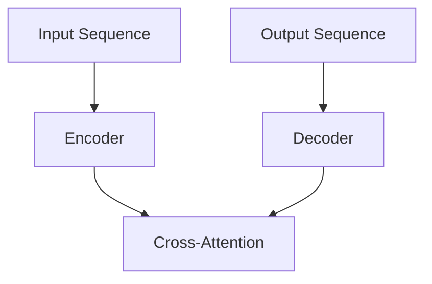

# 大语言模型原理基础与前沿 预训练和微调Transformer带来的新启示

## 1.背景介绍

### 1.1 语言模型的重要性

语言模型是自然语言处理领域中最基础和最重要的技术之一。它旨在学习并模拟人类语言的概率分布,为下游任务提供有价值的语义表示。随着深度学习技术的不断发展,大型语言模型(Large Language Model,LLM)已成为当前自然语言处理领域的主流方向。

### 1.2 预训练语言模型的兴起

传统的语言模型通常是基于统计方法或小型神经网络,其性能和泛化能力受到了严重限制。2018年,Transformer模型在机器翻译任务中取得了突破性的成果,随后被引入到语言模型中,催生了预训练语言模型(Pre-trained Language Model,PLM)的新范式。代表性工作包括GPT、BERT、XLNet等,它们通过在大规模无监督语料上进行预训练,学习到了丰富的语义知识,极大提升了语言理解和生成的能力。

### 1.3 微调技术的重要作用

预训练语言模型的关键在于通过微调(Fine-tuning)技术将通用的语言知识迁移到特定的下游任务中。微调是一种有监督的迁移学习方法,它在保留预训练模型参数的基础上,对部分参数进行进一步调整,使模型能够适应特定任务的数据分布和目标。微调技术的引入极大简化了下游任务的训练过程,同时保证了性能的显著提升。

## 2.核心概念与联系

### 2.1 自回归语言模型

自回归语言模型(Autoregressive Language Model)是语言模型的一种核心形式,它基于序列的历史信息来预测下一个词的概率分布。形式化地,给定一个长度为T的序列$X = (x_1, x_2, ..., x_T)$,自回归语言模型的目标是最大化序列的条件概率:

$$P(X) = \prod_{t=1}^{T}P(x_t|x_1, x_2, ..., x_{t-1})$$

自回归语言模型的典型代表是GPT系列模型,它们通过掩码自注意力机制(Masked Self-Attention)实现了高效的序列建模。

### 2.2 去噪自编码语言模型

与自回归语言模型不同,去噪自编码语言模型(Denoising Autoencoder Language Model)是基于重构的方式进行语言建模。它的目标是从一个被噪声破坏的输入序列中重构出原始的序列。形式化地,给定一个长度为T的序列$X$和其对应的噪声序列$\tilde{X}$,去噪自编码语言模型的目标是最大化:

$$P(X|\tilde{X}) = \prod_{t=1}^{T}P(x_t|\tilde{X})$$

BERT是最著名的去噪自编码语言模型,它通过掩码语言模型(Masked Language Model)和下一句预测(Next Sentence Prediction)两个任务实现了有效的预训练。

### 2.3 序列到序列语言模型

序列到序列(Sequence-to-Sequence)语言模型是一种更通用的形式,它同时涵盖了自回归和去噪自编码两种建模方式。给定一个输入序列$X$和目标序列$Y$,序列到序列语言模型的目标是最大化:

$$P(Y|X) = \prod_{t=1}^{T}P(y_t|y_1, y_2, ..., y_{t-1}, X)$$

T5、BART等模型都属于这一范畴,它们可以通过文本生成、文本摘要、问答等多种形式的任务进行预训练,获得更加通用和强大的语言表示能力。

### 2.4 Transformer编码器-解码器架构

Transformer编码器-解码器架构是实现上述语言模型的核心结构,如下图所示:

编码器(Encoder)负责从输入序列中提取语义特征,解码器(Decoder)则基于编码器的输出和自身的状态生成目标序列。两者之间通过交叉注意力(Cross-Attention)机制实现信息交互。该架构可以通过堆叠多层Transformer块来增强模型的表示能力。

## 3.核心算法原理具体操作步骤

### 3.1 Transformer模型结构

Transformer模型由编码器(Encoder)和解码器(Decoder)两个部分组成,每个部分都由多个相同的层(Layer)堆叠而成。

#### 3.1.1 编码器(Encoder)

编码器的主要作用是从输入序列中提取语义特征表示。每一层的编码器由两个子层组成:

1. **多头自注意力层(Multi-Head Self-Attention)**:计算输入序列中每个词与其他词的关系,捕捉长距离依赖关系。
2. **前馈全连接层(Feed-Forward Network)**:对每个位置的表示进行非线性变换,提供"理解"能力。

#### 3.1.2 解码器(Decoder)

解码器的主要作用是基于编码器的输出和自身的状态生成目标序列。每一层的解码器由三个子层组成:

1. **掩码多头自注意力层(Masked Multi-Head Self-Attention)**:计算当前位置与之前位置的关系,保证自回归属性。
2. **多头交叉注意力层(Multi-Head Cross-Attention)**:计算目标序列与编码器输出的关系,融合编码器信息。
3. **前馈全连接层(Feed-Forward Network)**:对每个位置的表示进行非线性变换,提供"生成"能力。

#### 3.1.3 位置编码(Positional Encoding)

由于Transformer没有使用循环或卷积结构,因此需要一种方式来注入序列的位置信息。位置编码就是为每个位置赋予一个固定的向量表示,并将其加到输入的词嵌入上。

#### 3.1.4 残差连接(Residual Connection)和层归一化(Layer Normalization)

为了加速训练收敛并缓解梯度消失问题,Transformer在每个子层之后使用了残差连接和层归一化操作。

### 3.2 注意力机制(Attention Mechanism)

注意力机制是Transformer的核心,它允许模型动态地捕捉输入序列中不同位置的相关性,而不受序列长度的限制。

#### 3.2.1 缩放点积注意力(Scaled Dot-Product Attention)

缩放点积注意力是Transformer中使用的基本注意力函数,定义如下:

$$\text{Attention}(Q, K, V) = \text{softmax}\left(\frac{QK^T}{\sqrt{d_k}}\right)V$$

其中$Q$为查询(Query)、$K$为键(Key)、$V$为值(Value),$d_k$为缩放因子,用于防止点积过大导致的梯度饱和问题。

#### 3.2.2 多头注意力(Multi-Head Attention)

多头注意力机制将注意力分成多个"头"进行并行计算,然后将结果拼接,以提高模型的表示能力:

$$\text{MultiHead}(Q, K, V) = \text{Concat}(\text{head}_1, ..., \text{head}_h)W^O$$
$$\text{where, head}_i = \text{Attention}(QW_i^Q, KW_i^K, VW_i^V)$$

其中$W_i^Q$、$W_i^K$、$W_i^V$和$W^O$是可学习的线性投影参数。

### 3.3 掩码机制(Masking)

掩码机制是实现自回归属性和去噪重构的关键。

#### 3.3.1 解码器掩码

在解码器的自注意力层中,需要防止每个位置的词会注意到未来的位置,以保证自回归属性。这可以通过在softmax计算之前,将未来位置的注意力分数设置为负无穷来实现。

#### 3.3.2 编码器掩码

在BERT等去噪自编码模型中,需要在输入序列中随机掩码一部分词,并在预训练时学习预测被掩码的词。这种掩码方式可以增强模型的泛化能力。

### 3.4 预训练任务

不同类型的语言模型通常采用不同的预训练任务。

#### 3.4.1 掩码语言模型(Masked Language Model,MLM)

MLM任务要求模型预测被掩码的词,是BERT等去噪自编码模型的核心任务。具体来说,给定一个输入序列$X$和其掩码版本$\tilde{X}$,MLM的目标是最大化:

$$\mathcal{L}_\text{MLM} = \mathbb{E}_{X}\left[\sum_{t=1}^T \log P(x_t|\tilde{X})\right]$$

#### 3.4.2 下一句预测(Next Sentence Prediction,NSP)

NSP任务是BERT的辅助任务,目的是学习更好的句子关系表示。给定两个句子$A$和$B$,NSP的目标是预测$B$是否为$A$的下一句。

#### 3.4.3 因果语言模型(Causal Language Model,CLM)

CLM任务要求模型基于历史信息预测下一个词,是GPT等自回归模型的核心任务:

$$\mathcal{L}_\text{CLM} = \mathbb{E}_{X}\left[\sum_{t=1}^T \log P(x_t|x_1, ..., x_{t-1})\right]$$

#### 3.4.4 序列到序列预训练

对于序列到序列模型如T5、BART等,它们通常采用多种形式的预训练任务,包括文本生成、文本摘要、问答等,以获得更加通用和强大的语言表示能力。

### 3.5 微调(Fine-tuning)

微调是将预训练语言模型迁移到下游任务的关键步骤。具体来说,我们初始化模型参数为预训练得到的参数值,然后在特定任务的数据上进行有监督的训练,对部分参数进行进一步调整。

微调的优势在于:

1. 大大减少了下游任务所需的训练数据量。
2. 预训练模型已经学习到了通用的语言知识,为下游任务提供了良好的初始化。
3. 训练过程相对高效,通常只需要少量的训练步骤。

微调时还可以采用一些技巧,如层wise适应性微调(Layer-wise Adaptive Fine-tuning)、判别式微调(Discriminative Fine-tuning)等,以进一步提升性能。

## 4.数学模型和公式详细讲解举例说明

### 4.1 Transformer模型的数学表示

我们可以将Transformer模型表示为一个序列到序列的条件概率模型:

$$P(Y|X;\theta) = \prod_{t=1}^{T_y} P(y_t|y_{<t}, X;\theta)$$

其中$X=(x_1, x_2, ..., x_{T_x})$是输入序列,$Y=(y_1, y_2, ..., y_{T_y})$是目标序列,$\theta$是模型参数。该模型的目标是最大化目标序列$Y$的条件概率。

对于编码器(Encoder),我们可以将其表示为一个将输入序列$X$映射到连续表示$C$的函数:

$$C = \text{Encoder}(X;\theta_\text{enc})$$

而解码器(Decoder)则是一个将编码器输出$C$和历史输出$y_{<t}$映射到下一个词$y_t$概率分布的函数:

$$P(y_t|y_{<t}, X;\theta) = \text{Decoder}(y_{<t}, C;\theta_\text{dec})$$

其中$\theta_\text{enc}$和$\theta_\text{dec}$分别表示编码器和解码器的参数子集。

在训练过程中,我们最小化模型在训练数据上的负对数似然损失:

$$\mathcal{L}(\theta) = -\frac{1}{N}\sum_{n=1}^{N}\log P(Y^{(n)}|X^{(n)};\theta)$$

其中$N$是训练样本数量。

### 4.2 注意力机制的数学表示

注意力机制是Transformer的核心,它允许模型动态地捕捉输入序列中不同位置的相关性。我们可以将注意力机制表示为一个将查询(Query)、键(Key)和值(Value)映射到输出表示的函数:

$$\text{Attention}(Q, K, V) = \text{softmax}\left(\frac{QK^T}{\sqrt{d_k}}\right)V$$

其中$Q\in\mathbb{R}^{n\times d_q}$、$K\in\mathbb{R}^{m\times d_k}$、$V