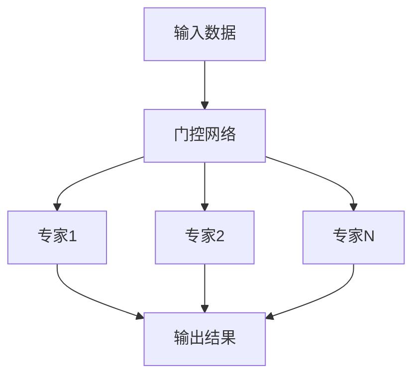

# 大语言模型原理基础与前沿 高效的MoE架构

## 1.背景介绍

在人工智能和自然语言处理领域，大语言模型（Large Language Models, LLMs）已经成为了研究和应用的热点。随着模型规模的不断扩大，如何在保证模型性能的同时提高计算效率成为了一个重要的研究方向。专家模型（Mixture of Experts, MoE）架构作为一种高效的模型架构，因其在大规模模型中的优越表现而备受关注。

MoE架构通过引入多个专家（Experts）模块，并在每次推理时仅激活部分专家，从而大幅减少计算量和内存占用。本文将深入探讨MoE架构的原理、算法、数学模型、实际应用及未来发展趋势。

## 2.核心概念与联系

### 2.1 大语言模型

大语言模型是指通过大量文本数据训练得到的深度学习模型，能够理解和生成自然语言。典型的大语言模型包括GPT-3、BERT等。

### 2.2 专家模型（MoE）

MoE是一种模型架构，包含多个专家模块和一个门控网络（Gating Network）。门控网络根据输入数据选择激活哪些专家，从而实现高效计算。

### 2.3 门控网络

门控网络是MoE架构中的关键组件，负责根据输入数据选择激活的专家。常见的门控网络包括软门控（Soft Gating）和硬门控（Hard Gating）。

### 2.4 专家模块

专家模块是MoE架构中的核心计算单元，每个专家模块通常是一个神经网络。不同的专家模块可以有不同的结构和参数。

## 3.核心算法原理具体操作步骤

### 3.1 数据预处理

在训练MoE模型之前，需要对数据进行预处理，包括文本清洗、分词、向量化等步骤。

### 3.2 模型初始化

初始化MoE模型，包括专家模块和门控网络的参数。可以使用随机初始化或预训练模型进行初始化。

### 3.3 前向传播

在前向传播过程中，输入数据首先通过门控网络，门控网络根据输入数据选择激活的专家模块。然后，激活的专家模块对输入数据进行处理，最终输出结果。



### 3.4 反向传播

在反向传播过程中，计算损失函数的梯度，并更新门控网络和专家模块的参数。由于每次前向传播只激活部分专家，反向传播时也只更新这些专家的参数。

### 3.5 模型优化

使用优化算法（如Adam、SGD等）对模型进行优化，逐步提高模型的性能。

## 4.数学模型和公式详细讲解举例说明

### 4.1 门控网络公式

门控网络的输出可以表示为：
$$
G(x) = \text{softmax}(W_g x + b_g)
$$
其中，$W_g$ 和 $b_g$ 是门控网络的参数，$x$ 是输入数据。

### 4.2 专家模块公式

每个专家模块的输出可以表示为：
$$
E_i(x) = f_i(W_i x + b_i)
$$
其中，$W_i$ 和 $b_i$ 是第 $i$ 个专家的参数，$f_i$ 是激活函数。

### 4.3 最终输出公式

MoE模型的最终输出可以表示为：
$$
y = \sum_{i=1}^N G_i(x) E_i(x)
$$
其中，$G_i(x)$ 是门控网络对第 $i$ 个专家的选择概率，$E_i(x)$ 是第 $i$ 个专家的输出。

### 4.4 损失函数

损失函数可以表示为：
$$
L = \frac{1}{M} \sum_{j=1}^M \left( y_j - \hat{y}_j \right)^2
$$
其中，$M$ 是样本数量，$y_j$ 是第 $j$ 个样本的真实值，$\hat{y}_j$ 是模型的预测值。

## 5.项目实践：代码实例和详细解释说明

### 5.1 数据预处理

```python
import numpy as np
import pandas as pd
from sklearn.model_selection import train_test_split

# 加载数据
data = pd.read_csv('data.csv')

# 数据清洗
data = data.dropna()

# 分词和向量化
from sklearn.feature_extraction.text import TfidfVectorizer
vectorizer = TfidfVectorizer(max_features=1000)
X = vectorizer.fit_transform(data['text']).toarray()

# 标签编码
from sklearn.preprocessing import LabelEncoder
encoder = LabelEncoder()
y = encoder.fit_transform(data['label'])

# 划分训练集和测试集
X_train, X_test, y_train, y_test = train_test_split(X, y, test_size=0.2, random_state=42)
```

### 5.2 模型定义

```python
import torch
import torch.nn as nn
import torch.optim as optim

class GatingNetwork(nn.Module):
    def __init__(self, input_dim, num_experts):
        super(GatingNetwork, self).__init__()
        self.fc = nn.Linear(input_dim, num_experts)
    
    def forward(self, x):
        return torch.softmax(self.fc(x), dim=1)

class Expert(nn.Module):
    def __init__(self, input_dim, output_dim):
        super(Expert, self).__init__()
        self.fc = nn.Linear(input_dim, output_dim)
    
    def forward(self, x):
        return torch.relu(self.fc(x))

class MoEModel(nn.Module):
    def __init__(self, input_dim, output_dim, num_experts):
        super(MoEModel, self).__init__()
        self.gating_network = GatingNetwork(input_dim, num_experts)
        self.experts = nn.ModuleList([Expert(input_dim, output_dim) for _ in range(num_experts)])
    
    def forward(self, x):
        gate_outputs = self.gating_network(x)
        expert_outputs = torch.stack([expert(x) for expert in self.experts], dim=1)
        return torch.sum(gate_outputs.unsqueeze(2) * expert_outputs, dim=1)

# 模型初始化
input_dim = X_train.shape[1]
output_dim = len(np.unique(y))
num_experts = 5
model = MoEModel(input_dim, output_dim, num_experts)
```

### 5.3 模型训练

```python
# 损失函数和优化器
criterion = nn.CrossEntropyLoss()
optimizer = optim.Adam(model.parameters(), lr=0.001)

# 训练模型
num_epochs = 10
for epoch in range(num_epochs):
    model.train()
    optimizer.zero_grad()
    outputs = model(torch.tensor(X_train, dtype=torch.float32))
    loss = criterion(outputs, torch.tensor(y_train, dtype=torch.long))
    loss.backward()
    optimizer.step()
    
    print(f'Epoch {epoch+1}/{num_epochs}, Loss: {loss.item()}')
```

### 5.4 模型评估

```python
# 模型评估
model.eval()
with torch.no_grad():
    outputs = model(torch.tensor(X_test, dtype=torch.float32))
    _, predicted = torch.max(outputs, 1)
    accuracy = (predicted == torch.tensor(y_test, dtype=torch.long)).sum().item() / y_test.shape[0]
    print(f'Accuracy: {accuracy * 100:.2f}%')
```

## 6.实际应用场景

### 6.1 自然语言处理

MoE架构在自然语言处理任务中表现出色，如文本分类、情感分析、机器翻译等。

### 6.2 计算机视觉

在计算机视觉任务中，MoE架构可以用于图像分类、目标检测、图像生成等。

### 6.3 推荐系统

MoE架构在推荐系统中也有广泛应用，可以提高推荐的准确性和效率。

### 6.4 语音识别

在语音识别任务中，MoE架构可以提高识别的准确性和速度。

## 7.工具和资源推荐

### 7.1 开源框架

- TensorFlow
- PyTorch
- Hugging Face Transformers

### 7.2 数据集

- IMDB电影评论数据集
- CIFAR-10图像数据集
- LibriSpeech语音数据集

### 7.3 书籍和论文

- 《深度学习》 - Ian Goodfellow
- 《模式识别与机器学习》 - Christopher Bishop
- "Mixture of Experts for Large-scale Neural Networks" - Shazeer et al.

## 8.总结：未来发展趋势与挑战

### 8.1 未来发展趋势

- **模型规模继续扩大**：随着计算资源的增加和算法的改进，大语言模型的规模将继续扩大。
- **高效计算架构**：MoE架构等高效计算架构将成为主流，进一步提高模型的计算效率。
- **多模态融合**：未来的模型将不仅限于单一模态，而是融合多种模态的数据，如文本、图像、语音等。

### 8.2 挑战

- **计算资源需求**：大规模模型的训练和推理需要大量的计算资源，如何高效利用资源是一个重要挑战。
- **模型解释性**：随着模型复杂度的增加，如何解释模型的决策过程变得更加困难。
- **数据隐私和安全**：在处理大规模数据时，如何保护用户的隐私和数据安全是一个重要问题。

## 9.附录：常见问题与解答

### 9.1 什么是MoE架构？

MoE架构是一种包含多个专家模块和一个门控网络的模型架构，通过门控网络选择激活的专家模块，从而实现高效计算。

### 9.2 MoE架构的优势是什么？

MoE架构的优势在于能够在保证模型性能的同时大幅减少计算量和内存占用。

### 9.3 如何训练MoE模型？

训练MoE模型的步骤包括数据预处理、模型初始化、前向传播、反向传播和模型优化。

### 9.4 MoE架构可以应用于哪些领域？

MoE架构可以应用于自然语言处理、计算机视觉、推荐系统、语音识别等多个领域。

### 9.5 MoE架构的未来发展趋势是什么？

未来，MoE架构将继续发展，模型规模将继续扩大，高效计算架构将成为主流，多模态融合将成为趋势。

---

作者：禅与计算机程序设计艺术 / Zen and the Art of Computer Programming