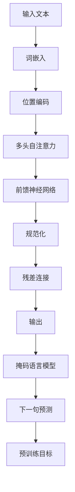

# 大语言模型应用指南：提示的基础技巧

## 1.背景介绍

在当今的人工智能时代,大语言模型已成为各个领域的核心技术。这些模型通过从海量文本数据中学习,获得了广博的知识和出色的自然语言处理能力。然而,要充分发挥大语言模型的潜力,有效的提示设计是关键。

提示(Prompt)是指向语言模型输入的指令或上下文信息,用于引导模型生成所需的输出。合理的提示设计可以帮助模型理解任务需求,生成更准确、相关和高质量的响应。

本文将探讨大语言模型提示的基础技巧,为读者提供实用的指导和最佳实践。无论您是开发人员、研究人员还是终端用户,掌握这些技巧都将助您更好地利用大语言模型的强大功能。

## 2.核心概念与联系

### 2.1 什么是大语言模型?

大语言模型是一种基于深度学习的自然语言处理(NLP)模型,通过在大规模文本语料库上进行预训练而获得强大的语言理解和生成能力。这些模型能够捕捉语言的复杂模式和语义关系,从而在各种NLP任务中表现出色,如文本生成、机器翻译、问答系统等。

一些著名的大语言模型包括:

- GPT(Generative Pre-trained Transformer)系列模型,如GPT-3
- BERT(Bidirectional Encoder Representations from Transformers)
- XLNet
- RoBERTa
- ALBERT

### 2.2 提示在大语言模型中的作用

提示是与大语言模型交互的关键接口。通过提供适当的提示,我们可以指导模型生成所需的输出,如文本、代码、图像等。提示的设计直接影响模型的理解能力和输出质量。

良好的提示设计需要考虑以下几个方面:

1. **任务框架**: 明确定义模型需要完成的任务,如文本生成、分类、问答等。
2. **上下文信息**: 提供足够的背景知识和上下文线索,帮助模型理解任务要求。
3. **示例**: 给出任务的示例输入和期望输出,让模型学习任务模式。
4. **约束条件**: 设置任务的限制条件,如输出长度、语气风格等。
5. **反馈**: 根据模型输出,提供反馈和改进建议,促进模型持续学习。

通过优化这些方面的提示设计,我们可以最大限度地发挥大语言模型的潜力,获得更好的输出质量和用户体验。

## 3.核心算法原理具体操作步骤

大语言模型的核心算法通常基于自注意力机制和Transformer架构。以下是这些模型的基本工作原理和操作步骤:



1. **输入文本**: 将原始文本作为模型的输入。

2. **词嵌入(Word Embedding)**: 将每个单词转换为一个固定长度的向量表示,捕捉单词的语义信息。

3. **位置编码(Positional Encoding)**: 由于Transformer模型没有递归或卷积结构,因此需要添加位置编码来保留输入序列的位置信息。

4. **多头自注意力(Multi-Head Self-Attention)**: 这是Transformer模型的核心机制。自注意力层允许每个单词关注整个输入序列中的其他单词,捕捉长距离依赖关系。多头注意力可以从不同的表示子空间关注信息,提高模型的表现力。

5. **前馈神经网络(Feed-Forward Neural Network)**: 对自注意力层的输出应用全连接前馈神经网络,进一步提取高级特征表示。

6. **规范化(Normalization)**: 对每一层的输出进行规范化,以加速训练过程并提高模型性能。

7. **残差连接(Residual Connection)**: 将输入直接与层输出相加,以缓解深层网络的梯度消失问题。

8. **输出**: 模型生成最终的输出序列。

9. **掩码语言模型(Masked Language Modeling)**: 在预训练阶段,模型需要预测被掩码的单词。这有助于模型学习语义和上下文信息。

10. **下一句预测(Next Sentence Prediction)**: 另一个预训练目标是预测两个句子是否相连。这有助于模型捕捉更长的上下文依赖关系。

通过在大规模语料库上预训练,大语言模型可以学习丰富的语言知识和模式,为下游任务提供强大的基础。在微调和推理阶段,模型将根据提示和任务需求生成所需的输出。

## 4.数学模型和公式详细讲解举例说明

大语言模型的核心是基于自注意力机制的Transformer架构。自注意力是一种计算每个输入元素与其他元素的关联程度的机制,从而捕捉长距离依赖关系。下面我们将详细介绍自注意力的数学模型和公式。

### 4.1 缩放点积注意力

缩放点积注意力是Transformer中使用的基本注意力机制,其数学表达式如下:

$$
\mathrm{Attention}(Q, K, V) = \mathrm{softmax}\left(\frac{QK^T}{\sqrt{d_k}}\right)V
$$

其中:

- $Q$ 是查询(Query)矩阵,表示我们要关注的信息。
- $K$ 是键(Key)矩阵,表示我们要从中查找相关信息的源。
- $V$ 是值(Value)矩阵,表示我们要获取的相关信息。
- $d_k$ 是缩放因子,用于防止点积过大导致梯度消失或爆炸。

缩放点积注意力的计算过程如下:

1. 计算查询 $Q$ 与所有键 $K$ 的点积,得到一个注意力分数矩阵。
2. 对注意力分数矩阵进行缩放,除以 $\sqrt{d_k}$。
3. 对缩放后的注意力分数矩阵应用 softmax 函数,得到注意力权重矩阵。
4. 将注意力权重矩阵与值矩阵 $V$ 相乘,得到加权求和的注意力输出。

这种注意力机制允许模型动态地关注输入序列中的不同部分,捕捉长距离依赖关系。

### 4.2 多头注意力

为了进一步提高模型的表现力,Transformer使用了多头注意力机制。多头注意力将查询、键和值矩阵线性投影到不同的子空间,并在每个子空间中计算缩放点积注意力。然后,将所有子空间的注意力输出进行拼接,形成最终的多头注意力输出。

多头注意力的数学表达式如下:

$$
\begin{aligned}
\mathrm{MultiHead}(Q, K, V) &= \mathrm{Concat}(\mathrm{head}_1, \ldots, \mathrm{head}_h)W^O\\
\mathrm{where}\ \mathrm{head}_i &= \mathrm{Attention}(QW_i^Q, KW_i^K, VW_i^V)
\end{aligned}
$$

其中:

- $h$ 是注意力头的数量。
- $W_i^Q \in \mathbb{R}^{d_\mathrm{model} \times d_k}$、$W_i^K \in \mathbb{R}^{d_\mathrm{model} \times d_k}$、$W_i^V \in \mathbb{R}^{d_\mathrm{model} \times d_v}$ 是线性投影矩阵。
- $W^O \in \mathbb{R}^{hd_v \times d_\mathrm{model}}$ 是用于将多头注意力输出拼接后的矩阵再次投影回模型维度的矩阵。

多头注意力机制允许模型从不同的表示子空间关注不同的位置,增强了模型的表现力和泛化能力。

通过自注意力机制,大语言模型能够有效地捕捉输入序列中的长距离依赖关系,从而更好地理解和生成自然语言。这种注意力机制是大语言模型取得卓越性能的关键因素之一。

## 5.项目实践:代码实例和详细解释说明

为了更好地理解大语言模型提示的使用,我们将通过一个实际项目来演示如何设计和优化提示。在本例中,我们将使用 GPT-3 模型生成一篇技术博客文章。

### 5.1 导入必要的库

```python
import openai
import os
```

我们需要导入 OpenAI 库来与 GPT-3 API 进行交互。此外,我们还需要设置 OpenAI API 密钥,以便进行身份验证。

```python
openai.api_key = os.environ["OPENAI_API_KEY"]
```

### 5.2 定义提示

提示是与语言模型交互的关键。我们将定义一个包含背景信息、任务描述和示例的提示。

```python
prompt = """
你是一位著名的技术博客作者,擅长用简单易懂的语言解释复杂的技术概念。你的任务是撰写一篇关于"大语言模型提示设计"的博客文章。

文章应包括以下内容:

1. 介绍大语言模型和提示的概念
2. 解释提示在大语言模型中的作用
3. 描述设计高质量提示的最佳实践和技巧
4. 提供一些示例提示,并解释它们的优缺点
5. 讨论提示设计的未来发展方向

请确保文章内容全面、深入,并使用简单易懂的语言。文章字数应在 1500 到 2000 字之间。

以下是一个示例提示,供你参考:

提示: 写一篇关于机器学习算法的博客文章,包括算法的工作原理、优缺点和实际应用场景。
"""
```

在这个提示中,我们提供了任务背景、要求和一个示例提示。这有助于模型更好地理解我们的期望,并生成相关的输出。

### 5.3 调用 GPT-3 API 生成文章

接下来,我们将调用 OpenAI 的 GPT-3 API,使用我们定义的提示生成博客文章。

```python
response = openai.Completion.create(
    engine="text-davinci-003",
    prompt=prompt,
    max_tokens=2048,
    n=1,
    stop=None,
    temperature=0.7,
)

article = response.choices[0].text
print(article)
```

在这个示例中,我们使用了 `text-davinci-003` 引擎,它是 OpenAI 提供的一种高性能语言模型。我们还设置了以下参数:

- `max_tokens`: 生成文本的最大长度,设置为 2048 个令牌。
- `n`: 生成的输出数量,我们只需要一个输出。
- `stop`: 用于指定生成文本的停止条件,在这里我们没有设置。
- `temperature`: 控制输出的随机性和创造性,值越高,输出越多样化。我们设置为 0.7,以获得一定程度的多样性。

最后,我们打印生成的博客文章内容。

### 5.4 优化提示

根据生成的文章质量,我们可以进一步优化提示,以获得更好的输出。例如,我们可以:

- 提供更多的背景信息和上下文细节,帮助模型更好地理解任务需求。
- 增加示例提示和期望输出,让模型学习任务模式。
- 调整提示的长度和结构,使其更加清晰和易于理解。
- 尝试不同的温度值,平衡输出的多样性和一致性。

通过反复迭代和优化提示,我们可以不断提高生成文章的质量和相关性。

## 6.实际应用场景

大语言模型提示的应用场景非常广泛,几乎涵盖了所有需要自然语言处理的领域。以下是一些典型的应用场景:

### 6.1 内容创作

提示可用于指导大语言模型生成各种形式的内容,如文章、故事、诗歌、代码等。这对于内容创作者、作家、程序员等人群非常有用,可以提高工作效率并激发创造力。

### 6.2 问答系统

在问答系统