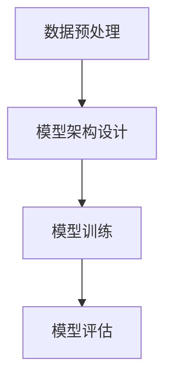

# 大语言模型进阶原理与代码实战案例讲解

## 1.背景介绍

大语言模型（Large Language Models, LLMs）近年来在自然语言处理（NLP）领域取得了显著的进展。自从OpenAI发布了GPT系列模型以来，LLMs在文本生成、翻译、问答系统等多个应用场景中展现了强大的能力。本文旨在深入探讨大语言模型的核心原理、算法、数学模型，并通过实际代码案例帮助读者更好地理解和应用这些技术。

## 2.核心概念与联系

### 2.1 语言模型

语言模型是通过统计语言中词语的分布和序列关系来预测下一个词的概率。传统的语言模型包括n-gram模型和基于马尔可夫链的模型。

### 2.2 神经网络语言模型

神经网络语言模型（Neural Network Language Models, NNLMs）利用神经网络来捕捉语言中的复杂模式。常见的NNLMs包括循环神经网络（RNN）、长短期记忆网络（LSTM）和变换器（Transformer）。

### 2.3 变换器模型

变换器模型（Transformer）是目前最先进的语言模型架构之一。它通过自注意力机制（Self-Attention）来捕捉序列中的长距离依赖关系。

### 2.4 GPT模型

GPT（Generative Pre-trained Transformer）是基于变换器架构的生成式预训练模型。它通过大规模的无监督预训练和小规模的有监督微调来实现强大的语言生成能力。

## 3.核心算法原理具体操作步骤

### 3.1 数据预处理

数据预处理是训练大语言模型的第一步。包括文本清洗、分词、词向量表示等步骤。

### 3.2 模型架构设计

大语言模型的核心是其架构设计。以GPT为例，其主要包括以下几个部分：

- **嵌入层**：将词语转换为向量表示。
- **多头自注意力机制**：捕捉序列中的长距离依赖关系。
- **前馈神经网络**：对注意力机制的输出进行进一步处理。
- **层归一化**：稳定训练过程。

### 3.3 模型训练

模型训练包括无监督预训练和有监督微调两个阶段。预训练阶段通过大规模的文本数据进行训练，微调阶段通过特定任务的数据进行训练。

### 3.4 模型评估

模型评估是通过多种指标来衡量模型的性能。常见的评估指标包括困惑度（Perplexity）、BLEU分数等。



## 4.数学模型和公式详细讲解举例说明

### 4.1 语言模型的数学基础

语言模型的目标是最大化给定序列的概率。对于一个序列 $X = (x_1, x_2, ..., x_n)$，其概率可以表示为：

$$
P(X) = P(x_1, x_2, ..., x_n) = \prod_{i=1}^{n} P(x_i | x_1, x_2, ..., x_{i-1})
$$

### 4.2 自注意力机制

自注意力机制的核心是通过加权求和来捕捉序列中的依赖关系。其计算公式为：

$$
Attention(Q, K, V) = softmax\left(\frac{QK^T}{\sqrt{d_k}}\right)V
$$

其中，$Q$、$K$、$V$分别表示查询、键和值矩阵，$d_k$表示键的维度。

### 4.3 变换器模型的损失函数

变换器模型的损失函数通常是交叉熵损失（Cross-Entropy Loss），其公式为：

$$
L = -\sum_{i=1}^{n} y_i \log(\hat{y}_i)
$$

其中，$y_i$表示真实标签，$\hat{y}_i$表示预测概率。

## 5.项目实践：代码实例和详细解释说明

### 5.1 数据预处理

```python
import re
import nltk
from nltk.tokenize import word_tokenize

# 下载nltk数据
nltk.download('punkt')

def preprocess_text(text):
    # 转换为小写
    text = text.lower()
    # 移除特殊字符
    text = re.sub(r'[^a-zA-Z0-9\s]', '', text)
    # 分词
    tokens = word_tokenize(text)
    return tokens

sample_text = "Hello, world! This is a test."
tokens = preprocess_text(sample_text)
print(tokens)
```

### 5.2 模型架构设计

```python
import torch
import torch.nn as nn

class TransformerModel(nn.Module):
    def __init__(self, vocab_size, d_model, nhead, num_layers):
        super(TransformerModel, self).__init__()
        self.embedding = nn.Embedding(vocab_size, d_model)
        self.transformer = nn.Transformer(d_model, nhead, num_layers)
        self.fc = nn.Linear(d_model, vocab_size)

    def forward(self, src, tgt):
        src = self.embedding(src)
        tgt = self.embedding(tgt)
        output = self.transformer(src, tgt)
        output = self.fc(output)
        return output

vocab_size = 10000
d_model = 512
nhead = 8
num_layers = 6

model = TransformerModel(vocab_size, d_model, nhead, num_layers)
print(model)
```

### 5.3 模型训练

```python
import torch.optim as optim

# 定义损失函数和优化器
criterion = nn.CrossEntropyLoss()
optimizer = optim.Adam(model.parameters(), lr=0.001)

# 模拟训练数据
src = torch.randint(0, vocab_size, (10, 32))  # (sequence_length, batch_size)
tgt = torch.randint(0, vocab_size, (10, 32))

# 训练步骤
model.train()
for epoch in range(10):
    optimizer.zero_grad()
    output = model(src, tgt)
    loss = criterion(output.view(-1, vocab_size), tgt.view(-1))
    loss.backward()
    optimizer.step()
    print(f'Epoch {epoch+1}, Loss: {loss.item()}')
```

### 5.4 模型评估

```python
def evaluate_model(model, data_loader):
    model.eval()
    total_loss = 0
    with torch.no_grad():
        for src, tgt in data_loader:
            output = model(src, tgt)
            loss = criterion(output.view(-1, vocab_size), tgt.view(-1))
            total_loss += loss.item()
    return total_loss / len(data_loader)

# 模拟评估数据
data_loader = [(src, tgt) for _ in range(10)]
eval_loss = evaluate_model(model, data_loader)
print(f'Evaluation Loss: {eval_loss}')
```

## 6.实际应用场景

### 6.1 文本生成

大语言模型可以用于生成高质量的文本内容，如新闻报道、小说创作等。

### 6.2 机器翻译

通过大语言模型，可以实现高精度的机器翻译，支持多种语言之间的互译。

### 6.3 问答系统

大语言模型在问答系统中表现出色，可以回答用户提出的各种问题。

### 6.4 情感分析

通过大语言模型，可以对文本进行情感分析，判断其情感倾向。

## 7.工具和资源推荐

### 7.1 开源框架

- **TensorFlow**：谷歌开发的开源机器学习框架，支持大规模分布式训练。
- **PyTorch**：Facebook开发的开源深度学习框架，易于使用和调试。

### 7.2 数据集

- **WikiText**：大规模的维基百科文本数据集，适用于语言模型的训练。
- **OpenWebText**：包含大量高质量的网页文本数据。

### 7.3 在线资源

- **Hugging Face**：提供了大量预训练的语言模型和相关工具。
- **Kaggle**：数据科学竞赛平台，提供丰富的数据集和代码示例。

## 8.总结：未来发展趋势与挑战

大语言模型在NLP领域展现了巨大的潜力，但也面临一些挑战。未来的发展趋势包括：

- **模型压缩**：通过模型剪枝、量化等技术，减少模型的计算和存储开销。
- **多模态学习**：结合图像、音频等多种模态的信息，提高模型的理解能力。
- **伦理和安全**：确保大语言模型的使用符合伦理规范，避免产生有害内容。

## 9.附录：常见问题与解答

### 9.1 大语言模型的训练需要多大的计算资源？

大语言模型的训练通常需要大量的计算资源，包括高性能的GPU和大规模的存储空间。具体需求取决于模型的规模和数据集的大小。

### 9.2 如何选择合适的预训练模型？

选择预训练模型时，可以根据具体的应用场景和任务需求来选择。例如，GPT-3适用于生成高质量的文本内容，而BERT则更适合于文本分类和问答任务。

### 9.3 如何处理大语言模型的过拟合问题？

可以通过正则化、数据增强、早停等技术来缓解过拟合问题。此外，适当减少模型的复杂度也是一种有效的方法。

### 9.4 大语言模型在实际应用中有哪些限制？

大语言模型在实际应用中可能面临一些限制，如计算资源的需求、生成内容的质量控制等。此外，模型的伦理和安全问题也是需要关注的重要方面。

---

作者：禅与计算机程序设计艺术 / Zen and the Art of Computer Programming