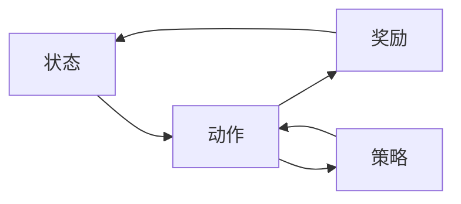

## 1.背景介绍

强化学习作为机器学习的一个重要分支，近年来在人工智能领域引起了广泛的关注。其基本思想是通过智能体与环境的交互，通过试错的方式，学习在特定环境下的最优策略，以达到某种目标。强化学习的理论和方法在很多领域都有广泛的应用，如游戏、机器人控制、自动驾驶等。

## 2.核心概念与联系

强化学习的核心概念包括状态(state)、动作(action)、奖励(reward)、策略(policy)等。智能体在某个状态下，采取某个动作，环境会给出一个奖励，并转移到新的状态。智能体的目标是通过学习找到一个最优策略，使得从任何状态出发，通过执行该策略能够获得最大的累积奖励。



## 3.核心算法原理具体操作步骤

强化学习的核心算法包括值迭代(Value Iteration)、策略迭代(Policy Iteration)、Q学习(Q-Learning)、Sarsa、深度Q网络(DQN)等。这些算法的基本思想都是通过迭代的方式，逐步优化值函数或策略函数，以达到最优策略。

以值迭代为例，其基本步骤如下：

1. 初始化值函数V(s)为任意值，通常为0。
2. 对每个状态s，更新其值函数V(s)为在该状态下所有可能的动作a的期望奖励的最大值。
3. 重复步骤2，直到值函数V(s)收敛。

## 4.数学模型和公式详细讲解举例说明

值迭代的数学模型可以用贝尔曼方程来描述。贝尔曼方程是强化学习的基础，它描述了状态值函数和动作值函数之间的关系。对于每个状态s和动作a，其动作值函数Q(s,a)可以表示为在状态s下执行动作a后获得的即时奖励和执行最优策略后的期望奖励的和。

$$Q(s,a) = r(s,a) + \gamma \max_{a'} Q(s',a')$$

其中，r(s,a)是在状态s下执行动作a后获得的即时奖励，s'是执行动作a后转移到的新状态，$\gamma$是折扣因子，用于控制即时奖励和未来奖励的权重。

## 5.项目实践：代码实例和详细解释说明

下面以Q学习算法为例，给出一个在格子世界(Grid World)环境下的代码实例。

```python
import numpy as np

# 初始化Q表
Q = np.zeros((state_num, action_num))

# Q学习算法
for episode in range(max_episode):
    state = env.reset()
    for step in range(max_step):
        action = choose_action(state, Q)
        next_state, reward, done = env.step(action)
        Q[state][action] = Q[state][action] + alpha * (reward + gamma * np.max(Q[next_state]) - Q[state][action])
        state = next_state
        if done:
            break
```

## 6.实际应用场景

强化学习在很多领域都有广泛的应用，如：

1. 游戏：如AlphaGo就是通过深度强化学习算法，打败了世界围棋冠军。
2. 机器人：强化学习可以用来训练机器人完成各种任务，如走路、跑步、打球等。
3. 自动驾驶：强化学习可以用来训练自动驾驶系统，使其能够在复杂的交通环境中做出正确的决策。

## 7.工具和资源推荐

强化学习的研究和应用，需要一些专门的工具和资源，如：

1. OpenAI Gym：一个用于开发和比较强化学习算法的工具包。
2. TensorFlow：一个强大的深度学习框架，可以用来实现深度强化学习。
3. RLlib：一个高级的强化学习库，提供了一系列的强化学习算法。

## 8.总结：未来发展趋势与挑战

强化学习作为人工智能的一个重要研究方向，其发展前景十分广阔。未来的研究将更加注重算法的效率和稳定性，以及在更复杂环境下的应用。同时，如何将强化学习与其他机器学习方法如监督学习、无监督学习等更好地结合起来，也是一个重要的研究方向。

## 9.附录：常见问题与解答

1. Q：强化学习和监督学习有什么区别？

   A：监督学习是通过学习输入和输出的对应关系来进行预测，需要大量的标注数据。而强化学习是通过智能体与环境的交互，通过试错的方式，学习在特定环境下的最优策略。

2. Q：强化学习的奖励是如何定义的？

   A：奖励是根据任务的目标来定义的，通常是一个数值，用来衡量智能体的行为的好坏。例如，在游戏中，如果智能体赢了，就给一个正奖励；如果输了，就给一个负奖励。

3. Q：什么是贝尔曼方程？

   A：贝尔曼方程是强化学习的基础，它描述了状态值函数和动作值函数之间的关系。

作者：禅与计算机程序设计艺术 / Zen and the Art of Computer Programming