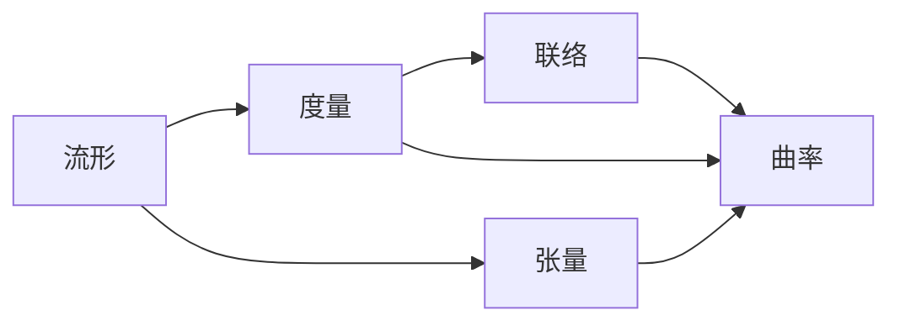

## 1. 背景介绍

广义相对论是爱因斯坦在1915年提出的一种描述引力的理论，它将引力视为时空曲率的结果，而非牛顿力学中的一种力。这一理论的提出，不仅在物理学领域产生了深远影响，也对数学、哲学乃至整个科学世界观带来了革命性的变化。微分几何作为研究曲面和曲线性质的数学分支，在广义相对论中扮演着核心角色，因为它提供了描述和分析时空几何结构的数学工具。

## 2. 核心概念与联系

在微分几何中，我们关注的核心概念包括流形、张量、度量、联络以及曲率等。这些概念在广义相对论中被用来描述时空的几何性质。例如，流形提供了一个连续可微的空间模型，度量定义了流形上的距离和角度，而曲率则描述了流形的弯曲程度。



## 3. 核心算法原理具体操作步骤

在广义相对论中，爱因斯坦场方程是核心的算法原理，它描述了物质和能量如何影响时空的几何结构。求解爱因斯坦场方程通常涉及以下步骤：

1. 选择合适的坐标系统和度量张量。
2. 计算克里斯托费尔符号，它们是联络的组成部分。
3. 利用克里斯托费尔符号计算里奇张量和曲率标量。
4. 根据物质和能量的分布确定应力-能量张量。
5. 将以上计算结果代入爱因斯坦场方程求解。

## 4. 数学模型和公式详细讲解举例说明

爱因斯坦场方程的数学表达式为：

$$
G_{\mu\nu} + \Lambda g_{\mu\nu} = \frac{8\pi G}{c^4} T_{\mu\nu}
$$

其中，$G_{\mu\nu}$ 是里奇曲率张量，$\Lambda$ 是宇宙常数，$g_{\mu\nu}$ 是度量张量，$G$ 是引力常数，$c$ 是光速，$T_{\mu\nu}$ 是应力-能量张量。

以史瓦西解为例，它描述了一个质量为 $M$ 的球对称非旋转物体外部的时空几何。史瓦西度量为：

$$
ds^2 = -\left(1-\frac{2GM}{c^2r}\right)c^2dt^2 + \left(1-\frac{2GM}{c^2r}\right)^{-1}dr^2 + r^2(d\theta^2 + \sin^2\theta d\phi^2)
$$

## 5. 项目实践：代码实例和详细解释说明

为了验证广义相对论的预言，我们可以通过编写程序来模拟光线在史瓦西度量下的传播。以下是一个简化的代码示例，使用Python语言：

```python
import numpy as np

# 定义常数
G = 6.67430e-11  # 引力常数
M = 1.989e30     # 太阳质量
c = 299792458    # 光速

# 史瓦西度量下的光线方程
def schwarzschild_geodesic(r, phi):
    b = r * np.sin(phi)  # 角动量
    return 1 - (2 * G * M) / (b * c**2)

# 光线路径模拟
def simulate_light_path(r_initial, phi_initial, steps):
    r = r_initial
    phi = phi_initial
    path = []
    for _ in range(steps):
        path.append((r, phi))
        phi = schwarzschild_geodesic(r, phi)
        r -= 0.001  # 假设光线向中心物体移动
    return path

# 模拟光线路径
light_path = simulate_light_path(1e9, np.pi/4, 1000)
```

这段代码模拟了光线在史瓦西度量下的径向运动，其中 `schwarzschild_geodesic` 函数计算了光线在给定半径和角度下的运动方程。

## 6. 实际应用场景

广义相对论的预言已在多个实际场景中得到验证，包括引力透镜效应、行星轨道的进动、光线在太阳附近的偏折以及时间膨胀效应。这些现象的观测与广义相对论的预测高度一致，为理论提供了强有力的实验支持。

## 7. 工具和资源推荐

为了深入研究广义相对论和微分几何，以下是一些推荐的工具和资源：

- Mathematica 或 Maple：用于符号计算和复杂数学表达式的处理。
- General Relativity Toolkit (GRTensor)：一个用于计算广义相对论张量的Mathematica包。
- "Gravitation" by Charles W. Misner, Kip S. Thorne, and John Archibald Wheeler：一本广义相对论的经典教材。

## 8. 总结：未来发展趋势与挑战

广义相对论作为现代物理学的基石之一，其理论和实验研究仍在不断进展。未来的发展趋势包括对极端引力场的探索，如黑洞和中子星，以及量子引力理论的发展。挑战则包括解决广义相对论与量子力学的统一问题，以及对更加精确的实验验证。

## 9. 附录：常见问题与解答

Q1: 广义相对论和牛顿引力有什么区别？
A1: 广义相对论将引力描述为时空的几何性质，而牛顿引力将其视为物体间的力。

Q2: 微分几何在广义相对论中的作用是什么？
A2: 微分几何提供了描述时空几何结构的数学框架，是理解和应用广义相对论不可或缺的工具。

Q3: 爱因斯坦场方程难以求解的原因是什么？
A3: 爱因斯坦场方程是一组复杂的非线性偏微分方程，通常需要特定的对称性或近似方法才能求解。

作者：禅与计算机程序设计艺术 / Zen and the Art of Computer Programming