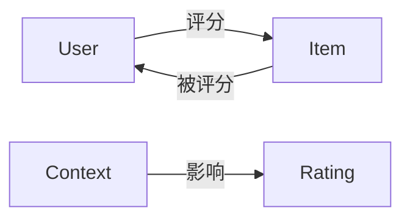
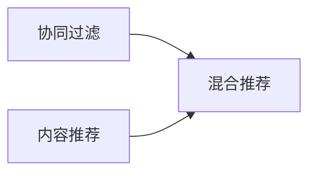

# 推荐系统(Recommender Systems) - 原理与代码实例讲解

## 1. 背景介绍
在数字化时代，推荐系统已成为连接用户与信息的重要桥梁。无论是电子商务、社交网络还是内容平台，推荐系统都在帮助用户发现对他们有价值的内容。它通过分析用户的历史行为、偏好和上下文信息，预测用户可能感兴趣的项目，并向用户推荐。

## 2. 核心概念与联系
推荐系统的核心概念包括用户（User）、物品（Item）、评分（Rating）和上下文（Context）。用户和物品是推荐系统的主体，评分是用户对物品的偏好程度的量化，而上下文则提供了评分发生的环境信息。这些概念之间的联系构成了推荐系统的基础。



## 3. 核心算法原理具体操作步骤
推荐系统的核心算法可以分为协同过滤（Collaborative Filtering）、内容推荐（Content-based Recommendation）和混合推荐（Hybrid Recommendation）。协同过滤依赖用户和物品的交互历史，内容推荐依赖物品的属性信息，而混合推荐结合了两者的优点。



## 4. 数学模型和公式详细讲解举例说明
以协同过滤为例，其核心数学模型是用户-物品评分矩阵。用户对物品的评分可以通过矩阵分解技术预测。例如，奇异值分解（SVD）是一种常用的矩阵分解方法。

$$
R \approx U \Sigma V^T
$$

其中，$R$ 是用户-物品评分矩阵，$U$ 和 $V$ 分别是用户和物品的特征矩阵，$\Sigma$ 是对角矩阵，包含了矩阵$R$的奇异值。

## 5. 项目实践：代码实例和详细解释说明
以Python的`surprise`库为例，我们可以实现SVD算法来预测用户对物品的评分。

```python
from surprise import SVD
from surprise import Dataset
from surprise.model_selection import cross_validate

# 加载数据集
data = Dataset.load_builtin('ml-100k')

# 使用SVD算法
algo = SVD()

# 对算法进行交叉验证
cross_validate(algo, data, measures=['RMSE', 'MAE'], cv=5, verbose=True)
```

这段代码首先加载了一个内置的电影评分数据集，然后使用SVD算法进行模型训练，并通过交叉验证评估算法的性能。

## 6. 实际应用场景
推荐系统在多个领域都有广泛应用，如电子商务网站推荐商品、视频平台推荐视频、音乐平台推荐歌曲等。它们帮助用户在海量的信息中找到自己感兴趣的内容，提高了用户体验和平台的用户粘性。

## 7. 工具和资源推荐
- `surprise`：一个Python推荐系统库，提供多种推荐算法。
- `TensorFlow Recommenders`：Google的推荐系统库，适用于大规模数据。
- `Recommender Systems Handbook`：一本全面介绍推荐系统理论和实践的书籍。

## 8. 总结：未来发展趋势与挑战
推荐系统的未来发展趋势包括利用深度学习提高推荐质量、融合多种类型的上下文信息、保护用户隐私和推荐的公平性等。这些趋势带来了新的挑战，如如何平衡推荐的准确性和多样性、如何处理冷启动问题等。

## 9. 附录：常见问题与解答
Q1: 协同过滤如何处理新用户或新物品的推荐？
A1: 可以采用基于内容的推荐或冷启动策略，如利用用户的人口统计信息或物品的属性信息进行推荐。

Q2: 推荐系统如何保证推荐的多样性？
A2: 可以在推荐算法中引入多样性指标，或者使用多臂老虎机算法等探索-利用策略。

Q3: 如何评估推荐系统的性能？
A3: 常用的评估指标包括准确率、召回率、覆盖率和多样性等。

作者：禅与计算机程序设计艺术 / Zen and the Art of Computer Programming