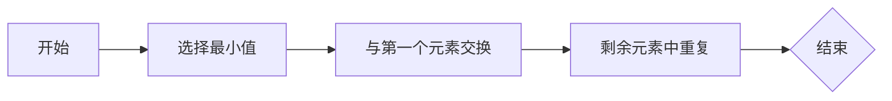

# 数据结构与算法原理与代码实战案例讲解

## 1. 背景介绍
在计算机科学的世界里，数据结构与算法是构建高效程序的基石。它们是解决问题和执行任务的蓝图，决定了程序的性能和可靠性。随着技术的不断进步，对数据处理的需求日益增长，优秀的数据结构和算法设计变得尤为重要。

## 2. 核心概念与联系
数据结构是组织和存储数据的方式，它影响数据的读取和写入效率。算法则是解决特定问题的步骤和规则。两者紧密相连，优秀的算法往往需要合适的数据结构作为支撑。

### 2.1 数据结构的分类
- 线性结构：如数组、链表、栈和队列。
- 非线性结构：如树、图。

### 2.2 算法的特性
- 正确性：算法应正确解决问题。
- 效率：算法应尽可能高效地使用计算资源。
- 可读性：算法应易于理解和维护。

## 3. 核心算法原理具体操作步骤
以排序算法为例，我们可以通过以下步骤来理解其原理：

### 3.1 选择排序
1. 从数组中找到最小（或最大）元素。
2. 将其与数组的第一个元素交换位置。
3. 从剩余元素中重复上述步骤。



## 4. 数学模型和公式详细讲解举例说明
排序算法的性能可以用大O表示法来描述。例如，选择排序的时间复杂度为 $O(n^2)$。

$$ T(n) = \frac{n(n-1)}{2} = O(n^2) $$

这表示随着输入规模的增长，选择排序的时间成本以平方的速度增加。

## 5. 项目实践：代码实例和详细解释说明
以下是选择排序的Python代码示例：

```python
def selection_sort(arr):
    for i in range(len(arr)):
        min_idx = i
        for j in range(i+1, len(arr)):
            if arr[j] < arr[min_idx]:
                min_idx = j
        arr[i], arr[min_idx] = arr[min_idx], arr[i]
    return arr
```

这段代码首先遍历数组，然后在内层循环中寻找最小元素，并与当前位置的元素交换。

## 6. 实际应用场景
数据结构和算法在许多领域都有应用，如搜索引擎、数据库管理、机器学习等。

## 7. 工具和资源推荐
- 《算法导论》：深入理解算法原理。
- LeetCode：练习算法题和面试准备。
- Visualgo：可视化数据结构和算法。

## 8. 总结：未来发展趋势与挑战
随着数据量的增长和计算需求的提高，数据结构和算法的优化将持续是计算机科学领域的重要挑战。未来的发展趋势可能包括算法的并行化和分布式计算。

## 9. 附录：常见问题与解答
Q1: 如何选择合适的数据结构？
A1: 需要根据数据的使用模式和操作频率来选择。

Q2: 如何评估算法的效率？
A2: 通常使用时间复杂度和空间复杂度来评估。

作者：禅与计算机程序设计艺术 / Zen and the Art of Computer Programming