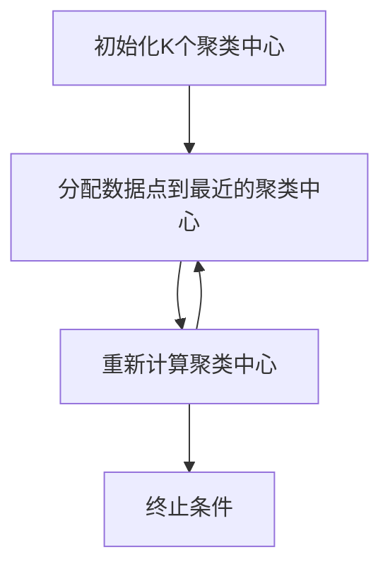
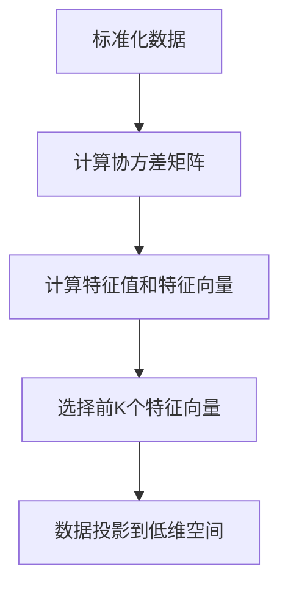
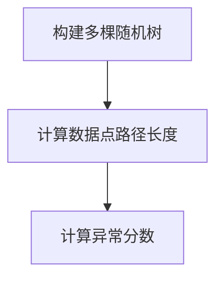

# 无监督学习 (Unsupervised Learning) 原理与代码实例讲解

## 1.背景介绍

在机器学习的广阔领域中，无监督学习（Unsupervised Learning）作为一种重要的学习范式，逐渐受到越来越多的关注。与监督学习不同，无监督学习不依赖于标注数据，而是通过分析和建模数据的内在结构来发现隐藏的模式和关系。无监督学习在数据挖掘、图像处理、自然语言处理等领域有着广泛的应用。

无监督学习的主要任务包括聚类（Clustering）、降维（Dimensionality Reduction）和异常检测（Anomaly Detection）等。本文将深入探讨无监督学习的核心概念、算法原理、数学模型，并通过代码实例展示其实际应用。

## 2.核心概念与联系

### 2.1 聚类

聚类是无监督学习中最常见的任务之一，其目标是将数据集划分为若干个簇，使得同一簇内的数据点相似度最大，不同簇之间的相似度最小。常见的聚类算法包括K-means、层次聚类（Hierarchical Clustering）和DBSCAN等。

### 2.2 降维

降维旨在将高维数据映射到低维空间，以便于数据的可视化和处理。常见的降维方法有主成分分析（PCA）、线性判别分析（LDA）和t-SNE等。

### 2.3 异常检测

异常检测用于识别数据集中与大多数数据点显著不同的异常点。常见的异常检测方法包括孤立森林（Isolation Forest）、高斯混合模型（GMM）和局部异常因子（LOF）等。

## 3.核心算法原理具体操作步骤

### 3.1 K-means 聚类

K-means 聚类是一种迭代优化算法，其基本步骤如下：

1. 初始化K个聚类中心。
2. 将每个数据点分配到最近的聚类中心。
3. 重新计算每个聚类的中心。
4. 重复步骤2和3，直到聚类中心不再变化或达到最大迭代次数。



### 3.2 主成分分析（PCA）

PCA 是一种线性降维方法，其基本步骤如下：

1. 标准化数据。
2. 计算协方差矩阵。
3. 计算协方差矩阵的特征值和特征向量。
4. 选择前K个特征向量构成投影矩阵。
5. 将数据投影到低维空间。



### 3.3 孤立森林（Isolation Forest）

孤立森林是一种基于树结构的异常检测方法，其基本步骤如下：

1. 构建多棵随机树。
2. 对每个数据点计算其在树中的路径长度。
3. 根据路径长度计算异常分数。



## 4.数学模型和公式详细讲解举例说明

### 4.1 K-means 聚类

K-means 聚类的目标是最小化簇内平方和（Within-Cluster Sum of Squares, WCSS），其数学表达式为：

$$
\text{WCSS} = \sum_{i=1}^{K} \sum_{x \in C_i} \| x - \mu_i \|^2
$$

其中，$K$ 是聚类数，$C_i$ 是第 $i$ 个簇，$\mu_i$ 是第 $i$ 个簇的中心，$x$ 是数据点。

### 4.2 主成分分析（PCA）

PCA 的目标是找到数据的主成分，其数学表达式为：

$$
\text{Cov}(X) = \frac{1}{n-1} \sum_{i=1}^{n} (x_i - \bar{x})(x_i - \bar{x})^T
$$

其中，$\text{Cov}(X)$ 是协方差矩阵，$x_i$ 是第 $i$ 个数据点，$\bar{x}$ 是数据的均值。

### 4.3 孤立森林（Isolation Forest）

孤立森林通过计算数据点的路径长度来评估其异常分数，其数学表达式为：

$$
s(x, n) = 2^{-\frac{E(h(x))}{c(n)}}
$$

其中，$s(x, n)$ 是数据点 $x$ 的异常分数，$E(h(x))$ 是 $x$ 的路径长度的期望值，$c(n)$ 是调整因子。

## 5.项目实践：代码实例和详细解释说明

### 5.1 K-means 聚类

```python
import numpy as np
from sklearn.cluster import KMeans
import matplotlib.pyplot as plt

# 生成示例数据
X = np.random.rand(100, 2)

# 训练K-means模型
kmeans = KMeans(n_clusters=3, random_state=0).fit(X)

# 获取聚类结果
labels = kmeans.labels_
centers = kmeans.cluster_centers_

# 可视化聚类结果
plt.scatter(X[:, 0], X[:, 1], c=labels, cmap='viridis')
plt.scatter(centers[:, 0], centers[:, 1], c='red', marker='x')
plt.show()
```

### 5.2 主成分分析（PCA）

```python
import numpy as np
from sklearn.decomposition import PCA
import matplotlib.pyplot as plt

# 生成示例数据
X = np.random.rand(100, 5)

# 训练PCA模型
pca = PCA(n_components=2)
X_reduced = pca.fit_transform(X)

# 可视化降维结果
plt.scatter(X_reduced[:, 0], X_reduced[:, 1])
plt.show()
```

### 5.3 孤立森林（Isolation Forest）

```python
import numpy as np
from sklearn.ensemble import IsolationForest
import matplotlib.pyplot as plt

# 生成示例数据
X = np.random.rand(100, 2)

# 训练孤立森林模型
clf = IsolationForest(random_state=0).fit(X)

# 获取异常分数
scores = clf.decision_function(X)

# 可视化异常检测结果
plt.scatter(X[:, 0], X[:, 1], c=scores, cmap='viridis')
plt.show()
```

## 6.实际应用场景

### 6.1 客户细分

通过聚类算法，可以将客户分为不同的群体，以便于进行精准营销和个性化推荐。例如，电商平台可以根据客户的购买行为将其分为高价值客户、潜在客户和普通客户。

### 6.2 图像压缩

通过降维算法，可以将高维图像数据压缩到低维空间，从而减少存储和传输的成本。例如，主成分分析（PCA）可以用于图像的压缩和降噪。

### 6.3 异常检测

通过异常检测算法，可以识别出数据中的异常点，从而进行风险控制和故障检测。例如，金融机构可以通过孤立森林算法检测交易数据中的异常行为，以防范欺诈风险。

## 7.工具和资源推荐

### 7.1 工具

- **Scikit-learn**：一个强大的Python机器学习库，提供了丰富的无监督学习算法实现。
- **TensorFlow**：一个开源的机器学习框架，支持深度学习和无监督学习。
- **Matplotlib**：一个Python绘图库，用于数据的可视化。

### 7.2 资源

- **《Pattern Recognition and Machine Learning》**：Christopher M. Bishop所著，详细介绍了无监督学习的理论和算法。
- **Coursera**：提供了丰富的机器学习和无监督学习课程。
- **Kaggle**：一个数据科学竞赛平台，提供了大量的无监督学习项目和数据集。

## 8.总结：未来发展趋势与挑战

无监督学习作为机器学习的重要分支，具有广阔的应用前景。随着数据量的不断增加和计算能力的提升，无监督学习将在更多领域发挥重要作用。然而，无监督学习也面临着一些挑战，如算法的可解释性、模型的稳定性和大规模数据处理等。未来，随着研究的深入和技术的进步，这些问题有望得到解决。

## 9.附录：常见问题与解答

### 9.1 无监督学习与监督学习的区别是什么？

无监督学习不依赖于标注数据，而是通过分析数据的内在结构来发现模式和关系；而监督学习则依赖于标注数据，通过学习输入和输出之间的映射关系来进行预测。

### 9.2 如何选择合适的聚类算法？

选择聚类算法时需要考虑数据的特点和具体应用场景。例如，K-means适用于簇形状为球形且簇大小相似的数据；DBSCAN适用于簇形状不规则且存在噪声的数据。

### 9.3 无监督学习的结果如何评估？

无监督学习的结果评估通常依赖于领域知识和具体应用场景。例如，聚类结果可以通过轮廓系数（Silhouette Coefficient）和调整兰德指数（Adjusted Rand Index）等指标进行评估；降维结果可以通过可视化和重构误差等方法进行评估。

---

作者：禅与计算机程序设计艺术 / Zen and the Art of Computer Programming