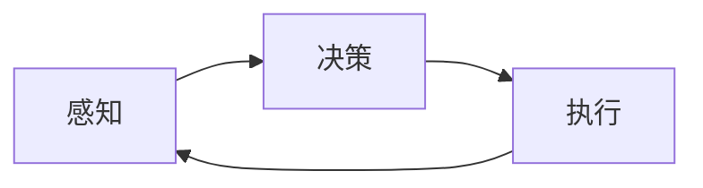
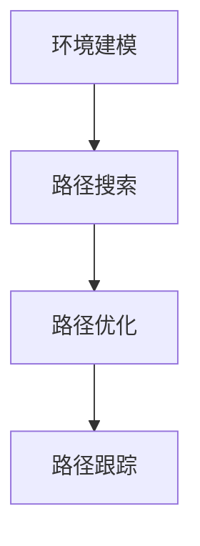

# 机器人学 (Robotics)

## 1. 背景介绍
机器人学是一门综合性极强的学科，它涉及机械工程、电子工程、计算机科学等多个领域。随着技术的发展，机器人已经从科幻小说中走入了现实生活，它们在制造业、医疗、服务业、探索和救援等多个领域发挥着越来越重要的作用。

## 2. 核心概念与联系
机器人学的核心概念包括机器人的感知、决策和执行。感知是指机器人通过传感器获取外部信息的能力；决策是指机器人处理信息并作出反应的过程；执行则是机器人通过驱动器实现物理动作的能力。这三个概念相互联系，共同构成了机器人的基本工作流程。



## 3. 核心算法原理具体操作步骤
机器人学中的核心算法原理包括路径规划、避障、机器学习等。以路径规划为例，其操作步骤通常包括环境建模、路径搜索、路径优化和路径跟踪。



## 4. 数学模型和公式详细讲解举例说明
在机器人学中，数学模型和公式是理解和实现算法的基础。例如，路径规划中常用的A*算法，其数学模型可以表示为：

$$ f(n) = g(n) + h(n) $$

其中，$f(n)$ 是从初始点通过节点$n$到目标点的估计总代价，$g(n)$ 是从初始点到节点$n$的实际代价，$h(n)$ 是节点$n$到目标点的估计代价。

## 5. 项目实践：代码实例和详细解释说明
在项目实践中，我们可以通过编写代码来实现机器人的基本功能。以下是一个简单的避障算法的伪代码示例：

```python
def avoid_obstacles(sensor_data):
    if sensor_data < THRESHOLD:
        turn_direction = choose_direction(sensor_data)
        move(turn_direction)
    else:
        move_forward()

def choose_direction(sensor_data):
    # 根据传感器数据决定转向
    if sensor_data.left < sensor_data.right:
        return 'left'
    else:
        return 'right'
```

## 6. 实际应用场景
机器人在许多领域都有应用，例如在制造业中，机器人可以进行精确的组装和焊接；在医疗领域，机器人可以辅助进行精细的手术；在服务业，如酒店和餐厅，机器人可以用来服务顾客。

## 7. 工具和资源推荐
对于机器人学的学习和研究，以下是一些有用的工具和资源：
- ROS（Robot Operating System）：一个用于机器人软件开发的灵活框架。
- Gazebo：一个用于机器人仿真的强大工具。
- OpenCV：一个用于计算机视觉应用的开源库。

## 8. 总结：未来发展趋势与挑战
机器人学的未来发展趋势包括更高的智能化、更强的自适应能力和更广泛的应用领域。同时，机器人学面临的挑战包括技术的复杂性、安全性问题以及伦理和法律问题。

## 9. 附录：常见问题与解答
Q1: 机器人如何感知环境？
A1: 机器人通过传感器，如摄像头、激光雷达等，来感知环境。

Q2: 机器人学中的算法如何实现？
A2: 机器人学中的算法通常通过编程语言实现，并在机器人的控制系统中运行。

作者：禅与计算机程序设计艺术 / Zen and the Art of Computer Programming