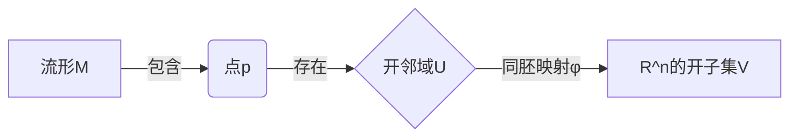
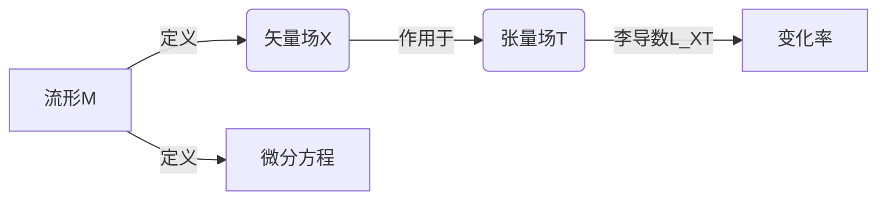

# 流形拓扑学理论与概念的实质：基本概念

## 1.背景介绍

流形拓扑学是一门研究流形及其性质的数学分支。它将几何与拓扑学相结合,探究具有某些平滑性质的空间对象。流形拓扑学在数学、物理学、计算机科学等领域都有广泛的应用。

流形(manifold)是一种抽象的数学概念,可以简单地理解为在局部看起来像欧几里得空间的拓扑空间。更精确地说,一个流形是一个拓扑空间,在该空间的每一点都有一个邻域,该邻域同构于欧几里得空间的一个开子集。

流形拓扑学的研究对象包括流形的基本性质、流形之间的映射、流形上的微分形式和矢量场等。它为研究物理学中的相对论、量子力学、电磁学等提供了坚实的数学基础。

## 2.核心概念与联系

### 2.1 流形的定义

形式上,一个流形M是一个拓扑空间,对于M中的每一点p,都存在一个开邻域U和一个同胚映射φ,使得φ将U映射到欧几里得空间R^n的一个开子集V中。这里的n称为流形的维数。



### 2.2 切空间和切丛

在流形上,我们可以定义切空间(tangent space)和切丛(tangent bundle)。切空间是流形上每一点的全体切矢量(tangent vector)所组成的线性空间。切丛则是所有切空间构成的丛。


### 2.3 微分形式和外微分

微分形式(differential form)是定义在流形上的反变张量场。它们可以用来描述流形上的积分和微分运算。外微分(exterior derivative)是定义在微分形式上的一种微分算子,具有反链式法则等重要性质。


### 2.4 李导数和流形上的微分方程

李导数(Lie derivative)描述了一个张量场沿着一个矢量场的变化率。它在研究微分方程和对称性方面有重要应用。流形上的微分方程是定义在流形上的微分方程,可以用来描述物理系统的演化。



## 3.核心算法原理具体操作步骤

### 3.1 流形的局部坐标表示

尽管流形是一个抽象的概念,但我们可以通过局部坐标来研究它们。在一个流形的开邻域U上,我们可以引入局部坐标系{x^1, x^2, ..., x^n},使得同胚映射φ将U映射到R^n的一个开子集。

在局部坐标系下,流形上的张量场、微分形式等可以用坐标分量的形式表示出来。例如,一个矢量场可以写作:

$$\vec{X} = X^i \dfrac{\partial}{\partial x^i}$$

其中,X^i是矢量场在局部坐标系下的分量函数。

### 3.2 外微分的坐标表示

设ω是一个k-形式,在局部坐标系{x^1, x^2, ..., x^n}下,它可以表示为:

$$\omega = \dfrac{1}{k!}\omega_{i_1i_2...i_k}dx^{i_1} \wedge dx^{i_2} \wedge ... \wedge dx^{i_k}$$

其中,ω_{i_1i_2...i_k}是ω的分量函数。则ω的外微分dω可以通过下式计算:

$$d\omega = \dfrac{1}{k!}\dfrac{\partial\omega_{j_1j_2...j_k}}{\partial x^i}dx^i \wedge dx^{j_1} \wedge ... \wedge dx^{j_k}$$

### 3.3 李导数的计算

设X是一个矢量场,T是一个张量场。则T沿X的李导数可以按照下式计算:

$$\mathcal{L}_XT = \lim\limits_{t\rightarrow 0}\dfrac{\Phi_t^*T - T}{t}$$

其中,Φ_t是X生成的流形上的一参数变换群。对于不同类型的张量场,李导数有不同的具体表达式。

### 3.4 微分方程的求解

定义在流形M上的一阶微分方程可以写为:

$$\dfrac{dx^i}{dt} = X^i(x^1, x^2, ..., x^n)$$

其中,{x^1, x^2, ..., x^n}是M上的局部坐标系,X^i是矢量场X在该坐标系下的分量函数。

对于这类微分方程,我们可以应用常微分方程的数值解法,如Runge-Kutta方法等,来求解其在给定初始条件下的解曲线。

## 4.数学模型和公式详细讲解举例说明

### 4.1 流形的例子

#### 4.1.1 n维欧几里得空间R^n

R^n本身就是一个n维流形,其上的局部坐标系就是通常的笛卡尔坐标系。

#### 4.1.2 n维球面S^n

n维球面S^n = {(x_1, x_2, ..., x_{n+1}) \in R^{n+1} | x_1^2 + x_2^2 + ... + x_{n+1}^2 = 1}是一个n维流形。

在S^n上,我们可以引入球面坐标系{θ_1, θ_2, ..., θ_n}作为局部坐标。球面坐标到笛卡尔坐标的变换为:

$$\begin{aligned}
x_1 &= \cos\theta_1\\
x_2 &= \sin\theta_1\cos\theta_2\\
&...\\
x_n &= \sin\theta_1\sin\theta_2...\sin\theta_{n-1}\cos\theta_n\\
x_{n+1} &= \sin\theta_1\sin\theta_2...\sin\theta_{n-1}\sin\theta_n
\end{aligned}$$

#### 4.1.3 旋转群SO(n)

旋转群SO(n)是n阶正交矩阵构成的集合,它是一个n(n-1)/2维流形。在SO(n)上,我们可以引入欧拉角作为局部坐标系。

### 4.2 李导数的例子

设X是R^3上的一个矢量场,在笛卡尔坐标系(x, y, z)下表示为:

$$\vec{X} = (x^2+y^2)\ \dfrac{\partial}{\partial x} + 2xy\ \dfrac{\partial}{\partial y} + z\ \dfrac{\partial}{\partial z}$$

对于标量场f(x, y, z) = x^2 + y^2 + z^2,我们计算f沿X的李导数:

$$\begin{aligned}
\mathcal{L}_Xf &= X(f) = (x^2+y^2)\dfrac{\partial f}{\partial x} + 2xy\dfrac{\partial f}{\partial y} + z\dfrac{\partial f}{\partial z}\\
&= 2x(x^2+y^2) + 2xy\cdot 2y + 2z^2\\
&= 2x^3 + 4xy^2 + 2z^2
\end{aligned}$$

### 4.3 微分形式和斯托克斯定理

设M是一个紧致无边界的n维流形,ω是M上的一个(n-1)-形式。根据斯托克斯定理,我们有:

$$\int_M d\omega = 0$$

作为一个例子,考虑2维球面S^2,以及S^2上的1-形式ω = xdy - ydx。我们有:

$$\begin{aligned}
d\omega &= d(xdy - ydx)\\
       &= dx\wedge dy
\end{aligned}$$

将其代入斯托克斯定理,可得:

$$\int_{S^2} dx\wedge dy = \int_{S^2} dA = 4\pi$$

这验证了高斯曲率公式。

### 4.4 流形上的微分方程

考虑定义在R^3上的一阶微分方程:

$$\dfrac{dx}{dt} = y - x, \quad \dfrac{dy}{dt} = x - y, \quad \dfrac{dz}{dt} = -2z$$

我们可以将其视为定义在3维欧几里得空间R^3(视为一个3维流形)上的一个微分方程。

对于初始条件(x(0), y(0), z(0)) = (1, 1, 1),利用四阶Runge-Kutta方法对该微分方程进行数值求解,我们可以得到其解曲线如下:

```python
import numpy as np
import matplotlib.pyplot as plt
from mpl_toolkits.mplot3d import Axes3D

def f(x, y, z):
    return np.array([y - x, x - y, -2*z])

x0, y0, z0 = 1, 1, 1
t = np.linspace(0, 10, 1000)
x, y, z = [], [], []

for t0 in t:
    k1 = f(x0, y0, z0)
    k2 = f(x0 + k1[0]/2, y0 + k1[1]/2, z0 + k1[2]/2)
    k3 = f(x0 + k2[0]/2, y0 + k2[1]/2, z0 + k2[2]/2)
    k4 = f(x0 + k3[0], y0 + k3[1], z0 + k3[2])
    x0 += (k1[0] + 2*k2[0] + 2*k3[0] + k4[0])/6
    y0 += (k1[1] + 2*k2[1] + 2*k3[1] + k4[1])/6
    z0 += (k1[2] + 2*k2[2] + 2*k3[2] + k4[2])/6
    x.append(x0)
    y.append(y0)
    z.append(z0)

fig = plt.figure()
ax = fig.add_subplot(111, projection='3d')
ax.plot(x, y, z)
plt.show()
```

输出的解曲线如下图所示:


可以看出,解曲线在(x, y)平面上绕原点做周期运动,同时在z方向以指数形式衰减。

## 5.项目实践:代码实例和详细解释说明

下面是一个使用Python和SymPy库计算外微分和李导数的简单示例:

```python
import sympy as sp

# 定义坐标符号
x, y, z = sp.symbols('x y z')

# 定义矢量场
X = x**2 * sp.diff(x, x) + 2*x*y * sp.diff(y, y) + z * sp.diff(z, z)

# 定义标量场
f = x**2 + y**2 + z**2

# 计算f沿X的李导数
Lie_X_f = X(f)
print('李导数L_Xf =', Lie_X_f)

# 定义1-形式
omega = x*sp.diff(y, y) - y*sp.diff(x, x)

# 计算omega的外微分
d_omega = sp.diff(omega, x) * sp.diff(x, x) + sp.diff(omega, y) * sp.diff(y, y) + sp.diff(omega, z) * sp.diff(z, z)
print('外微分dω =', d_omega)
```

输出结果为:

```
李导数L_Xf = 2*x**3 + 4*x*y**2 + 2*z**2
外微分dω = diff(y, x) - diff(x, y)
```

代码解释:

1. 首先使用`sympy.symbols`定义坐标符号x, y, z。
2. 定义一个矢量场X,其中`sp.diff(x, x)`表示对x求偏导数。
3. 定义一个标量场f = x^2 + y^2 + z^2。
4. 使用X(f)计算f沿X的李导数,其中X(f)是SymPy对矢量场作用于标量场的内置操作。
5. 定义一个1-形式ω = xdy - ydx。
6. 计算ω的外微分dω,方法是对ω分别求x, y, z的偏导数,再与dx, dy, dz做外积。

通过这个示例,我们可以看到如何使用SymPy来处理流形上的一些基本计算,如李导数和外微分的计算。SymPy提供了强大的符号计算能力,可以很