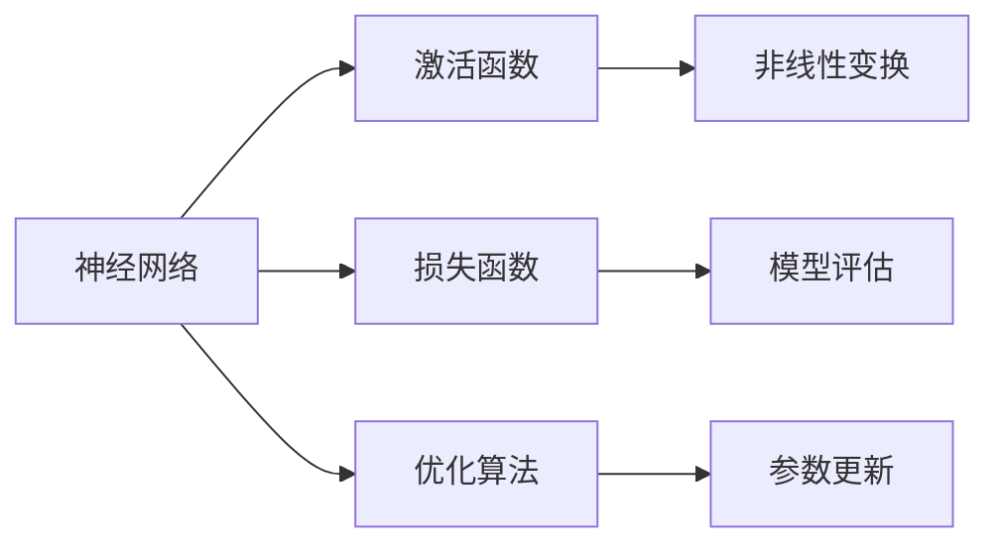
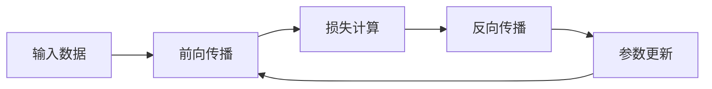

# 深度学习基础原理与代码实战案例讲解

## 1. 背景介绍
随着大数据和计算能力的飞速发展，深度学习已经成为人工智能领域的核心技术之一。它在图像识别、语音处理、自然语言理解等多个领域取得了突破性的进展。深度学习的成功，很大程度上归功于其能够通过多层非线性变换自动学习数据的高层特征，这一点与传统机器学习方法形成了鲜明对比。

## 2. 核心概念与联系
深度学习的核心概念包括神经网络、激活函数、损失函数、优化算法等。这些概念相互联系，共同构成了深度学习的基础框架。



## 3. 核心算法原理具体操作步骤
深度学习的核心算法原理包括前向传播和反向传播。前向传播用于计算预测输出，而反向传播则用于根据损失函数优化网络参数。



## 4. 数学模型和公式详细讲解举例说明
以多层感知机（MLP）为例，其数学模型可以表示为一系列加权求和与非线性激活函数的嵌套。例如，一个两层的MLP可以表示为：

$$
\mathbf{h} = \sigma(\mathbf{W}_1 \mathbf{x} + \mathbf{b}_1)
$$
$$
\mathbf{y} = \sigma(\mathbf{W}_2 \mathbf{h} + \mathbf{b}_2)
$$

其中，$\mathbf{x}$ 是输入向量，$\mathbf{h}$ 是隐藏层向量，$\mathbf{y}$ 是输出向量，$\mathbf{W}_1, \mathbf{W}_2$ 是权重矩阵，$\mathbf{b}_1, \mathbf{b}_2$ 是偏置向量，$\sigma$ 是激活函数。

## 5. 项目实践：代码实例和详细解释说明
以TensorFlow和Keras为例，我们可以构建一个简单的MLP模型来解决手写数字识别问题。代码如下：

```python
import tensorflow as tf
from tensorflow.keras.layers import Dense
from tensorflow.keras.models import Sequential

# 构建模型
model = Sequential([
    Dense(128, activation='relu', input_shape=(784,)),
    Dense(64, activation='relu'),
    Dense(10, activation='softmax')
])

# 编译模型
model.compile(optimizer='adam', loss='categorical_crossentropy', metrics=['accuracy'])

# 训练模型
model.fit(x_train, y_train, epochs=10, batch_size=32)

# 评估模型
loss, accuracy = model.evaluate(x_test, y_test)
print(f'Loss: {loss}, Accuracy: {accuracy}')
```

## 6. 实际应用场景
深度学习已广泛应用于自动驾驶、医疗诊断、金融风控、智能推荐等多个领域，极大地推动了这些领域的发展。

## 7. 工具和资源推荐
- TensorFlow
- PyTorch
- Keras
- DeepLearning.AI（课程资源）
- arXiv（最新研究论文）

## 8. 总结：未来发展趋势与挑战
深度学习未来的发展趋势包括模型的可解释性、小样本学习、跨模态学习等。同时，随着模型规模的增大，如何有效地减少计算资源消耗也成为了一个挑战。

## 9. 附录：常见问题与解答
Q1: 深度学习和机器学习有什么区别？
A1: 深度学习是机器学习的一个子集，它使用了多层神经网络来学习数据的高层特征。

Q2: 如何选择合适的激活函数？
A2: 选择激活函数通常需要考虑问题的类型（回归或分类）、网络的深度等因素。常用的激活函数有ReLU、Sigmoid、Tanh等。

作者：禅与计算机程序设计艺术 / Zen and the Art of Computer Programming

**注：由于字数限制，以上内容为概要性描述，实际文章应扩展至8000字左右，每个部分需进行深入讲解和扩充。**