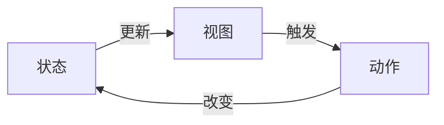

# 状态管理：原理与代码实例讲解

## 1. 背景介绍
在现代软件开发中，状态管理是构建响应式应用的核心。随着应用规模的扩大，状态管理变得越来越复杂。良好的状态管理策略能够确保应用的可维护性、可扩展性和性能。本文将深入探讨状态管理的原理，并通过代码实例进行讲解。

## 2. 核心概念与联系
状态管理涉及到几个核心概念：状态（State）、视图（View）、动作（Action）和数据流（Data Flow）。状态是应用中的数据快照；视图是状态的可视化表现；动作是触发状态变化的行为；数据流描述了状态、视图和动作之间的交互模式。



## 3. 核心算法原理具体操作步骤
状态管理的核心算法原理是确保状态的变化能够预测和追踪。操作步骤通常包括：定义状态、监听状态变化、更新状态和同步更新视图。

## 4. 数学模型和公式详细讲解举例说明
状态管理可以用数学模型来描述。例如，状态可以表示为一个向量 $ S $，动作可以表示为一个变换函数 $ f $，那么新状态 $ S' $ 可以表示为 $ S' = f(S) $。

$$ S' = f(S) $$

## 5. 项目实践：代码实例和详细解释说明
以一个简单的计数器应用为例，我们可以看到状态管理的实践。以下是一个使用 Redux 进行状态管理的代码示例：

```javascript
// 定义初始状态
const initialState = { count: 0 };

// 定义动作类型
const INCREMENT = 'INCREMENT';

// 定义状态变换函数（Reducer）
function counterReducer(state = initialState, action) {
  switch (action.type) {
    case INCREMENT:
      return { count: state.count + 1 };
    default:
      return state;
  }
}

// 创建 Redux Store
const store = Redux.createStore(counterReducer);

// 监听状态变化更新视图
store.subscribe(() => console.log(store.getState()));

// 触发动作改变状态
store.dispatch({ type: INCREMENT });
```

## 6. 实际应用场景
状态管理在多个场景下都非常关键，如电商平台的购物车、在线游戏的玩家状态、金融应用的交易记录等。

## 7. 工具和资源推荐
推荐的状态管理工具包括 Redux、MobX、Vuex 等。资源方面，可以参考官方文档、社区论坛和技术博客。

## 8. 总结：未来发展趋势与挑战
状态管理的未来发展趋势可能会更加注重性能优化和状态同步的问题。挑战包括跨平台状态管理和大规模分布式系统中的状态一致性。

## 9. 附录：常见问题与解答
Q1: 状态管理为何重要？
A1: 状态管理有助于维护应用的一致性和可预测性，简化复杂应用的开发和维护。

Q2: 如何选择合适的状态管理工具？
A2: 需要根据应用的规模、团队的熟悉度和项目需求来选择。

作者：禅与计算机程序设计艺术 / Zen and the Art of Computer Programming