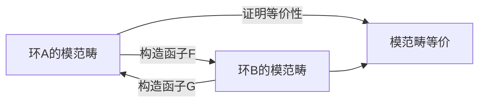

# 环与代数：Morita筹价

## 1. 背景介绍

在现代数学和理论物理中，环与代数的理论是构建复杂系统模型的基础。Morita等价是代数学中的一个重要概念，它描述了在某种意义下不同代数结构之间的等价关系。这一理论不仅在数学颖域内有着深远的影响，同时也在计算机科学，尤其是在程序设计、类型理论和并行计算等领域中发挥着重要作用。

## 2. 核心概念与联系

环（Ring）是一种代数结构，它包含了加法和乘法两种运算，并满足一系列公理，如交换律、结合律等。代数（Algebra）则是在环的基础上，增加了向量空间的结构。Morita等价是代数之间的一种特殊关系，它揭示了不同代数结构在模范畴中的等价性。

### 2.1 环的定义

环是一个集合R，配备了两种二元运算：加法（+）和乘法（×），这两种运算满足以下性质：

- 加法交换律：$a + b = b + a$
- 加法结合律：$(a + b) + c = a + (b + c)$
- 乘法结合律：$(a × b) × c = a × (b × c)$
- 分配律：$a × (b + c) = (a × b) + (a × c)$ 和 $(b + c) × a = (b × a) + (c × a)$

### 2.2 代数的定义

代数是一个环A，它同时也是一个向量空间，其上的乘法与向量空间的标量乘法兼容。

### 2.3 Morita等价

两个环A和B如果它们的模范畴是等价的，则称A和B是Morita等价的。这意味着A的模可以转换为B的模，反之亦然。

## 3. 核心算法原理具体操作步骤

Morita等价的核心算法原理涉及到模范畴的转换。以下是操作步骤的简化流程图：



## 4. 数学模型和公式详细讲解举例说明

### 4.1 Morita等价的数学模型

Morita等价的数学模型基于模范畴的概念。如果存在函子F和G，使得对于任意的A-模M和B-模N，都有：

- $F(M)$ 是B-模
- $G(N)$ 是A-模
- $G(F(M)) \cong M$ 和 $F(G(N)) \cong N$

则称A和B是Morita等价的。

### 4.2 公式举例

假设有环A和B，A的模范畴中有对象M，B的模范畴中有对象N。构造函子F和G如下：

- $F(M) = M \otimes_A P$
- $G(N) = \text{Hom}_B(P, N)$

其中P是一个特定的A-B双模。如果P满足一定条件（例如P是投射的且生成B），那么F和G构成了Morita等价的证明。

## 5. 项目实践：代码实例和详细解释说明

在计算机科学中，我们可以通过编程语言来模拟环和代数的操作。以下是一个简单的Python代码示例，展示了如何定义一个环和执行基本的环运算：

```python
class Ring:
    def __init__(self, elements):
        self.elements = elements

    def add(self, a, b):
        return (a + b) % len(self.elements)

    def multiply(self, a, b):
        return (a * b) % len(self.elements)

# 示例环的元素
elements = [0, 1, 2, 3, 4]

# 创建环实例
my_ring = Ring(elements)

# 环上的加法和乘法
addition_result = my_ring.add(2, 3)
multiplication_result = my_ring.multiply(2, 3)

print(f"Addition: {addition_result}")
print(f"Multiplication: {multiplication_result}")
```

这个代码定义了一个简单的环，并实现了加法和乘法运算。在实际应用中，环和代数的操作会更加复杂，涉及到更多的数学理论和算法。

## 6. 实际应用场景

Morita等价的概念在多个领域都有应用，例如：

- 在代数几何中，通过研究代数结构的Morita等价，可以更好地理解几何对象的性质。
- 在量子物理中，Morita等价在研究量子场论和弦理论中的对偶性时起着关键作用。
- 在计算机科学中，类型理论和程序设计中的抽象数据类型可以通过Morita等价的概念来分析和优化。

## 7. 工具和资源推荐

- 数学软件：如Mathematica、MATLAB，它们提供了强大的数学计算和符号运算能力。
- 计算机代数系统：如SageMath、Maple，这些系统可以帮助进行代数结构的计算和理论验证。
- 在线资源：如ArXiv、MathOverflow，这些平台提供了大量的数学和计算机科学的研究论文和讨论。

## 8. 总结：未来发展趋势与挑战

Morita等价作为一种深刻的数学理论，其在未来的发展趋势中将更多地与计算机科学和量子信息等前沿领域交叉。挑战在于如何将这些抽象的数学理论应用到具体的技术问题中，以及如何通过计算机辅助工具来探索这些理论的新领域。

## 9. 附录：常见问题与解答

Q1: Morita等价在计算机科学中有什么应用？
A1: 在计算机科学中，Morita等价可以用来分析和优化程序设计中的抽象数据类型和类型系统。

Q2: 如何直观理解Morita等价？
A2: Morita等价可以被理解为不同代数结构之间的一种“同构”，它们虽然在表面上不同，但在模范畴的层面上具有相同的结构和性质。

Q3: 学习Morita等价需要哪些数学基础？
A3: 学习Morita等价需要良好的抽象代数基础，包括环论、模论和范畴论的知识。

作者：禅与计算机程序设计艺术 / Zen and the Art of Computer Programming