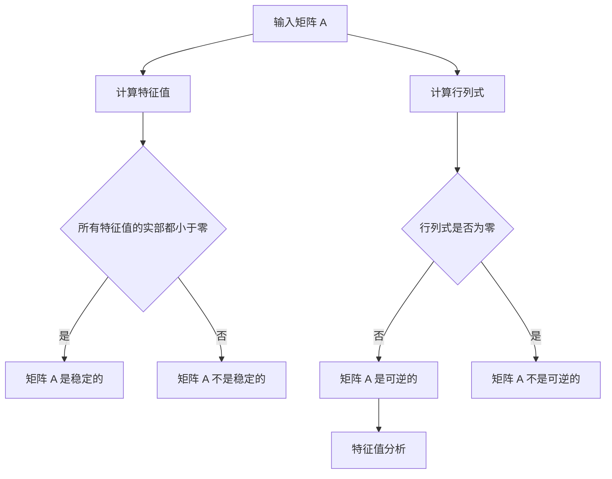

# 矩阵理论与应用：Shemesh定理与Brualdi定理

## 1.背景介绍

矩阵理论是线性代数的核心部分，广泛应用于计算机科学、物理学、工程学等多个领域。矩阵不仅是数据表示的基本形式，还在算法设计、机器学习、图像处理等方面发挥着重要作用。在矩阵理论中，Shemesh定理和Brualdi定理是两个重要的定理，它们在矩阵的稳定性、可逆性和特征值分析中具有重要意义。

### 1.1 矩阵理论的基本概念

矩阵是一个二维数组，由行和列组成。一个 $m \times n$ 的矩阵 $A$ 可以表示为：

$$
A = \begin{pmatrix}
a_{11} & a_{12} & \cdots & a_{1n} \\
a_{21} & a_{22} & \cdots & a_{2n} \\
\vdots & \vdots & \ddots & \vdots \\
a_{m1} & a_{m2} & \cdots & a_{mn}
\end{pmatrix}
$$

矩阵的基本操作包括加法、乘法、转置、求逆等。

### 1.2 Shemesh定理和Brualdi定理的历史背景

Shemesh定理和Brualdi定理分别由数学家 Shemesh 和 Brualdi 提出。Shemesh定理主要研究矩阵的稳定性问题，而Brualdi定理则关注矩阵的可逆性和特征值分布。这两个定理在理论研究和实际应用中都有重要的地位。

## 2.核心概念与联系

### 2.1 Shemesh定理

Shemesh定理主要研究矩阵的稳定性。一个矩阵 $A$ 被称为稳定的，如果其所有特征值的实部都小于零。Shemesh定理给出了判断矩阵稳定性的一种方法。

### 2.2 Brualdi定理

Brualdi定理则关注矩阵的可逆性和特征值分布。它提供了一种方法来判断一个矩阵是否可逆，并分析其特征值的分布情况。

### 2.3 Shemesh定理与Brualdi定理的联系

虽然Shemesh定理和Brualdi定理研究的方向不同，但它们都涉及矩阵的特征值分析。特征值是矩阵的重要性质，决定了矩阵的许多行为特征。通过特征值分析，可以深入理解矩阵的稳定性和可逆性。

## 3.核心算法原理具体操作步骤

### 3.1 Shemesh定理的算法步骤

1. **计算特征值**：首先计算矩阵 $A$ 的特征值。
2. **判断实部**：检查所有特征值的实部是否都小于零。
3. **结论**：如果所有特征值的实部都小于零，则矩阵 $A$ 是稳定的。

### 3.2 Brualdi定理的算法步骤

1. **计算行列式**：计算矩阵 $A$ 的行列式。
2. **判断行列式是否为零**：如果行列式不为零，则矩阵 $A$ 是可逆的。
3. **特征值分析**：进一步分析矩阵 $A$ 的特征值分布情况。

### 3.3 算法流程图



## 4.数学模型和公式详细讲解举例说明

### 4.1 Shemesh定理的数学模型

Shemesh定理的核心在于特征值的实部。设 $A$ 是一个 $n \times n$ 的矩阵，其特征值为 $\lambda_1, \lambda_2, \ldots, \lambda_n$。Shemesh定理可以表述为：

$$
A \text{ 是稳定的} \iff \forall i, \Re(\lambda_i) < 0
$$

### 4.2 Brualdi定理的数学模型

Brualdi定理主要涉及行列式和特征值。设 $A$ 是一个 $n \times n$ 的矩阵，其行列式为 $\det(A)$。Brualdi定理可以表述为：

$$
A \text{ 是可逆的} \iff \det(A) \neq 0
$$

### 4.3 举例说明

#### 4.3.1 Shemesh定理举例

设 $A$ 为一个 $2 \times 2$ 的矩阵：

$$
A = \begin{pmatrix}
-2 & 1 \\
0 & -3
\end{pmatrix}
$$

计算其特征值：

$$
\lambda_1 = -2, \quad \lambda_2 = -3
$$

由于 $\Re(\lambda_1) = -2 < 0$ 和 $\Re(\lambda_2) = -3 < 0$，因此矩阵 $A$ 是稳定的。

#### 4.3.2 Brualdi定理举例

设 $B$ 为一个 $2 \times 2$ 的矩阵：

$$
B = \begin{pmatrix}
1 & 2 \\
3 & 4
\end{pmatrix}
$$

计算其行列式：

$$
\det(B) = 1 \cdot 4 - 2 \cdot 3 = -2
$$

由于 $\det(B) \neq 0$，因此矩阵 $B$ 是可逆的。

## 5.项目实践：代码实例和详细解释说明

### 5.1 Shemesh定理的代码实现

以下是使用Python实现Shemesh定理的代码示例：

```python
import numpy as np

def is_stable(matrix):
    eigenvalues = np.linalg.eigvals(matrix)
    for eigenvalue in eigenvalues:
        if np.real(eigenvalue) >= 0:
            return False
    return True

# 示例矩阵
A = np.array([[-2, 1], [0, -3]])
print("矩阵 A 是否稳定:", is_stable(A))
```

### 5.2 Brualdi定理的代码实现

以下是使用Python实现Brualdi定理的代码示例：

```python
import numpy as np

def is_invertible(matrix):
    determinant = np.linalg.det(matrix)
    return determinant != 0

# 示例矩阵
B = np.array([[1, 2], [3, 4]])
print("矩阵 B 是否可逆:", is_invertible(B))
```

### 5.3 代码解释

- `np.linalg.eigvals(matrix)`：计算矩阵的特征值。
- `np.real(eigenvalue)`：获取特征值的实部。
- `np.linalg.det(matrix)`：计算矩阵的行列式。

## 6.实际应用场景

### 6.1 控制系统

在控制系统中，系统的稳定性是一个关键问题。Shemesh定理可以用于判断系统矩阵的稳定性，从而确保系统的正常运行。

### 6.2 机器学习

在机器学习中，矩阵的可逆性和特征值分析是许多算法的基础。Brualdi定理可以帮助判断矩阵是否可逆，从而确保算法的正确性。

### 6.3 图像处理

在图像处理领域，矩阵操作是基本操作之一。通过Shemesh定理和Brualdi定理，可以优化图像处理算法，提高处理效率。

## 7.工具和资源推荐

### 7.1 工具

- **NumPy**：Python的科学计算库，提供了丰富的矩阵操作函数。
- **MATLAB**：强大的数学计算软件，广泛用于矩阵计算和算法开发。
- **SciPy**：Python的科学计算库，扩展了NumPy的功能，提供了更多的矩阵操作函数。

### 7.2 资源

- **《矩阵分析与应用》**：一本经典的矩阵理论书籍，详细介绍了矩阵的基本概念和应用。
- **Coursera上的线性代数课程**：提供了系统的线性代数学习资源，适合初学者和进阶学习者。

## 8.总结：未来发展趋势与挑战

### 8.1 未来发展趋势

随着计算机科学和人工智能的发展，矩阵理论的应用将越来越广泛。未来，矩阵理论将在大数据分析、深度学习、量子计算等领域发挥更大的作用。

### 8.2 挑战

尽管矩阵理论已经取得了许多重要成果，但仍然存在一些挑战。例如，如何高效地计算大规模矩阵的特征值和行列式，如何在实际应用中更好地利用Shemesh定理和Brualdi定理等。

## 9.附录：常见问题与解答

### 9.1 什么是矩阵的特征值？

特征值是矩阵的重要性质，表示矩阵在某个方向上的伸缩因子。设 $A$ 是一个 $n \times n$ 的矩阵，$\lambda$ 是一个标量，如果存在一个非零向量 $v$ 使得 $Av = \lambda v$，则 $\lambda$ 是矩阵 $A$ 的特征值。

### 9.2 如何计算矩阵的行列式？

行列式是一个标量，表示矩阵的某种代数性质。对于 $2 \times 2$ 的矩阵 $A = \begin{pmatrix} a & b \\ c & d \end{pmatrix}$，其行列式为 $\det(A) = ad - bc$。对于更高维的矩阵，可以使用递归的方法计算行列式。

### 9.3 Shemesh定理和Brualdi定理的实际应用有哪些？

Shemesh定理主要用于判断矩阵的稳定性，广泛应用于控制系统、信号处理等领域。Brualdi定理则用于判断矩阵的可逆性，应用于机器学习、图像处理等领域。

---

作者：禅与计算机程序设计艺术 / Zen and the Art of Computer Programming