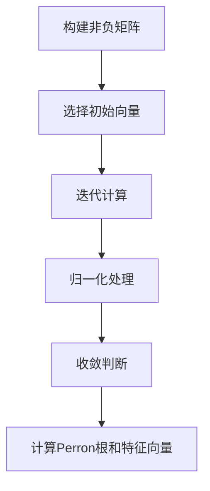

# 矩阵理论与应用：一般非负矩阵Perron-Frobenius理论的古典结果

## 1.背景介绍

在现代数学和计算机科学中，矩阵理论是一个极其重要的分支。它不仅在纯数学中有着广泛的应用，还在物理学、工程学、经济学和计算机科学等领域发挥着关键作用。特别是非负矩阵的Perron-Frobenius理论，它为我们提供了理解和分析复杂系统的强大工具。

Perron-Frobenius理论最初由Oskar Perron和Georg Frobenius在20世纪初提出，主要研究非负矩阵的特征值和特征向量。这个理论不仅在数学上有深远的影响，还在实际应用中，如Google的PageRank算法、马尔可夫链、生态学模型等方面有着广泛的应用。

## 2.核心概念与联系

### 2.1 非负矩阵

非负矩阵是指所有元素均为非负数的矩阵。形式上，如果矩阵 $A = [a_{ij}]$ 满足 $a_{ij} \geq 0$ 对于所有的 $i$ 和 $j$，则称 $A$ 为非负矩阵。

### 2.2 Perron-Frobenius定理

Perron-Frobenius定理是关于非负矩阵特征值和特征向量的一个重要结果。其核心内容包括：

1. **存在性**：对于一个非负矩阵 $A$，存在一个最大的实特征值 $\lambda$，称为Perron根。
2. **唯一性**：这个最大的实特征值是唯一的，并且对应的特征向量可以选择为非负的。
3. **正性**：如果矩阵 $A$ 是不可约的（即矩阵不能分解为两个更小的矩阵），则对应于Perron根的特征向量是严格正的。

### 2.3 不可约矩阵

一个矩阵 $A$ 被称为不可约的，如果对于任意的 $i$ 和 $j$，存在一个正整数 $k$ 使得 $A^k$ 的 $(i, j)$ 元素大于零。不可约矩阵在Perron-Frobenius理论中扮演着重要角色。

## 3.核心算法原理具体操作步骤

### 3.1 特征值和特征向量的计算

计算非负矩阵的特征值和特征向量是Perron-Frobenius理论的核心。以下是具体步骤：

1. **构建矩阵**：首先，构建一个非负矩阵 $A$。
2. **初始向量选择**：选择一个初始向量 $x_0$，通常可以选择一个所有元素均为1的向量。
3. **迭代计算**：通过迭代计算 $x_{k+1} = A x_k$，并在每次迭代后对向量进行归一化处理。
4. **收敛判断**：当向量 $x_k$ 收敛时，计算 $\lambda = \frac{x_{k+1}}{x_k}$，此时 $\lambda$ 即为Perron根，对应的 $x_k$ 即为特征向量。

### 3.2 Mermaid 流程图



## 4.数学模型和公式详细讲解举例说明

### 4.1 Perron-Frobenius定理的数学表述

对于一个非负矩阵 $A$，Perron-Frobenius定理可以表述为：

1. 存在一个实数 $\lambda$ 和一个非负向量 $x$ 使得 $A x = \lambda x$。
2. $\lambda$ 是最大的特征值，即 $\lambda \geq |\mu|$ 对于所有的特征值 $\mu$。
3. 如果 $A$ 是不可约的，则 $\lambda$ 是唯一的，并且对应的特征向量 $x$ 是严格正的。

### 4.2 举例说明

考虑一个简单的非负矩阵：

$$
A = \begin{pmatrix}
2 & 1 \\
1 & 2
\end{pmatrix}
$$

我们可以通过迭代法计算其Perron根和特征向量。选择初始向量 $x_0 = \begin{pmatrix} 1 \\ 1 \end{pmatrix}$，进行迭代计算：

$$
x_1 = A x_0 = \begin{pmatrix}
2 & 1 \\
1 & 2
\end{pmatrix} \begin{pmatrix}
1 \\
1
\end{pmatrix} = \begin{pmatrix}
3 \\
3
\end{pmatrix}
$$

归一化处理后：

$$
x_1 = \begin{pmatrix}
1 \\
1
\end{pmatrix}
$$

继续迭代，直到收敛：

$$
x_2 = A x_1 = \begin{pmatrix}
2 & 1 \\
1 & 2
\end{pmatrix} \begin{pmatrix}
1 \\
1
\end{pmatrix} = \begin{pmatrix}
3 \\
3
\end{pmatrix}
$$

归一化处理后：

$$
x_2 = \begin{pmatrix}
1 \\
1
\end{pmatrix}
$$

此时，特征向量已经收敛，计算Perron根：

$$
\lambda = \frac{A x_2}{x_2} = 3
$$

因此，Perron根为3，对应的特征向量为 $\begin{pmatrix} 1 \\ 1 \end{pmatrix}$。

## 5.项目实践：代码实例和详细解释说明

### 5.1 Python代码实现

以下是一个使用Python实现Perron-Frobenius定理的示例代码：

```python
import numpy as np

def perron_frobenius(matrix, tol=1e-6, max_iter=1000):
    n = matrix.shape[0]
    x = np.ones(n)
    for _ in range(max_iter):
        x_new = np.dot(matrix, x)
        x_new = x_new / np.linalg.norm(x_new, ord=1)
        if np.linalg.norm(x_new - x, ord=1) < tol:
            break
        x = x_new
    eigenvalue = np.dot(matrix, x)[0] / x[0]
    return eigenvalue, x

# 示例矩阵
A = np.array([[2, 1], [1, 2]])
eigenvalue, eigenvector = perron_frobenius(A)
print("Perron根:", eigenvalue)
print("特征向量:", eigenvector)
```

### 5.2 代码解释

1. **初始化**：定义一个非负矩阵 $A$ 和一个初始向量 $x$。
2. **迭代计算**：通过矩阵乘法和归一化处理，迭代计算特征向量。
3. **收敛判断**：判断向量是否收敛，如果收敛则计算Perron根。
4. **输出结果**：输出Perron根和对应的特征向量。

## 6.实际应用场景

### 6.1 Google PageRank算法

Perron-Frobenius理论在Google的PageRank算法中有着重要应用。PageRank算法通过构建一个网页链接矩阵，利用Perron-Frobenius定理计算每个网页的排名。

### 6.2 马尔可夫链

在马尔可夫链中，转移矩阵通常是非负矩阵。Perron-Frobenius定理可以用来分析马尔可夫链的稳态分布。

### 6.3 生态学模型

在生态学中，种群动态模型通常可以表示为非负矩阵。Perron-Frobenius定理可以用来分析种群的长期行为。

## 7.工具和资源推荐

### 7.1 矩阵计算工具

- **NumPy**：Python的科学计算库，提供了强大的矩阵计算功能。
- **MATLAB**：专业的数学软件，广泛用于矩阵计算和数值分析。

### 7.2 参考书籍

- 《矩阵分析》：Roger A. Horn 和 Charles R. Johnson 所著，是矩阵理论的经典教材。
- 《非负矩阵与应用》：Henryk Minc 所著，详细介绍了非负矩阵的理论和应用。

## 8.总结：未来发展趋势与挑战

Perron-Frobenius理论在现代数学和计算机科学中有着广泛的应用。随着大数据和人工智能的发展，非负矩阵的分析和计算将变得更加重要。然而，如何高效地处理大规模矩阵，特别是在分布式计算环境下，仍然是一个巨大的挑战。

未来，随着计算能力的提升和算法的改进，Perron-Frobenius理论将会在更多领域中发挥作用，如社交网络分析、推荐系统和生物信息学等。

## 9.附录：常见问题与解答

### 9.1 什么是Perron根？

Perron根是非负矩阵的最大实特征值。根据Perron-Frobenius定理，这个特征值是唯一的，并且对应的特征向量可以选择为非负的。

### 9.2 如何判断一个矩阵是否不可约？

一个矩阵是不可约的，如果对于任意的 $i$ 和 $j$，存在一个正整数 $k$ 使得 $A^k$ 的 $(i, j)$ 元素大于零。可以通过图论的方法来判断矩阵的不可约性。

### 9.3 Perron-Frobenius定理的实际应用有哪些？

Perron-Frobenius定理在Google PageRank算法、马尔可夫链、生态学模型等领域有着广泛的应用。

---

作者：禅与计算机程序设计艺术 / Zen and the Art of Computer Programming