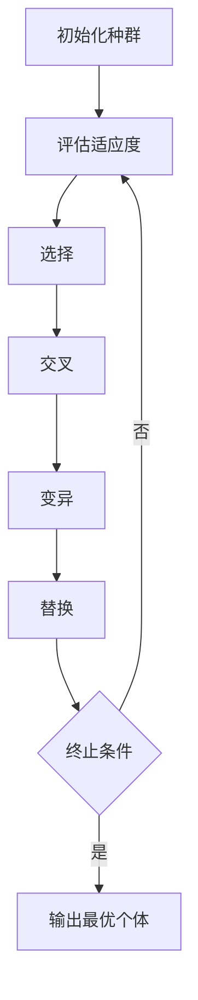

# 神经进化算法(Neuroevolution) - 原理与代码实例讲解

## 1.背景介绍

神经进化算法（Neuroevolution）是将进化算法与神经网络相结合的一种技术。它通过模拟自然选择和遗传变异的过程，自动优化神经网络的结构和权重。神经进化算法在解决复杂问题、自动化设计神经网络结构以及优化神经网络参数方面表现出色，尤其在强化学习和自动驾驶等领域有广泛应用。

传统的神经网络训练方法，如反向传播算法，依赖于梯度下降法来优化网络权重。然而，这些方法在处理高维度、非凸优化问题时可能会遇到局部最优解的问题。神经进化算法通过进化策略，能够更好地探索搜索空间，避免陷入局部最优解。

## 2.核心概念与联系

### 2.1 神经网络

神经网络是由多个神经元（节点）组成的计算模型，模仿生物神经系统的工作原理。每个神经元接收输入信号，经过加权求和和激活函数处理后，输出信号传递给下一个神经元。

### 2.2 进化算法

进化算法是一类基于自然选择和遗传变异的优化算法。它通过模拟生物进化过程，逐步优化个体的适应度。常见的进化算法包括遗传算法（Genetic Algorithm, GA）、进化策略（Evolution Strategy, ES）和差分进化（Differential Evolution, DE）。

### 2.3 神经进化

神经进化是将进化算法应用于神经网络的优化过程。它可以优化神经网络的权重、结构或两者兼而有之。神经进化的目标是通过进化过程找到最优的神经网络，以解决特定问题。

### 2.4 核心联系

神经进化算法将神经网络和进化算法结合起来，通过进化过程优化神经网络的权重和结构。进化算法负责选择、交叉和变异操作，而神经网络则负责处理输入数据并生成输出结果。

## 3.核心算法原理具体操作步骤

### 3.1 初始化种群

首先，初始化一个包含多个神经网络个体的种群。每个个体的神经网络结构和权重可以随机生成。

### 3.2 评估适应度

对每个个体的神经网络进行评估，计算其适应度。适应度函数根据问题的具体需求设计，通常是神经网络在特定任务上的表现。

### 3.3 选择

根据适应度选择优秀的个体进行繁殖。常见的选择方法包括轮盘赌选择、锦标赛选择和排名选择。

### 3.4 交叉

对选择出的个体进行交叉操作，生成新的个体。交叉操作可以交换神经网络的部分结构或权重。

### 3.5 变异

对新生成的个体进行变异操作，随机改变神经网络的部分结构或权重。变异操作增加了种群的多样性，有助于探索搜索空间。

### 3.6 替换

将新生成的个体替换掉种群中的部分个体，形成新的种群。替换策略可以是完全替换、部分替换或精英保留。

### 3.7 重复迭代

重复上述步骤，直到满足终止条件。终止条件可以是达到预定的适应度阈值、迭代次数或时间限制。

以下是神经进化算法的流程图：



## 4.数学模型和公式详细讲解举例说明

### 4.1 神经网络的数学模型

神经网络的基本单元是神经元。每个神经元接收输入信号 $x_i$，通过权重 $w_i$ 加权求和后，经过激活函数 $f$ 处理，输出信号 $y$。数学表达式如下：

$$
y = f\left(\sum_{i=1}^{n} w_i x_i + b\right)
$$

其中，$b$ 是偏置项，$f$ 是激活函数，如 Sigmoid、ReLU 等。

### 4.2 进化算法的数学模型

进化算法通过选择、交叉和变异操作优化个体的适应度。假设种群大小为 $N$，每个个体的适应度为 $F_i$，则选择概率 $P_i$ 可以表示为：

$$
P_i = \frac{F_i}{\sum_{j=1}^{N} F_j}
$$

交叉操作通过交换两个个体的部分基因生成新个体。假设个体 $A$ 和 $B$ 的基因序列分别为 $a_1, a_2, \ldots, a_n$ 和 $b_1, b_2, \ldots, b_n$，交叉后的新个体基因序列为：

$$
c_i = \begin{cases} 
a_i & \text{if } r < 0.5 \\
b_i & \text{if } r \geq 0.5 
\end{cases}
$$

其中，$r$ 是一个随机数。

变异操作通过随机改变个体的部分基因增加种群的多样性。假设个体 $A$ 的基因序列为 $a_1, a_2, \ldots, a_n$，变异后的新个体基因序列为：

$$
a_i' = a_i + \Delta a_i
$$

其中，$\Delta a_i$ 是一个随机变化量。

### 4.3 举例说明

假设我们有一个简单的神经网络，输入层有 3 个节点，输出层有 1 个节点。我们使用神经进化算法优化该神经网络的权重。

1. 初始化种群：生成 10 个随机神经网络，每个网络的权重在 [-1, 1] 之间。
2. 评估适应度：计算每个神经网络在特定任务上的表现，作为其适应度。
3. 选择：根据适应度选择 5 个优秀的神经网络进行繁殖。
4. 交叉：对选择出的神经网络进行交叉操作，生成 5 个新神经网络。
5. 变异：对新生成的神经网络进行变异操作，随机改变部分权重。
6. 替换：将新生成的 5 个神经网络替换掉种群中的 5 个表现最差的神经网络。
7. 重复迭代：重复上述步骤，直到达到预定的适应度阈值或迭代次数。

## 5.项目实践：代码实例和详细解释说明

### 5.1 环境准备

首先，确保你已经安装了 Python 和相关的库，如 NumPy 和 Matplotlib。

```bash
pip install numpy matplotlib
```

### 5.2 神经网络类

定义一个简单的神经网络类，用于表示个体。

```python
import numpy as np

class NeuralNetwork:
    def __init__(self, input_size, output_size):
        self.weights = np.random.uniform(-1, 1, (input_size, output_size))
        self.bias = np.random.uniform(-1, 1, output_size)

    def forward(self, x):
        return self.sigmoid(np.dot(x, self.weights) + self.bias)

    def sigmoid(self, x):
        return 1 / (1 + np.exp(-x))
```

### 5.3 进化算法类

定义一个进化算法类，用于管理种群和进化过程。

```python
class EvolutionAlgorithm:
    def __init__(self, population_size, input_size, output_size):
        self.population = [NeuralNetwork(input_size, output_size) for _ in range(population_size)]
        self.population_size = population_size

    def evaluate_fitness(self, individual, data, labels):
        predictions = individual.forward(data)
        return -np.mean((predictions - labels) ** 2)

    def select(self, fitnesses):
        total_fitness = sum(fitnesses)
        probabilities = [f / total_fitness for f in fitnesses]
        return np.random.choice(self.population, p=probabilities)

    def crossover(self, parent1, parent2):
        child = NeuralNetwork(parent1.weights.shape[0], parent1.weights.shape[1])
        mask = np.random.rand(*parent1.weights.shape) < 0.5
        child.weights = np.where(mask, parent1.weights, parent2.weights)
        child.bias = np.where(mask[0], parent1.bias, parent2.bias)
        return child

    def mutate(self, individual, mutation_rate=0.01):
        mutation_mask = np.random.rand(*individual.weights.shape) < mutation_rate
        individual.weights += mutation_mask * np.random.uniform(-1, 1, individual.weights.shape)
        individual.bias += (np.random.rand(*individual.bias.shape) < mutation_rate) * np.random.uniform(-1, 1, individual.bias.shape)

    def evolve(self, data, labels, generations=100):
        for generation in range(generations):
            fitnesses = [self.evaluate_fitness(ind, data, labels) for ind in self.population]
            new_population = []
            for _ in range(self.population_size // 2):
                parent1 = self.select(fitnesses)
                parent2 = self.select(fitnesses)
                child1 = self.crossover(parent1, parent2)
                child2 = self.crossover(parent1, parent2)
                self.mutate(child1)
                self.mutate(child2)
                new_population.extend([child1, child2])
            self.population = new_population
            best_fitness = max(fitnesses)
            print(f"Generation {generation}: Best Fitness = {best_fitness}")
```

### 5.4 数据准备

生成一些简单的训练数据。

```python
data = np.random.rand(100, 3)
labels = np.sum(data, axis=1, keepdims=True)
```

### 5.5 运行进化算法

创建进化算法实例并运行。

```python
ea = EvolutionAlgorithm(population_size=10, input_size=3, output_size=1)
ea.evolve(data, labels, generations=100)
```

## 6.实际应用场景

### 6.1 强化学习

神经进化算法在强化学习中表现出色，尤其在解决复杂的策略优化问题时。通过进化过程，神经进化算法可以自动优化策略网络，适应不同的环境和任务。

### 6.2 自动驾驶

在自动驾驶领域，神经进化算法可以用于优化车辆的控制策略。通过模拟驾驶环境，神经进化算法可以逐步优化车辆的驾驶行为，提高驾驶安全性和效率。

### 6.3 游戏AI

神经进化算法在游戏AI中有广泛应用。通过进化过程，神经进化算法可以优化游戏角色的行为策略，使其在游戏中表现更加智能和灵活。

### 6.4 机器人控制

在机器人控制领域，神经进化算法可以用于优化机器人的运动控制策略。通过模拟机器人在不同环境中的运动，神经进化算法可以逐步优化机器人的控制参数，提高其运动性能。

## 7.工具和资源推荐

### 7.1 工具

- **DEAP**：一个用于进化算法的Python库，支持遗传算法、遗传编程等。
- **NEAT-Python**：一个用于神经进化的Python库，支持NEAT算法。
- **TensorFlow**：一个广泛使用的深度学习框架，支持自定义神经网络结构和优化算法。

### 7.2 资源

- **《Neuroevolution: From Algorithms to Applications》**：一本详细介绍神经进化算法及其应用的书籍。
- **OpenAI Gym**：一个用于开发和比较强化学习算法的工具包，提供了多种模拟环境。
- **Kaggle**：一个数据科学竞赛平台，提供了丰富的数据集和竞赛，适合进行神经进化算法的实践。

## 8.总结：未来发展趋势与挑战

神经进化算法作为一种结合进化算法和神经网络的技术，具有广泛的应用前景。未来，随着计算能力的提升和算法的改进，神经进化算法将在更多领域展现其优势。

### 8.1 发展趋势

- **自动化设计神经网络结构**：神经进化算法可以自动设计神经网络结构，减少人工干预，提高设计效率。
- **多目标优化**：未来的神经进化算法将更加注重多目标优化，能够同时优化多个性能指标。
- **大规模并行计算**：随着计算能力的提升，神经进化算法将能够处理更大规模的问题，进一步提高优化效果。

### 8.2 挑战

- **计算资源需求**：神经进化算法需要大量的计算资源，尤其在处理复杂问题时，计算成本较高。
- **适应度评估**：适应度评估是神经进化算法的关键步骤，设计合理的适应度函数是一个挑战。
- **收敛速度**：神经进化算法的收敛速度较慢，如何提高算法的收敛速度是一个重要研究方向。

## 9.附录：常见问题与解答

### 9.1 神经进化算法与传统神经网络训练方法有何不同？

神经进化算法通过进化过程优化神经网络的结构和权重，而传统神经网络训练方法通常使用梯度下降法优化权重。神经进化算法不依赖梯度信息，适用于非凸优化问题。

### 9.2 神经进化算法适用于哪些问题？

神经进化算法适用于复杂的优化问题，尤其在强化学习、自动驾驶、游戏AI和机器人控制等领域表现出色。

### 9.3 如何选择适应度函数？

适应度函数根据具体问题设计，通常是神经网络在特定任务上的表现。适应度函数应能够准确反映个体的优劣，指导进化过程。

### 9.4 如何提高神经进化算法的收敛速度？

可以通过增加种群多样性、改进选择和交叉策略、引入精英保留等方法提高神经进化算法的收敛速度。

### 9.5 神经进化算法的计算资源需求如何？

神经进化算法需要大量的计算资源，尤其在处理复杂问题时，计算成本较高。可以通过并行计算和分布式计算等方法降低计算成本。

---

作者：禅与计算机程序设计艺术 / Zen and the Art of Computer Programming