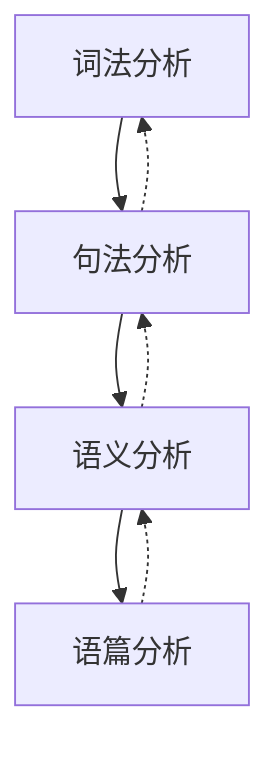

# 自然语言处理 (Natural Language Processing)

## 1. 背景介绍
### 1.1 自然语言处理的定义与目标
自然语言处理(Natural Language Processing, NLP)是人工智能(Artificial Intelligence, AI)的一个重要分支,旨在赋予计算机理解、生成和处理人类语言的能力。NLP 的主要目标是弥合人类语言和计算机之间的鸿沟,使计算机能够像人一样理解和生成自然语言,从而实现人机交互、信息检索、机器翻译等多种应用。

### 1.2 NLP的发展历程
NLP 的研究可以追溯到20世纪50年代图灵测试的提出。此后,NLP 经历了基于规则、基于统计和基于深度学习三个主要阶段:

1. 基于规则的方法(20世纪50年代-90年代):利用语言学规则进行语言理解和生成,代表性的系统有 ELIZA 和 SHRDLU。
2. 基于统计的方法(20世纪90年代-2010年):利用统计机器学习方法从大规模语料库中学习语言模型,代表性的模型有 N-gram、隐马尔可夫模型(HMM)等。
3. 基于深度学习的方法(2010年至今):利用深度神经网络从海量数据中学习语言表示,代表性的模型有循环神经网络(RNN)、Transformer等。

### 1.3 NLP的应用场景
NLP 在现实生活中有广泛的应用,主要包括:

1. 信息检索:通过理解用户的自然语言查询,从海量文本数据中检索相关信息。
2. 机器翻译:将一种自然语言翻译成另一种自然语言,实现跨语言交流。 
3. 情感分析:分析文本中蕴含的情感倾向,如正面、负面、中性等。
4. 文本摘要:自动生成文本的简明摘要,提取文本的核心内容。
5. 问答系统:根据用户的自然语言问题,给出准确的答案。
6. 对话系统:实现人机对话,提供智能客服、虚拟助手等服务。

## 2. 核心概念与联系
### 2.1 词法分析
词法分析是 NLP 的基础,主要任务是将连续的字符序列切分成一个个单词(Token),并确定每个单词的词性(POS)。常用的词法分析技术包括:

- 分词(Tokenization):将句子切分成词的过程。英文等语言可以根据空格和标点符号切分,而中文等语言需要更复杂的方法。
- 词性标注(POS Tagging):为每个单词标注词性,如名词、动词、形容词等。常用的方法有隐马尔可夫模型、条件随机场等。

### 2.2 句法分析
句法分析是在词法分析的基础上进行的,旨在分析句子的语法结构,揭示词与词之间的关系。常见的句法分析任务包括:

- 成分句法分析(Constituent Parsing):分析句子的短语结构,生成一棵句法树。
- 依存句法分析(Dependency Parsing):分析句子中词与词之间的依存关系,生成一个依存树。

### 2.3 语义分析 
语义分析是理解句子意思的关键,主要研究词语和句子的含义,以及上下文对含义的影响。语义分析的任务包括:

- 词义消歧(Word Sense Disambiguation):确定一个词在特定上下文中的具体含义。
- 指代消解(Coreference Resolution):确定文本中代词或其他指示语指代的对象。
- 语义角色标注(Semantic Role Labeling):识别句子中的语义角色,如施事、受事、时间、地点等。

### 2.4 语篇分析
语篇分析是对篇章层面的语言现象进行研究,主要任务包括:

- 篇章结构分析:分析篇章的结构和衔接方式,如论证结构、修辞结构等。
- 篇章关系识别:识别篇章中句子之间的语义关系,如因果、并列、转折等。
- 文本分类:根据文本的内容将其分类,如主题分类、情感分类等。

### 2.5 核心概念之间的联系
NLP 的各个层面是相互关联、相互影响的。词法分析是句法分析的基础,句法分析为语义分析提供结构信息,语义分析是语篇分析的基础。同时,高层的分析也会反过来指导低层的分析。例如,语义信息可以帮助消除句法分析中的歧义。

下图展示了 NLP 各个层面之间的关系:

## 3. 核心算法原理具体操作步骤
### 3.1 基于统计的方法
#### 3.1.1 语言模型
语言模型是对语言规律的概率描述,常用的语言模型有 N-gram 模型和神经网络语言模型。

N-gram 模型的基本思想是一个词出现的概率只与前面 n-1 个词有关。以 Bigram 为例,其计算公式为:

$P(w_1, w_2, ..., w_n) = \prod_{i=1}^n P(w_i | w_{i-1})$

其中,$w_i$ 表示第 i 个词,$P(w_i | w_{i-1})$ 表示在 $w_{i-1}$ 出现的条件下 $w_i$ 出现的概率,可以通过最大似然估计从语料库中计算得到:

$P(w_i | w_{i-1}) = \frac{Count(w_{i-1}, w_i)}{Count(w_{i-1})}$

神经网络语言模型使用神经网络学习词语的分布式表示,并根据上下文预测下一个词出现的概率。常用的神经网络结构有 RNN、LSTM 等。

#### 3.1.2 序列标注
序列标注是为输入序列中的每个元素分配一个标签,常用于词性标注、命名实体识别等任务。主要方法有:

- 隐马尔可夫模型(HMM):使用隐藏状态表示词性,观测状态表示词,通过极大似然估计学习模型参数。
- 条件随机场(CRF):在 HMM 的基础上引入了特征函数,可以融入更丰富的特征信息。

以 HMM 为例,其生成一个观测序列 $O=(o_1, o_2, ..., o_T)$ 的联合概率为:

$P(O, I) = \prod_{t=1}^T P(o_t | i_t) P(i_t | i_{t-1})$

其中,$I=(i_1, i_2, ..., i_T)$ 为隐藏状态序列,$P(o_t | i_t)$ 为发射概率,$P(i_t | i_{t-1})$ 为转移概率。使用维特比算法可以找到最可能的隐藏状态序列。

### 3.2 基于深度学习的方法
#### 3.2.1 词嵌入
词嵌入是将词映射为低维稠密向量的技术,可以有效表示词的语义信息。常用的词嵌入方法有:

- Word2Vec:包括 CBOW 和 Skip-gram 两种模型,分别通过上下文预测中心词和通过中心词预测上下文来学习词向量。
- GloVe:基于全局词共现统计信息学习词向量,考虑了词频的影响。

以 CBOW 为例,其目标是最大化如下对数似然函数:

$\mathcal{L} = \sum_{t=1}^T \log P(w_t | w_{t-c}, ..., w_{t-1}, w_{t+1}, ..., w_{t+c})$

其中,$w_t$ 为中心词,$c$ 为上下文窗口大小。$P(w_t | w_{t-c}, ..., w_{t-1}, w_{t+1}, ..., w_{t+c})$ 可以通过 softmax 函数计算:

$P(w_t | w_{t-c}, ..., w_{t-1}, w_{t+1}, ..., w_{t+c}) = \frac{\exp(v_{w_t}^T \cdot \hat{v}_{context})}{\sum_{w \in V} \exp(v_w^T \cdot \hat{v}_{context})}$

其中,$v_w$ 和 $\hat{v}_w$ 分别为词 $w$ 的输入和输出向量,$\hat{v}_{context}$ 为上下文词向量的平均。

#### 3.2.2 序列到序列模型
序列到序列模型可以将一个序列转换为另一个序列,广泛用于机器翻译、文本摘要等任务。其基本结构为编码器-解码器框架:

- 编码器:将输入序列编码为一个固定长度的向量表示。常用的编码器有 RNN、LSTM、GRU 等。
- 解码器:根据编码器的输出和之前生成的词,预测下一个词。常用的解码器有 RNN、LSTM、GRU 等。

以 RNN 为例,编码器在时间步 $t$ 的隐藏状态为:

$h_t = f(W_{xh} x_t + W_{hh} h_{t-1} + b_h)$

其中,$x_t$ 为 $t$ 时刻的输入,$f$ 为激活函数,通常选择 tanh 或 ReLU。

解码器在时间步 $t$ 的隐藏状态为:

$s_t = f(W_{ys} y_{t-1} + W_{ss} s_{t-1} + b_s)$

其中,$y_{t-1}$ 为 $t-1$ 时刻的输出。解码器根据 $s_t$ 预测 $t$ 时刻的输出 $y_t$:

$P(y_t | y_1, ..., y_{t-1}, X) = softmax(W_{sy} s_t + b_y)$

训练时,使用教师强制(teacher forcing)的方式,将上一时刻的真实输出作为当前时刻的输入。预测时,将上一时刻的预测输出作为当前时刻的输入。

#### 3.2.3 注意力机制
注意力机制可以让模型根据当前任务的需要,有选择地关注输入序列的不同部分,提高了模型的表达能力。常见的注意力机制有:

- Bahdanau Attention:根据解码器的隐藏状态和编码器的输出计算注意力权重,然后将编码器输出的加权和作为解码器的输入。
- Luong Attention:根据解码器的当前隐藏状态和编码器的输出计算注意力权重,与 Bahdanau Attention 的区别在于计算权重的方式不同。

以 Bahdanau Attention 为例,解码器在时间步 $t$ 的隐藏状态为:

$s_t = f(W_{ys} y_{t-1} + W_{ss} s_{t-1} + W_{cs} c_t + b_s)$

其中,$c_t$ 为 $t$ 时刻的上下文向量,计算公式为:

$c_t = \sum_{i=1}^T \alpha_{ti} h_i$

$\alpha_{ti}$ 为 $t$ 时刻对编码器第 $i$ 个隐藏状态的注意力权重,计算公式为:

$\alpha_{ti} = \frac{\exp(e_{ti})}{\sum_{j=1}^T \exp(e_{tj})}$

$e_{ti} = v_a^T \tanh(W_a [s_{t-1}; h_i])$

其中,$v_a$ 和 $W_a$ 为可学习的参数。

#### 3.2.4 Transformer
Transformer 是一种完全基于注意力机制的序列到序列模型,不再使用 RNN 或 CNN 等结构。其主要组成部分为:

- 多头自注意力(Multi-Head Self-Attention):允许模型在不同的子空间内计算注意力,捕捉输入序列中的不同方面的信息。
- 前馈神经网络(Feed-Forward Network):对注意力层的输出进行非线性变换,增强模型的表达能力。
- 残差连接(Residual Connection)和层归一化(Layer Normalization):有助于模型的优化和收敛。

以多头自注意力为例,其计算过程为:

$Q = XW_Q, K = XW_K, V = XW_V$

$head_i = \text{Attention}(QW_i^Q, KW_i^K, VW_i^V)$

$\text{MultiHead}(Q, K, V) = \text{Concat}(head_1, ..., head_h)W^O$

其中,$W_Q, W_K, W_V, W_i^Q, W_i^K, W_i^V, W^O$ 为可学习的参数,$\text{Attention}