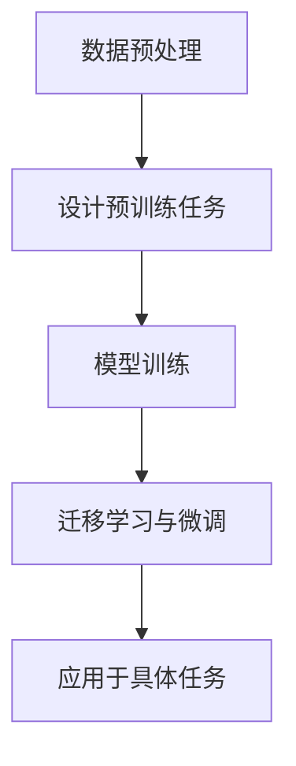

# 自监督学习 原理与代码实例讲解

## 1.背景介绍

自监督学习（Self-Supervised Learning, SSL）是近年来机器学习领域的一个重要研究方向。它通过利用未标注数据中的内在结构信息来生成监督信号，从而减少对大量标注数据的依赖。自监督学习在自然语言处理、计算机视觉等领域取得了显著的成果，成为深度学习研究的热点。

### 1.1 什么是自监督学习

自监督学习是一种特殊的无监督学习方法，它通过设计预训练任务（pretext tasks）来生成伪标签，从而将无监督学习转化为有监督学习。预训练任务通常是从数据本身提取的，例如图像的旋转预测、颜色恢复等。

### 1.2 自监督学习的优势

- **减少标注成本**：自监督学习利用未标注数据生成监督信号，减少了对大量标注数据的需求。
- **提高模型泛化能力**：通过预训练任务，模型可以学习到数据的内在结构，从而提高泛化能力。
- **广泛应用**：自监督学习在自然语言处理、计算机视觉等多个领域都有广泛应用。

### 1.3 自监督学习的发展历程

自监督学习的发展可以追溯到早期的无监督学习方法，如自编码器（Autoencoder）和生成对抗网络（GAN）。近年来，随着深度学习的发展，自监督学习逐渐成为一个独立的研究方向，并在多个领域取得了显著成果。

## 2.核心概念与联系

### 2.1 预训练任务

预训练任务是自监督学习的核心，通过设计合理的预训练任务，可以从未标注数据中提取有用的监督信号。常见的预训练任务包括图像的旋转预测、颜色恢复、上下文预测等。

### 2.2 表示学习

自监督学习的一个重要目标是学习数据的有效表示（representation）。通过预训练任务，模型可以学习到数据的内在结构，从而生成高质量的表示。

### 2.3 迁移学习

自监督学习通常与迁移学习结合使用。通过在大规模未标注数据上进行预训练，模型可以学习到通用的表示，然后在小规模标注数据上进行微调，从而提高模型的性能。

### 2.4 自监督学习与其他学习方法的关系

自监督学习与有监督学习、无监督学习和半监督学习有着密切的联系。自监督学习通过生成伪标签，将无监督学习转化为有监督学习；同时，自监督学习也可以与半监督学习结合，进一步提高模型的性能。

## 3.核心算法原理具体操作步骤

### 3.1 数据预处理

数据预处理是自监督学习的第一步。通过对数据进行适当的预处理，可以提高预训练任务的效果。常见的数据预处理方法包括数据增强、归一化等。

### 3.2 设计预训练任务

设计合理的预训练任务是自监督学习的关键。预训练任务的选择应根据具体的应用场景和数据特点来确定。以下是几种常见的预训练任务：

- **图像旋转预测**：通过预测图像的旋转角度来生成监督信号。
- **颜色恢复**：通过将灰度图像恢复为彩色图像来生成监督信号。
- **上下文预测**：通过预测图像或文本的上下文信息来生成监督信号。

### 3.3 模型训练

在设计好预训练任务后，可以使用深度学习模型进行训练。常用的模型包括卷积神经网络（CNN）、循环神经网络（RNN）等。训练过程中，模型通过预训练任务生成的伪标签进行学习，从而提取数据的有效表示。

### 3.4 迁移学习与微调

在完成预训练后，可以将预训练模型应用于具体的任务中。通过在小规模标注数据上进行微调，模型可以进一步提高性能。迁移学习的过程如下：

- **加载预训练模型**：将预训练模型加载到新的任务中。
- **微调模型**：在小规模标注数据上进行微调，调整模型参数以适应新任务。

### 3.5 算法流程图

以下是自监督学习的算法流程图：



## 4.数学模型和公式详细讲解举例说明

### 4.1 自监督学习的数学模型

自监督学习的数学模型可以表示为一个优化问题。假设我们有一个未标注数据集 $X = \{x_1, x_2, \ldots, x_n\}$，预训练任务生成的伪标签为 $Y = \{y_1, y_2, \ldots, y_n\}$，模型的参数为 $\theta$，则自监督学习的目标是最小化以下损失函数：

$$
L(\theta) = \frac{1}{n} \sum_{i=1}^n \ell(f(x_i; \theta), y_i)
$$

其中，$\ell$ 是损失函数，$f(x_i; \theta)$ 是模型的预测结果。

### 4.2 预训练任务的数学表示

以图像旋转预测为例，假设我们有一个图像 $x$，其旋转角度为 $\theta$，则预训练任务的目标是预测旋转角度 $\theta$。损失函数可以表示为：

$$
L(\theta) = \frac{1}{n} \sum_{i=1}^n (\hat{\theta}_i - \theta_i)^2
$$

其中，$\hat{\theta}_i$ 是模型预测的旋转角度，$\theta_i$ 是真实的旋转角度。

### 4.3 表示学习的数学模型

表示学习的目标是学习数据的有效表示。假设我们有一个数据 $x$，其表示为 $h = g(x; \theta)$，则表示学习的目标是最小化以下损失函数：

$$
L(\theta) = \frac{1}{n} \sum_{i=1}^n \ell(g(x_i; \theta), y_i)
$$

其中，$g(x; \theta)$ 是表示学习模型，$\ell$ 是损失函数。

### 4.4 迁移学习的数学模型

迁移学习的目标是将预训练模型应用于新任务。假设我们有一个预训练模型 $f(x; \theta)$，新任务的数据为 $X' = \{x'_1, x'_2, \ldots, x'_m\}$，标签为 $Y' = \{y'_1, y'_2, \ldots, y'_m\}$，则迁移学习的目标是最小化以下损失函数：

$$
L(\theta') = \frac{1}{m} \sum_{i=1}^m \ell(f(x'_i; \theta'), y'_i)
$$

其中，$\theta'$ 是微调后的模型参数。

## 5.项目实践：代码实例和详细解释说明

### 5.1 数据预处理

在项目实践中，首先需要对数据进行预处理。以下是一个简单的图像数据预处理示例：

```python
import torchvision.transforms as transforms
from torchvision.datasets import CIFAR10
from torch.utils.data import DataLoader

# 数据预处理
transform = transforms.Compose([
    transforms.RandomResizedCrop(32),
    transforms.RandomHorizontalFlip(),
    transforms.ToTensor(),
    transforms.Normalize((0.5, 0.5, 0.5), (0.5, 0.5, 0.5))
])

# 加载数据集
train_dataset = CIFAR10(root='./data', train=True, download=True, transform=transform)
train_loader = DataLoader(train_dataset, batch_size=64, shuffle=True)
```

### 5.2 设计预训练任务

以下是一个图像旋转预测的预训练任务示例：

```python
import torch
import torch.nn as nn
import torch.optim as optim

# 定义模型
class RotationPredictionModel(nn.Module):
    def __init__(self):
        super(RotationPredictionModel, self).__init__()
        self.conv = nn.Sequential(
            nn.Conv2d(3, 64, kernel_size=3, stride=1, padding=1),
            nn.ReLU(),
            nn.MaxPool2d(kernel_size=2, stride=2),
            nn.Conv2d(64, 128, kernel_size=3, stride=1, padding=1),
            nn.ReLU(),
            nn.MaxPool2d(kernel_size=2, stride=2)
        )
        self.fc = nn.Sequential(
            nn.Linear(128 * 8 * 8, 256),
            nn.ReLU(),
            nn.Linear(256, 4)  # 4个旋转角度：0度, 90度, 180度, 270度
        )

    def forward(self, x):
        x = self.conv(x)
        x = x.view(x.size(0), -1)
        x = self.fc(x)
        return x

# 定义损失函数和优化器
model = RotationPredictionModel()
criterion = nn.CrossEntropyLoss()
optimizer = optim.Adam(model.parameters(), lr=0.001)
```

### 5.3 模型训练

以下是模型训练的代码示例：

```python
# 训练模型
num_epochs = 10
for epoch in range(num_epochs):
    model.train()
    running_loss = 0.0
    for images, _ in train_loader:
        # 生成旋转角度和标签
        angles = torch.randint(0, 4, (images.size(0),))
        rotated_images = torch.stack([transforms.functional.rotate(img, angle * 90) for img, angle in zip(images, angles)])
        
        # 前向传播
        outputs = model(rotated_images)
        loss = criterion(outputs, angles)
        
        # 反向传播和优化
        optimizer.zero_grad()
        loss.backward()
        optimizer.step()
        
        running_loss += loss.item()
    
    print(f'Epoch [{epoch+1}/{num_epochs}], Loss: {running_loss/len(train_loader):.4f}')
```

### 5.4 迁移学习与微调

以下是迁移学习与微调的代码示例：

```python
# 加载预训练模型
pretrained_model = RotationPredictionModel()
pretrained_model.load_state_dict(torch.load('pretrained_model.pth'))

# 定义新任务的模型
class NewTaskModel(nn.Module):
    def __init__(self, pretrained_model):
        super(NewTaskModel, self).__init__()
        self.features = pretrained_model.conv
        self.classifier = nn.Sequential(
            nn.Linear(128 * 8 * 8, 256),
            nn.ReLU(),
            nn.Linear(256, 10)  # 新任务的类别数
        )

    def forward(self, x):
        x = self.features(x)
        x = x.view(x.size(0), -1)
        x = self.classifier(x)
        return x

# 微调模型
new_task_model = NewTaskModel(pretrained_model)
criterion = nn.CrossEntropyLoss()
optimizer = optim.Adam(new_task_model.parameters(), lr=0.001)

# 训练新任务模型
num_epochs = 10
for epoch in range(num_epochs):
    new_task_model.train()
    running_loss = 0.0
    for images, labels in train_loader:
        # 前向传播
        outputs = new_task_model(images)
        loss = criterion(outputs, labels)
        
        # 反向传播和优化
        optimizer.zero_grad()
        loss.backward()
        optimizer.step()
        
        running_loss += loss.item()
    
    print(f'Epoch [{epoch+1}/{num_epochs}], Loss: {running_loss/len(train_loader):.4f}')
```

## 6.实际应用场景

### 6.1 自然语言处理

在自然语言处理领域，自监督学习被广泛应用于预训练语言模型，如BERT、GPT等。通过设计合理的预训练任务（如掩码语言模型、下一句预测等），这些模型可以在大规模未标注文本数据上进行预训练，然后在具体任务（如文本分类、命名实体识别等）上进行微调。

### 6.2 计算机视觉

在计算机视觉领域，自监督学习被广泛应用于图像分类、目标检测、图像生成等任务。通过设计合理的预训练任务（如图像旋转预测、颜色恢复等），模型可以在大规模未标注图像数据上进行预训练，然后在具体任务上进行微调。

### 6.3 语音处理

在语音处理领域，自监督学习被广泛应用于语音识别、语音合成等任务。通过设计合理的预训练任务（如语音片段预测、语音特征恢复等），模型可以在大规模未标注语音数据上进行预训练，然后在具体任务上进行微调。

### 6.4 推荐系统

在推荐系统领域，自监督学习被广泛应用于用户行为预测、物品推荐等任务。通过设计合理的预训练任务（如用户行为序列预测、物品特征恢复等），模型可以在大规模未标注用户行为数据上进行预训练，然后在具体任务上进行微调。

## 7.工具和资源推荐

### 7.1 开源框架

- **PyTorch**：一个流行的深度学习框架，支持自监督学习的实现。
- **TensorFlow**：另一个流行的深度学习框架，支持自监督学习的实现。
- **Hugging Face Transformers**：一个用于自然语言处理的开源库，支持自监督学习的预训练模型。

### 7.2 数据集

- **ImageNet**：一个大规模图像数据集，常用于自监督学习的预训练。
- **CIFAR-10/100**：一个小规模图像数据集，常用于自监督学习的实验。
- **COCO**：一个大规模图像数据集，常用于自监督学习的预训练。
- **Wikipedia**：一个大规模文本数据集，常用于自监督学习的预训练。

### 7.3 研究论文

- **BERT: Pre-training of Deep Bidirectional Transformers for Language Understanding**：介绍了BERT模型及其自监督学习方法。
- **GPT-3: Language Models are Few-Shot Learners**：介绍了GPT-3模型及其自监督学习方法。
- **SimCLR: A Simple Framework for Contrastive Learning of Visual Representations**：介绍了SimCLR模型及其自监督学习方法。

## 8.总结：未来发展趋势与挑战

### 8.1 未来发展趋势

- **更复杂的预训练任务**：未来的自监督学习研究将探索更复杂的预训练任务，以提取更丰富的监督信号。
- **跨模态自监督学习**：未来的自监督学习研究将探索跨模态的预训练任务，如图像与文本的联合预训练。
- **自监督学习与强化学习的结合**：未来的自监督学习研究将探索与强化学习的结合，以提高模型的决策能力。

### 8.2 挑战

- **预训练任务的设计**：设计合理的预训练任务是自监督学习的关键，但也是一个挑战。如何设计出能够提取有效监督信号的预训练任务是一个重要的研究方向。
- **计算资源的需求**：自监督学习通常需要在大规模数据上进行预训练，这对计算资源提出了较高的要求。如何提高训练效率、减少计算资源的需求是一个重要的研究方向。
- **模型的泛化能力**：自监督学习模型在预训练任务上的表现不一定能够直接转化为具体任务上的性能。如何提高模型的泛化能力是一个重要的研究方向。

## 9.附录：常见问题与解答

### 9.1 自监督学习与无监督学习有什么区别？

自监督学习是一种特殊的无监督学习方法，通过设计预训练任务生成伪标签，将无监督学习转化为有监督学习。无监督学习通常直接在未标注数据上进行训练，而自监督学习通过预训练任务生成监督信号，从而进行有监督学习。

### 9.2 自监督学习与有监督学习有什么联系？

自监督学习通过生成伪标签，将无监督学习转化为有监督学习。自监督学习的目标是通过预训练任务提取数据的有效表示，然后在具体任务上进行微调，从而提高模型的性能。

### 9.3 自监督学习的预训练任务如何设计？

预训练任务的设计应根据具体的应用场景和数据特点来确定。常见的预训练任务包括图像的旋转预测、颜色恢复、上下文预测等。预训练任务的选择应能够提取有效的监督信号，从而提高模型的性能。

### 9.4 自监督学习的模型如何进行微调？

自监督学习的模型在预训练完成后，可以通过迁移学习进行微调。微调的过程包括加载预训练模型、定义新任务的模型、在小规模标注数据上进行训练等。通过微调，模型可以进一步提高在具体任务上的性能。

### 9.5 自监督学习的应用场景有哪些？

自监督学习在自然语言处理、计算机视觉、语音处理、推荐系统等多个领域都有广泛应用。通过设计合理的预训练任务，模型可以在大规模未标注数据上进行预训练，然后在具体任务上进行微调，从而提高模型的性能。

---

作者：禅与计算机程序设计艺术 / Zen and the Art of Computer Programming