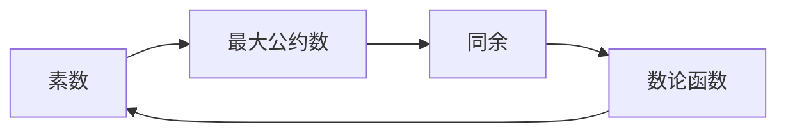

# 解析数论基础：一点说明

## 1. 背景介绍

数论，被誉为数学的皇后，是研究整数性质的学科。它的历史悠久，从古希腊的欧几里得《几何原本》中的素数定理，到现代的大整数分解，数论一直是数学研究的核心领域。随着计算机科学的发展，数论与算法结合，成为现代密码学、计算复杂性理论等领域的基石。

## 2. 核心概念与联系

数论中的核心概念包括素数、最大公约数、同余、数论函数等。这些概念之间存在着紧密的联系。例如，素数是最大公约数为1的特殊整数对，而同余则是比较整数在除以某个数的余数是否相等的一种方法。



## 3. 核心算法原理具体操作步骤

在数论中，算法的核心是有效计算。例如，欧几里得算法是计算两个整数最大公约数的经典方法。其操作步骤如下：

1. 设两个正整数$a$和$b$，且$a > b$。
2. 计算$a$除以$b$的余数$r$。
3. 若$r=0$，则$b$即为最大公约数。
4. 否则，将$b$赋值给$a$，$r$赋值给$b$，重复步骤2和3。

## 4. 数学模型和公式详细讲解举例说明

以同余为例，两个整数$a$和$b$，若它们除以正整数$m$的余数相等，则称$a$同余于$b$模$m$，记作$a \equiv b \pmod{m}$。例如，$38 \equiv 14 \pmod{12}$，因为它们除以12的余数都是2。

## 5. 项目实践：代码实例和详细解释说明

在编程实践中，我们可以使用Python来实现欧几里得算法：

```python
def gcd(a, b):
    while b:
        a, b = b, a % b
    return a

print(gcd(60, 48))  # 输出最大公约数12
```

## 6. 实际应用场景

数论在现代科技中的应用非常广泛，特别是在密码学中。例如，RSA加密算法就是基于大整数分解的困难性，而这正是数论研究的内容。

## 7. 工具和资源推荐

对于数论的学习和研究，推荐使用数学软件如Mathematica、Maple，以及编程语言Python中的SymPy库。

## 8. 总结：未来发展趋势与挑战

数论的研究仍然充满挑战，如Riemann猜想等未解问题。随着量子计算的发展，数论在密码学中的应用也将面临新的挑战。

## 9. 附录：常见问题与解答

Q: 为什么素数在数论中如此重要？
A: 素数是数论的基本构建块，许多数论定理和算法都与素数有关。

作者：禅与计算机程序设计艺术 / Zen and the Art of Computer Programming