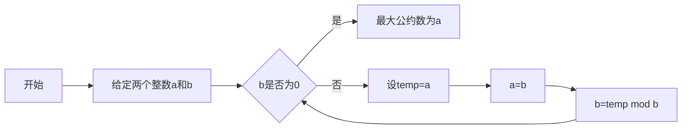

# 解析数论基础：问题的转化

## 1. 背景介绍

数论，被誉为数学的皇后，是研究整数性质的学科。它的魅力在于，许多问题可以用极其简单的语言描述，却需要深刻的数学思想去解决。在计算机科学中，数论的应用广泛，从密码学到算法设计，再到复杂性理论，数论的基础理论和技巧都扮演着重要的角色。本文将探讨数论中问题转化的基础，以及如何将这些理论应用于实际的计算机科学问题中。

## 2. 核心概念与联系

数论中的核心概念包括素数、最大公约数、同余、数论函数等。这些概念之间存在着紧密的联系，例如，素数是最大公约数为1的特殊情况，而同余则是比较整数除以某个数的余数的一种方式。数论函数如欧拉函数，描述了小于等于n且与n互质的正整数的数量，这些函数在解决问题时提供了重要的工具。

## 3. 核心算法原理具体操作步骤

在数论中，算法的核心在于找到问题的数学本质，并转化为可计算的形式。例如，求解最大公约数的欧几里得算法，就是通过不断取余的方式，将问题简化为更小的问题，直至找到答案。



## 4. 数学模型和公式详细讲解举例说明

以欧拉函数为例，其数学定义为 $$ \varphi(n) = n \prod_{p|n}(1 - \frac{1}{p}) $$，其中 $ p $ 是 $ n $ 的素因子。例如，计算 $\varphi(8)$，由于8的素因子只有2，因此 $\varphi(8) = 8 \times (1 - \frac{1}{2}) = 4$。

## 5. 项目实践：代码实例和详细解释说明

在实际编程中，我们可以这样计算欧拉函数：

```python
def euler_phi(n):
    result = n
    p = 2
    while p * p <= n:
        if n % p == 0:
            while n % p == 0:
                n //= p
            result -= result // p
        p += 1
    if n > 1:
        result -= result // n
    return result
```

这段代码首先将结果初始化为n，然后从2开始遍历可能的素因子。如果找到一个素因子，就不断除以这个素因子，同时按照欧拉函数的定义更新结果。最后，如果n大于1，说明n本身是一个素数，也需要更新结果。

## 6. 实际应用场景

数论在计算机科学中的应用非常广泛，例如在密码学中，RSA加密算法就基于大数分解的困难性和欧拉函数的性质。在算法竞赛中，数论问题也是常见的题目类型，要求参赛者熟练掌握数论基础知识和算法。

## 7. 工具和资源推荐

对于数论的学习，推荐以下资源：

- 书籍：《数论基础》（Borevich和Shafarevich著）
- 在线课程：Coursera上的“Number Theory and Cryptography”
- 软件：SageMath，一个开源的数学软件系统，包含了许多数论算法的实现

## 8. 总结：未来发展趋势与挑战

数论作为数学的一个古老而活跃的分支，其在计算机科学中的应用仍在不断拓展。随着量子计算的发展，传统的基于数论难题的密码体系可能会面临挑战，同时也会催生新的基于数论的算法和应用。

## 9. 附录：常见问题与解答

Q1: 为什么数论在计算机科学中如此重要？
A1: 数论提供了许多基础算法和理论，这些在密码学、算法设计等领域都有广泛应用。

Q2: 学习数论有哪些好的起点？
A2: 从基础的素数、最大公约数等概念学起，然后逐步深入到同余、数论函数等更深层次的内容。

作者：禅与计算机程序设计艺术 / Zen and the Art of Computer Programming