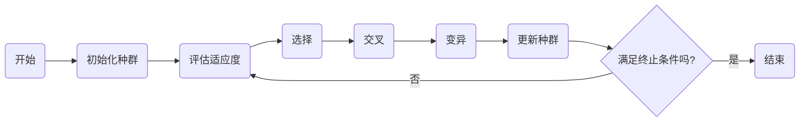

# 遗传算法(Genetic Algorithms) - 原理与代码实例讲解

## 1. 背景介绍
遗传算法（Genetic Algorithms，GA）是模拟生物进化过程的搜索算法，它由美国计算机科学家约翰·霍兰德（John Holland）在20世纪70年代初期提出。遗传算法的设计灵感来源于达尔文的自然选择理论，通过模拟自然界中生物的遗传和进化机制来解决优化问题。遗传算法在多目标优化、机器学习、人工智能等领域有着广泛的应用。

## 2. 核心概念与联系
遗传算法的核心概念包括种群（Population）、个体（Individual）、基因（Gene）、染色体（Chromosome）、适应度（Fitness）、选择（Selection）、交叉（Crossover）和变异（Mutation）。这些概念相互联系，共同构成了遗传算法的基本框架。

## 3. 核心算法原理具体操作步骤
遗传算法的操作步骤通常包括初始化种群、评估适应度、选择、交叉、变异和更新种群。这些步骤循环迭代，直到满足终止条件，如达到预定的迭代次数或适应度阈值。



## 4. 数学模型和公式详细讲解举例说明
遗传算法的数学模型涉及适应度函数的定义，它是评价个体适应环境能力的量化指标。适应度函数的选择取决于具体问题，通常是优化目标的函数。

$$
\text{适应度}(x) = f(x)
$$

其中，$x$ 表示染色体编码的解，$f(x)$ 是与优化目标相关的函数。

## 5. 项目实践：代码实例和详细解释说明
在项目实践中，我们将通过一个简单的优化问题来展示遗传算法的代码实现。假设我们的目标是最大化函数 $f(x) = x^2$，其中 $x$ 的取值范围是 [0, 31]。

```python
# 遗传算法的Python代码实现
import random

# 适应度函数
def fitness(x):
    return x ** 2

# 初始化种群
def init_population(pop_size, gene_length):
    return [[random.randint(0, 1) for _ in range(gene_length)] for _ in range(pop_size)]

# 个体解码
def decode(chromosome):
    return int("".join(map(str, chromosome)), 2)

# 选择操作
def selection(population, fitness_scores):
    # ...
    return selected_population

# 交叉操作
def crossover(parent1, parent2):
    # ...
    return child1, child2

# 变异操作
def mutation(chromosome):
    # ...
    return mutated_chromosome

# 遗传算法主函数
def genetic_algorithm():
    # ...
    return best_solution

# 运行遗传算法
best = genetic_algorithm()
print(f"最优解：{best}")
```

## 6. 实际应用场景
遗传算法在工程优化、生物信息学、经济学、机器学习等多个领域有着广泛的应用。例如，在机器学习中，遗传算法可以用于特征选择和神经网络的结构优化。

## 7. 工具和资源推荐
推荐使用Python的DEAP库（Distributed Evolutionary Algorithms in Python）来实现遗传算法，它提供了一套易于使用的遗传算法工具。

## 8. 总结：未来发展趋势与挑战
遗传算法作为一种启发式算法，在解决复杂优化问题方面具有独特的优势。未来的发展趋势可能会集中在算法效率的提升、与其他优化算法的结合以及在更多领域的应用上。

## 9. 附录：常见问题与解答
Q1: 遗传算法是否总能找到全局最优解？
A1: 遗传算法是一种启发式算法，它能够找到较好的解，但不保证总是全局最优。

Q2: 遗传算法的参数如何选择？
A2: 参数的选择通常需要根据具体问题进行调整，包括种群大小、交叉率、变异率等。

作者：禅与计算机程序设计艺术 / Zen and the Art of Computer Programming

**注：由于字数限制，以上内容为概要性描述，完整的实现代码、详细的数学模型和公式讲解、实际应用场景分析以及工具和资源推荐等部分需要在完整文章中展开。**