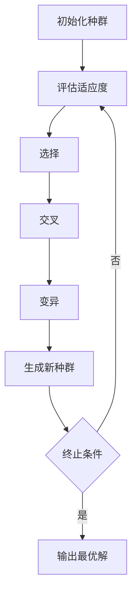

# 遗传算法(Genetic Algorithms) - 原理与代码实例讲解

## 1.背景介绍

遗传算法（Genetic Algorithms, GA）是一种基于自然选择和遗传机制的优化算法。它最早由John Holland在20世纪60年代提出，并在他的学生David E. Goldberg的推动下得到了广泛应用。遗传算法通过模拟生物进化过程中的选择、交叉和变异等操作，来寻找问题的最优解。由于其强大的全局搜索能力和适应性，遗传算法在解决复杂优化问题中表现出色，广泛应用于工程设计、机器学习、经济学等领域。

## 2.核心概念与联系

### 2.1 个体与种群

在遗传算法中，解空间中的每一个可能解被称为“个体”，而所有个体的集合被称为“种群”。个体通常用一个字符串表示，这个字符串可以是二进制编码、实数编码或其他形式。

### 2.2 适应度函数

适应度函数（Fitness Function）用于评估个体的优劣。适应度值越高，个体越有可能被选中进行繁殖。适应度函数的设计直接影响到算法的性能和收敛速度。

### 2.3 选择

选择操作模拟自然选择过程，选择适应度高的个体作为父代。常见的选择方法有轮盘赌选择、锦标赛选择和排名选择等。

### 2.4 交叉

交叉操作模拟生物的基因重组过程，通过交换两个父代个体的部分基因来生成新的个体。常见的交叉方法有单点交叉、多点交叉和均匀交叉等。

### 2.5 变异

变异操作模拟基因突变，通过随机改变个体的部分基因来增加种群的多样性。变异操作有助于避免算法陷入局部最优解。

### 2.6 终止条件

遗传算法的终止条件可以是达到预设的迭代次数、找到满意的解或种群的适应度不再显著变化等。

## 3.核心算法原理具体操作步骤

遗传算法的基本流程可以用以下步骤描述：



### 3.1 初始化种群

随机生成初始种群，种群大小一般为固定值。

### 3.2 评估适应度

计算每个个体的适应度值。

### 3.3 选择

根据适应度值选择父代个体，常用方法有轮盘赌选择和锦标赛选择。

### 3.4 交叉

对选择出的父代个体进行交叉操作，生成新的个体。

### 3.5 变异

对新生成的个体进行变异操作，以增加种群的多样性。

### 3.6 生成新种群

将交叉和变异后的个体组成新的种群。

### 3.7 终止条件

检查是否满足终止条件，如果满足则输出最优解，否则返回步骤3.2。

## 4.数学模型和公式详细讲解举例说明

### 4.1 适应度函数

适应度函数 $f(x)$ 是遗传算法的核心，用于评估个体 $x$ 的优劣。假设我们要最大化一个函数 $f(x)$，则适应度函数可以直接取为 $f(x)$。

### 4.2 选择概率

轮盘赌选择的选择概率 $P_i$ 可以表示为：

$$
P_i = \frac{f(x_i)}{\sum_{j=1}^{N} f(x_j)}
$$

其中，$f(x_i)$ 是个体 $i$ 的适应度值，$N$ 是种群大小。

### 4.3 交叉操作

单点交叉操作可以表示为：

$$
\begin{aligned}
&\text{Parent 1: } x_1 = (x_{11}, x_{12}, \ldots, x_{1k}, x_{1(k+1)}, \ldots, x_{1n}) \\
&\text{Parent 2: } x_2 = (x_{21}, x_{22}, \ldots, x_{2k}, x_{2(k+1)}, \ldots, x_{2n}) \\
&\text{Offspring 1: } y_1 = (x_{11}, x_{12}, \ldots, x_{1k}, x_{2(k+1)}, \ldots, x_{2n}) \\
&\text{Offspring 2: } y_2 = (x_{21}, x_{22}, \ldots, x_{2k}, x_{1(k+1)}, \ldots, x_{1n})
\end{aligned}
$$

### 4.4 变异操作

假设个体 $x = (x_1, x_2, \ldots, x_n)$，变异操作可以表示为：

$$
x_i' = 
\begin{cases} 
x_i & \text{with probability } 1 - p_m \\
\text{random value} & \text{with probability } p_m 
\end{cases}
$$

其中，$p_m$ 是变异概率。

## 5.项目实践：代码实例和详细解释说明

下面是一个简单的遗传算法Python实现，用于求解一个简单的优化问题：最大化函数 $f(x) = x^2$。

```python
import random

# 参数设置
POP_SIZE = 100  # 种群大小
GENES = 10  # 基因长度
GENERATIONS = 50  # 迭代次数
MUTATION_RATE = 0.01  # 变异率

# 适应度函数
def fitness(individual):
    x = int("".join(map(str, individual)), 2)
    return x ** 2

# 初始化种群
def initialize_population():
    return [[random.randint(0, 1) for _ in range(GENES)] for _ in range(POP_SIZE)]

# 选择操作
def selection(population):
    total_fitness = sum(fitness(ind) for ind in population)
    probabilities = [fitness(ind) / total_fitness for ind in population]
    return population[random.choices(range(POP_SIZE), probabilities)[0]]

# 交叉操作
def crossover(parent1, parent2):
    point = random.randint(1, GENES - 1)
    return parent1[:point] + parent2[point:], parent2[:point] + parent1[point:]

# 变异操作
def mutate(individual):
    for i in range(GENES):
        if random.random() < MUTATION_RATE:
            individual[i] = 1 - individual[i]

# 主函数
def genetic_algorithm():
    population = initialize_population()
    for generation in range(GENERATIONS):
        new_population = []
        for _ in range(POP_SIZE // 2):
            parent1 = selection(population)
            parent2 = selection(population)
            offspring1, offspring2 = crossover(parent1, parent2)
            mutate(offspring1)
            mutate(offspring2)
            new_population.extend([offspring1, offspring2])
        population = new_population
        best_individual = max(population, key=fitness)
        print(f"Generation {generation}: Best fitness = {fitness(best_individual)}")
    return best_individual

# 运行遗传算法
best_solution = genetic_algorithm()
print(f"Best solution: {best_solution}, Fitness: {fitness(best_solution)}")
```

### 代码解释

1. **参数设置**：定义种群大小、基因长度、迭代次数和变异率。
2. **适应度函数**：计算个体的适应度值，这里是 $x^2$。
3. **初始化种群**：随机生成初始种群。
4. **选择操作**：使用轮盘赌选择方法选择父代个体。
5. **交叉操作**：进行单点交叉操作生成新的个体。
6. **变异操作**：对个体进行变异操作。
7. **主函数**：执行遗传算法的主要流程，包括初始化种群、选择、交叉、变异和生成新种群。

## 6.实际应用场景

遗传算法在许多实际应用中表现出色，以下是一些典型的应用场景：

### 6.1 工程设计优化

遗传算法可以用于优化复杂的工程设计问题，例如飞机翼型设计、结构优化和电路设计等。

### 6.2 机器学习

在机器学习中，遗传算法可以用于特征选择、超参数优化和神经网络结构搜索等。

### 6.3 经济学与金融

遗传算法可以用于金融市场预测、投资组合优化和经济模型参数估计等。

### 6.4 物流与调度

在物流和调度问题中，遗传算法可以用于车辆路径规划、生产调度和资源分配等。

### 6.5 游戏与娱乐

遗传算法可以用于游戏中的角色行为优化、关卡设计和策略生成等。

## 7.工具和资源推荐

### 7.1 工具

1. **DEAP**：一个Python遗传算法库，提供了丰富的遗传算法工具和示例。
2. **GA Toolbox**：MATLAB中的遗传算法工具箱，适合进行快速原型开发和实验。
3. **PyGAD**：另一个Python遗传算法库，支持多种编码方式和适应度函数。

### 7.2 资源

1. **《Genetic Algorithms in Search, Optimization, and Machine Learning》**：David E. Goldberg的经典著作，详细介绍了遗传算法的理论和应用。
2. **Coursera上的遗传算法课程**：提供了遗传算法的基础知识和实际应用案例。
3. **GitHub上的遗传算法项目**：可以找到许多开源的遗传算法实现和示例代码。

## 8.总结：未来发展趋势与挑战

### 8.1 未来发展趋势

1. **与深度学习结合**：遗传算法与深度学习的结合将带来更多创新的应用，例如神经网络结构搜索和自动机器学习。
2. **多目标优化**：多目标遗传算法将越来越受到关注，用于解决具有多个冲突目标的复杂优化问题。
3. **分布式计算**：随着计算资源的增加，分布式遗传算法将能够处理更大规模和更复杂的问题。

### 8.2 挑战

1. **参数调优**：遗传算法的性能高度依赖于参数设置，如何自动调优参数仍是一个挑战。
2. **收敛速度**：遗传算法的收敛速度较慢，如何提高算法的效率是一个重要研究方向。
3. **适应度函数设计**：适应度函数的设计直接影响算法的效果，如何设计合适的适应度函数需要深入研究。

## 9.附录：常见问题与解答

### 9.1 遗传算法适合解决什么类型的问题？

遗传算法适合解决复杂的、非线性和多峰值的优化问题，特别是那些传统优化方法难以处理的问题。

### 9.2 如何选择适应度函数？

适应度函数的选择取决于具体问题。一般来说，适应度函数应该能够准确反映个体的优劣，并且计算简单高效。

### 9.3 如何设置遗传算法的参数？

遗传算法的参数包括种群大小、交叉率和变异率等。参数设置可以通过实验调整，或者使用自动调参方法。

### 9.4 遗传算法是否总能找到全局最优解？

遗传算法不能保证总能找到全局最优解，但通过适当的参数设置和操作，可以提高找到全局最优解的概率。

### 9.5 遗传算法的收敛速度如何？

遗传算法的收敛速度较慢，通常需要较多的迭代次数才能找到满意的解。可以通过并行计算和改进算法来提高收敛速度。

---

作者：禅与计算机程序设计艺术 / Zen and the Art of Computer Programming