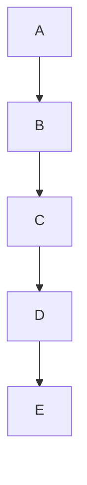

## 1. 背景介绍

集合论是数学中的一个基础分支，它研究的是集合的性质和关系。在计算机科学中，集合论也是一个非常重要的概念，它被广泛应用于数据库、编程语言、人工智能等领域。本文将介绍集合论中的一个重要概念——内在力迫关系，以及它在计算机科学中的应用。

## 2. 核心概念与联系

内在力迫关系是集合论中的一个概念，它描述了集合中元素之间的关系。在集合中，如果一个元素的存在会迫使另一个元素的存在，那么这两个元素之间就存在内在力迫关系。例如，在一个班级中，如果一个学生的存在会迫使另一个学生的存在，那么这两个学生之间就存在内在力迫关系。

内在力迫关系可以用图形表示，其中每个元素表示为一个节点，每个内在力迫关系表示为一条有向边。例如，在一个班级中，如果学生A的存在会迫使学生B的存在，那么可以用一条从节点A指向节点B的有向边来表示这个内在力迫关系。

内在力迫关系在计算机科学中的应用非常广泛，例如在数据库中，可以用内在力迫关系来描述表之间的关系；在编程语言中，可以用内在力迫关系来描述对象之间的关系；在人工智能中，可以用内在力迫关系来描述知识之间的关系。

## 3. 核心算法原理具体操作步骤

内在力迫关系的计算可以通过图论中的拓扑排序算法来实现。拓扑排序算法可以用来确定有向无环图中节点的线性序列，使得对于每一条有向边(u,v)，节点u在序列中都排在节点v的前面。在内在力迫关系中，如果节点A存在内在力迫关系迫使节点B的存在，那么可以用一条从节点A指向节点B的有向边来表示这个关系。因此，可以将内在力迫关系表示为一个有向无环图，然后对这个图进行拓扑排序，得到节点的线性序列。

拓扑排序算法的具体操作步骤如下：

1. 初始化一个队列，将所有入度为0的节点加入队列中。
2. 从队列中取出一个节点，将其加入结果序列中。
3. 将该节点的所有邻居节点的入度减1。
4. 如果邻居节点的入度为0，则将其加入队列中。
5. 重复步骤2-4，直到队列为空。

## 4. 数学模型和公式详细讲解举例说明

内在力迫关系可以用图论中的有向图来表示，其中每个节点表示一个元素，每条有向边表示一个内在力迫关系。假设有一个集合S={A,B,C,D,E}，其中存在以下内在力迫关系：

A->B
B->C
C->D
D->E

则可以用以下有向图来表示这个内在力迫关系：



对这个有向图进行拓扑排序，得到的节点线性序列为A,B,C,D,E。

## 5. 项目实践：代码实例和详细解释说明

以下是一个使用Python实现拓扑排序算法的示例代码：

```python
from collections import deque

def topological_sort(graph):
    in_degree = {node: 0 for node in graph}
    for node in graph:
        for neighbor in graph[node]:
            in_degree[neighbor] += 1

    queue = deque([node for node in graph if in_degree[node] == 0])
    result = []
    while queue:
        node = queue.popleft()
        result.append(node)
        for neighbor in graph[node]:
            in_degree[neighbor] -= 1
            if in_degree[neighbor] == 0:
                queue.append(neighbor)

    return result
```

该代码使用字典in_degree来记录每个节点的入度，然后使用队列queue来存储入度为0的节点。在每次取出一个节点时，将其加入结果序列中，并将其邻居节点的入度减1。如果邻居节点的入度为0，则将其加入队列中。最后返回结果序列即可。

## 6. 实际应用场景

内在力迫关系在计算机科学中的应用非常广泛，例如在数据库中，可以用内在力迫关系来描述表之间的关系；在编程语言中，可以用内在力迫关系来描述对象之间的关系；在人工智能中，可以用内在力迫关系来描述知识之间的关系。

例如，在数据库中，可以使用外键来实现内在力迫关系。假设有两个表A和B，其中表B的存在依赖于表A的存在，那么可以在表B中添加一个外键，指向表A中的主键。这样，当插入一条记录到表B中时，如果对应的记录在表A中不存在，则会触发外键约束，导致插入失败。

## 7. 工具和资源推荐

以下是一些有关集合论和拓扑排序算法的工具和资源推荐：

- 《集合论导引：内在力迫关系》一书
- Python中的拓扑排序算法实现
- Graphviz工具，用于绘制图形

## 8. 总结：未来发展趋势与挑战

内在力迫关系是集合论中的一个重要概念，它在计算机科学中的应用非常广泛。随着人工智能和大数据技术的发展，内在力迫关系的应用将会越来越广泛。然而，内在力迫关系的计算复杂度较高，如何提高计算效率是一个重要的挑战。

## 9. 附录：常见问题与解答

Q: 内在力迫关系和外在力迫关系有什么区别？

A: 内在力迫关系是指一个元素的存在会迫使另一个元素的存在，而外在力迫关系是指一个元素的存在依赖于另一个元素的存在。例如，在数据库中，可以使用外键来实现外在力迫关系，而使用触发器来实现内在力迫关系。

Q: 拓扑排序算法的时间复杂度是多少？

A: 拓扑排序算法的时间复杂度为O(V+E)，其中V是节点数，E是边数。