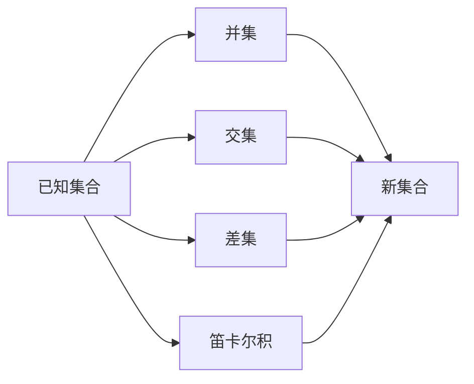

## 1. 背景介绍

集合论是数学的一个基础分支，它为现代数学提供了统一的框架。在20世纪初，数学家哥德尔（Kurt Gödel）提出了关于集合论的重要理论，包括哥德尔不完备性定理和关于可构造性的研究。哥德尔的集合运算和可构造集公理是集合论中的核心概念，它们对数学逻辑、计算机科学乃至人工智能都有深远的影响。

## 2. 核心概念与联系

在集合论中，哥德尔的工作主要集中在可构造性和集合的相对一致性上。可构造集公理（Axiom of Constructibility）声称所有的集合都是在某种意义上“可构造”的。这个概念与哥德尔的集合运算紧密相关，后者提供了一种构造集合的具体方法。

## 3. 核心算法原理具体操作步骤

哥德尔集合运算的核心在于定义了一系列操作，通过这些操作可以从已知的集合构造出新的集合。这些操作包括并集、交集、差集、笛卡尔积等。



## 4. 数学模型和公式详细讲解举例说明

哥德尔集合运算可以用数学公式表示。例如，两个集合A和B的并集可以表示为：

$$ A \cup B = \{ x | x \in A \text{ 或 } x \in B \} $$

交集和差集也有类似的表示方法。哥德尔的可构造集公理可以形式化为：

$$ V = L $$

这里的V代表所有集合的宇宙，而L是可构造集合的层次结构。

## 5. 项目实践：代码实例和详细解释说明

在计算机科学中，我们可以通过编程语言来实现哥德尔集合运算。以下是一个简单的Python代码示例，展示了如何实现集合的并集运算：

```python
def union(setA, setB):
    return setA | setB

# 示例
setA = {1, 2, 3}
setB = {3, 4, 5}
print(union(setA, setB))  # 输出 {1, 2, 3, 4, 5}
```

## 6. 实际应用场景

哥德尔集合运算和可构造集公理在多个领域都有应用，例如在数据库理论中，集合运算用于查询优化；在人工智能中，可构造性概念用于理解和设计智能算法。

## 7. 工具和资源推荐

对于想深入学习集合论和哥德尔理论的读者，以下是一些推荐资源：

- 《集合论与其逻辑基础》
- 《哥德尔证明》
- 数学软件Mathematica和MATLAB中的集合运算工具箱

## 8. 总结：未来发展趋势与挑战

哥德尔的集合论研究为数学和计算机科学提供了深刻的洞见。未来，我们可以预见到集合论在处理大数据、优化算法和人工智能领域将发挥更大的作用。同时，哥德尔不完备性定理也提醒我们，任何系统都有其局限性，这对于理论和实践都是一个挑战。

## 9. 附录：常见问题与解答

Q1: 哥德尔集合运算有哪些基本操作？
A1: 基本操作包括并集、交集、差集和笛卡尔积等。

Q2: 可构造集公理在实际中有什么用？
A2: 它提供了一种理解集合可构造性的方式，对于算法设计和理论分析都有重要意义。

作者：禅与计算机程序设计艺术 / Zen and the Art of Computer Programming