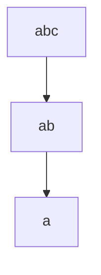

# 集合论导引：闭集树表示

## 1. 背景介绍

集合论是数学的一个基础分支，它以研究集合及其性质为对象。在计算机科学中，集合论的概念和工具被广泛应用于数据库理论、形式语言、编程语言设计等领域。闭集树（Closed Set Tree，CST）是集合论中的一个重要概念，它提供了一种高效的方式来表示和操作闭集，即满足某些性质的集合的集合。闭集树在数据挖掘、模式识别等领域有着重要的应用。

## 2. 核心概念与联系

### 2.1 集合与闭集

- **集合（Set）**: 集合是数学中的一个基本概念，指的是一些对象的汇总。
- **闭集（Closed Set）**: 在集合论中，闭集是指满足某种特定性质的集合，这种性质在集合的子集中也必须成立。

### 2.2 闭集树

- **闭集树（CST）**: 闭集树是一种特殊的数据结构，用于表示和存储闭集。它是一棵树，其中每个节点代表一个闭集，父节点的闭集是其所有子节点闭集的超集。

## 3. 核心算法原理具体操作步骤

闭集树的构建和操作可以分为以下步骤：

1. **初始化**: 创建一个空的闭集树。
2. **插入操作**: 当插入一个新的闭集时，从根节点开始，递归地将闭集与当前节点的闭集进行比较，并根据闭集的包含关系插入到适当的位置。
3. **查询操作**: 查询闭集树中是否存在某个特定的闭集，可以通过遍历树结构来完成。
4. **删除操作**: 删除操作需要找到目标闭集对应的节点，并调整树结构以保持闭集树的性质。

## 4. 数学模型和公式详细讲解举例说明

闭集树的数学模型可以用以下公式表示：

$$
CST = (N, E)
$$

其中，$N$ 是闭集树中的节点集合，$E$ 是节点之间的边集合。每个节点 $n \in N$ 都对应一个闭集 $S_n$，且对于任意的边 $(n_i, n_j) \in E$，都有 $S_{n_i} \supset S_{n_j}$。

例如，考虑闭集 $\{a, b, c\}$，$\{a, b\}$ 和 $\{a\}$，它们之间的关系可以用闭集树表示如下：



在这个闭集树中，节点 `abc` 表示闭集 $\{a, b, c\}$，节点 `ab` 表示闭集 $\{a, b\}$，节点 `a` 表示闭集 $\{a\}$。

## 5. 项目实践：代码实例和详细解释说明

以下是一个简单的闭集树构建和查询的Python代码示例：

```python
class ClosedSetTreeNode:
    def __init__(self, set_elements):
        self.set_elements = set_elements
        self.children = []

    def insert(self, new_set):
        # 如果新闭集是当前闭集的子集，则递归插入到子节点
        for child in self.children:
            if new_set.issubset(child.set_elements):
                child.insert(new_set)
                return
        # 否则，将新闭集作为当前节点的子节点
        new_node = ClosedSetTreeNode(new_set)
        self.children.append(new_node)

    def query(self, query_set):
        # 如果查询闭集与当前闭集相等，则返回True
        if self.set_elements == query_set:
            return True
        # 否则，递归查询子节点
        for child in self.children:
            if child.query(query_set):
                return True
        return False

# 构建闭集树
root = ClosedSetTreeNode(set(['a', 'b', 'c']))
root.insert(set(['a', 'b']))
root.insert(set(['a']))

# 查询闭集树
print(root.query(set(['a', 'b'])))  # 输出: True
print(root.query(set(['b'])))       # 输出: False
```

在这个代码示例中，我们定义了一个闭集树节点类 `ClosedSetTreeNode`，它包含闭集元素和子节点列表。`insert` 方法用于将新闭集插入到闭集树中，而 `query` 方法用于查询闭集树是否包含特定的闭集。

## 6. 实际应用场景

闭集树在多个领域有着广泛的应用，例如：

- **数据挖掘**: 在频繁项集挖掘中，闭集树可以用来存储和查询频繁闭集。
- **模式识别**: 在模式识别任务中，闭集树可以用来表示和比较不同的模式。
- **知识表示**: 在人工智能领域，闭集树可以用来表示知识的层次结构。

## 7. 工具和资源推荐

对于想要深入学习闭集树的读者，以下是一些有用的工具和资源：

- **Formal Concept Analysis (FCA) 工具**: FCA是一种基于闭集理论的数据分析方法，有多种工具支持闭集树的构建和分析。
- **数据挖掘软件包**: 如 R 语言的 `arules` 包，提供了闭集树的实现和频繁项集挖掘功能。

## 8. 总结：未来发展趋势与挑战

闭集树作为一种高效的数据结构，其未来的发展趋势可能会集中在以下几个方面：

- **性能优化**: 随着数据量的增加，如何进一步优化闭集树的构建和查询性能将是一个挑战。
- **并行和分布式处理**: 如何将闭集树的算法扩展到并行和分布式环境中，以处理大规模数据集。
- **集成学习和人工智能**: 闭集树在人工智能领域的应用将会更加广泛，特别是在知识表示和推理方面。

## 9. 附录：常见问题与解答

**Q1: 闭集树和普通树有什么区别？**

A1: 闭集树是一种特殊的树结构，它的每个节点代表一个闭集，且父节点的闭集是其所有子节点闭集的超集。这与普通树的结构和性质有所不同。

**Q2: 如何判断一个集合是不是闭集？**

A2: 一个集合是闭集的判断依据取决于定义闭集的性质。通常，如果一个集合及其所有子集都满足某个特定性质，则该集合可以被认为是闭集。

**Q3: 闭集树在实际应用中有哪些优势？**

A3: 闭集树在存储和查询闭集时具有高效性，尤其是在处理大量数据和复杂结构时，它可以提供快速的查询响应和较低的存储成本。

作者：禅与计算机程序设计艺术 / Zen and the Art of Computer Programming