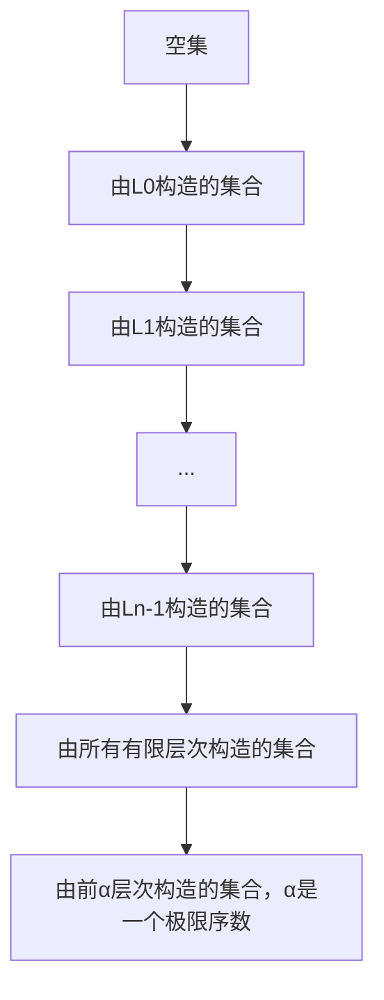

# 集合论导引：集合论内模型

## 1. 背景介绍

集合论作为数学的一个基础分支，自从Cantor在19世纪末提出以来，已经成为现代数学语言的核心。它不仅仅是数学理论的基石，也是现代计算机科学的重要组成部分。集合论内模型，特别是Gödel构造的L模型，为我们提供了一种研究集合论相容性和独立性问题的强大工具。本文将深入探讨集合论内模型的核心概念、算法原理、数学模型，并结合代码实例进行项目实践，以期为读者提供一个全面的集合论内模型导引。

## 2. 核心概念与联系

集合论内模型是指满足ZFC公理系统的集合论模型的一个子模型。它们通常被用来研究集合论的一致性和独立性问题。最著名的内模型是L模型，即由所有可构造集合构成的类。这里的“可构造”意味着可以通过一系列明确的步骤从空集开始构造出来。

### 2.1 集合论基础
- 集合：一个无序的元素集合。
- 元素：构成集合的对象。
- 子集：若集合A中的每个元素都在集合B中，则A是B的子集。

### 2.2 内模型的特性
- 传递性：如果M是一个内模型，那么对于M中的任何集合S，S的所有元素也都在M中。
- 相对可构造性：内模型中的集合是通过相对于该模型的可构造过程得到的。

### 2.3 L模型
- L模型是最小的包含所有序数的传递模型，并且它满足ZFC公理。

## 3. 核心算法原理具体操作步骤

构造L模型的核心算法是通过递归定义一系列L层次，每一层都是基于前一层通过特定规则构造出的集合。



每一步的构造都遵循确定的规则，确保每个新构造的集合都是可构造的。

## 4. 数学模型和公式详细讲解举例说明

在集合论内模型中，我们使用累积层次来构造L模型。对于每一个序数α，我们定义L_α如下：

$$
L_0 = \emptyset
$$

$$
L_{\alpha+1} = Def(L_\alpha)
$$

$$
L_\lambda = \bigcup_{\alpha < \lambda} L_\alpha \text{ for limit ordinal } \lambda
$$

其中$Def(L_\alpha)$表示在$L_\alpha$上所有可定义的集合。通过这种方式，我们可以构造出整个L模型。

## 5. 项目实践：代码实例和详细解释说明

在计算机科学中，我们可以通过编程来模拟集合论内模型的构造过程。以下是一个简单的Python代码示例，展示了如何构造L模型的前几个层次。

```python
def definable_sets(S):
    # 这里是一个简化的示例函数，用于计算S上所有可定义的集合
    return {frozenset(subset) for subset in powerset(S)}

def powerset(S):
    # 计算S的幂集
    return chain.from_iterable(combinations(S, r) for r in range(len(S)+1))

L = [set()]  # L模型的初始层次，包含空集

# 构造L模型的前几个层次
for _ in range(1, 5):
    L.append(definable_sets(L[-1]))

# 打印结果
for idx, level in enumerate(L):
    print(f"L_{idx}: {level}")
```

这个代码片段展示了如何从空集开始，逐步构造出L模型的前几个层次。在实际应用中，这个过程会更加复杂和详细。

## 6. 实际应用场景

集合论内模型在数学和计算机科学中有广泛的应用。在数学中，它们被用来研究集合论的一致性和独立性问题。在计算机科学中，它们可以用来设计和分析算法，特别是在处理无限结构和递归定义时。

## 7. 工具和资源推荐

- ZFC公理系统的文献和教材
- 数学软件，如Coq或Agda，用于形式化验证集合论内模型
- Python或其他编程语言，用于模拟和实验集合论概念

## 8. 总结：未来发展趋势与挑战

集合论内模型的研究仍然是数学和计算机科学中的一个活跃领域。随着计算能力的提升和算法的发展，我们可以期待在这一领域有更多的突破。未来的挑战包括更深入地理解大基数假设、探索L模型之外的其他内模型，以及将这些理论应用于实际问题。

## 9. 附录：常见问题与解答

Q: 集合论内模型与普通集合论有什么区别？
A: 集合论内模型是普通集合论的一个子模型，它特别关注可构造集合，并用于研究集合论的一致性和独立性问题。

Q: L模型为什么重要？
A: L模型是最著名的集合论内模型，它提供了一种研究集合论公理独立性的方法，并且在证明某些公理的相对一致性方面起到了关键作用。

Q: 如何在计算机上模拟集合论内模型？
A: 可以通过编程语言来模拟集合论内模型的构造过程，例如使用Python来递归定义和构造L模型的层次。

作者：禅与计算机程序设计艺术 / Zen and the Art of Computer Programming