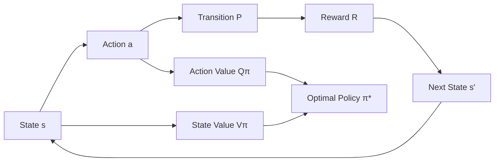

# 马尔可夫决策过程(MDP)原理与代码实战案例讲解

## 1.背景介绍
### 1.1 马尔可夫决策过程的起源与发展
马尔可夫决策过程(Markov Decision Process, MDP)源于俄罗斯数学家安德烈·马尔可夫(Andrey Markov)的研究工作。马尔可夫在20世纪初提出了马尔可夫链(Markov Chain)的概念,用于描述状态空间中状态转移的随机过程。后来,贝尔曼(Richard Bellman)在马尔可夫链的基础上引入了决策和奖励的概念,提出了马尔可夫决策过程,为强化学习奠定了理论基础。

MDP作为一个数学框架,在运筹学、博弈论和控制论等领域有广泛应用。近年来随着人工智能的发展,MDP在强化学习中得到了大量应用和发展。谷歌DeepMind的DQN、DDPG等算法都是以MDP为基础,结合深度学习技术,在Atari游戏、围棋等领域取得了令人瞩目的成就。MDP已成为当前人工智能领域的研究热点之一。

### 1.2 马尔可夫决策过程的现实应用
MDP不仅是一个理论框架,在现实世界中也有非常广泛的应用,主要包括:

1. 自动控制:如工业生产过程控制、智能电网调度、无人驾驶等
2. 机器人决策:机器人在复杂环境下的运动规划、对抗博弈等
3. 运筹优化:如库存管理、动态定价、资源分配等
4. 自然语言处理:如对话系统、机器翻译中的决策过程优化
5. 金融投资:股票、期权的动态投资组合管理
6. 智慧城市:交通信号灯控制、智能电网调度等城市管理决策

MDP提供了一个通用的数学框架来描述和优化存在不确定性的多阶段决策问题,在人工智能时代,必将得到更加广泛和深入的应用。

## 2.核心概念与联系
### 2.1 状态、动作、转移概率和奖励
MDP中包含四个核心要素:状态(State)、动作(Action)、转移概率(Transition Probability)和奖励(Reward)。

- 状态:描述了智能体(Agent)所处的环境状况,记为 $s \in S$。
- 动作:智能体可以采取的行为决策,记为 $a \in A$。
- 转移概率:在状态 $s$ 下采取动作 $a$ 后,环境转移到下一个状态 $s'$ 的条件概率,记为 $P(s'|s,a)$。
- 奖励:在状态 $s$ 下采取动作 $a$ 后,环境给予智能体的即时反馈,记为 $R(s,a)$。

MDP的目标是寻找一个最优策略 $\pi^*:S \rightarrow A$,使得智能体在所有可能的状态下采取动作,最大化累积奖励的期望值。

### 2.2 策略、状态值函数和动作值函数
除了状态、动作、转移和奖励,MDP中还有三个重要概念:策略(Policy)、状态值函数(State Value Function)和动作值函数(Action Value Function)。

- 策略:将状态映射到动作的函数,表示智能体的行为决策法则,记为 $\pi(a|s)$。
- 状态值函数:评估某一状态的长期累积奖励期望,在策略 $\pi$ 下的状态值函数记为 $V^{\pi}(s)$。
- 动作值函数:评估在某一状态下采取某一动作的长期累积奖励期望,在策略 $\pi$ 下的动作值函数记为 $Q^{\pi}(s,a)$。

MDP的求解过程就是寻找最优策略 $\pi^*$ 以最大化状态值函数 $V^*(s)$ 或动作值函数 $Q^*(s,a)$。

### 2.3 MDP核心概念之间的关系
下图展示了MDP中状态、动作、转移、奖励、策略、值函数之间的关系:



智能体根据当前状态 $s$,依据策略 $\pi$ 选择动作 $a$,环境根据转移概率 $P$ 转移到下一状态 $s'$ 并给予奖励 $R$,重复此过程,形成了一个闭环的序贯决策过程。策略 $\pi$ 将状态映射为动作,而状态值函数 $V^{\pi}$ 和动作值函数 $Q^{\pi}$ 则从长期奖励的角度评估策略的优劣。MDP的目标就是寻找最优策略 $\pi^*$ 以最大化长期累积奖励。

## 3.核心算法原理具体操作步骤
求解MDP的经典算法主要包括动态规划(Dynamic Programming)、蒙特卡洛方法(Monte Carlo Methods)和时序差分学习(Temporal Difference Learning)。本节重点介绍动态规划算法的原理和步骤。

### 3.1 动态规划算法原理
动态规划是一种将复杂问题分解为相互重叠的子问题,并存储子问题答案以避免重复计算的优化算法。马尔可夫决策过程可以用动态规划高效求解,主要依据贝尔曼最优性原理(Bellman Optimality Equation):
$$V^*(s)=\max _{a \in A}\left[R(s, a)+\gamma \sum_{s^{\prime} \in S} P\left(s^{\prime} \mid s, a\right) V^*\left(s^{\prime}\right)\right]$$

其中 $V^*(s)$ 表示状态 $s$ 的最优状态值函数,$\gamma$ 是折扣因子。这个方程表明,最优策略下状态 $s$ 的长期累积奖励,等于在 $s$ 下采取最优动作 $a$ 能获得的即时奖励 $R(s,a)$ 和折扣后下一状态 $s'$ 的最优累积奖励 $V^*(s')$ 的和。

### 3.2 值迭代(Value Iteration)算法
值迭代是一种迭代求解贝尔曼最优性方程的动态规划算法,主要步骤如下:

1. 初始化状态值函数 $V(s)=0,\forall s \in S$
2. 重复直到收敛:
   
   对每个状态 $s \in S$,更新状态值函数:
   $$V(s) \leftarrow \max _{a \in A}\left[R(s, a)+\gamma \sum_{s^{\prime} \in S} P\left(s^{\prime} \mid s, a\right) V\left(s^{\prime}\right)\right]$$
3. 根据最优状态值函数 $V^*(s)$ 得到最优策略:
$$\pi^*(s)=\arg \max _{a \in A}\left[R(s, a)+\gamma \sum_{s^{\prime} \in S} P\left(s^{\prime} \mid s, a\right) V^*\left(s^{\prime}\right)\right]$$

值迭代通过迭代更新状态值函数直至收敛,进而得到最优策略。

### 3.3 策略迭代(Policy Iteration)算法 
策略迭代是另一种动态规划算法,通过交替执行策略评估(Policy Evaluation)和策略改进(Policy Improvement)来求解最优策略,主要步骤如下:

1. 初始化策略 $\pi(s)$,例如随机策略
2. 重复直到策略收敛:
   
   (a) 策略评估:对每个状态 $s \in S$,计算当前策略 $\pi$ 下的状态值函数 $V^{\pi}(s)$:
   $$V^{\pi}(s) \leftarrow R(s, \pi(s))+\gamma \sum_{s^{\prime} \in S} P\left(s^{\prime} \mid s, \pi(s)\right) V^{\pi}\left(s^{\prime}\right)$$
   
   (b) 策略改进:对每个状态 $s \in S$,更新策略:
   $$\pi(s) \leftarrow \arg \max _{a \in A}\left[R(s, a)+\gamma \sum_{s^{\prime} \in S} P\left(s^{\prime} \mid s, a\right) V^{\pi}\left(s^{\prime}\right)\right]$$

3. 返回最优策略 $\pi^*$ 和对应的状态值函数 $V^*$

策略迭代通过反复执行策略评估和策略改进,直到策略不再发生变化,得到最优策略。相比值迭代,策略迭代通常收敛更快,但每轮迭代的计算量更大。

## 4.数学模型和公式详细讲解举例说明
本节以一个简单的网格世界MDP为例,详细说明MDP的数学模型和求解过程。

### 4.1 网格世界MDP示例
考虑如下的网格世界环境:

```
+-------+
|   |   |
|   | G |
+-------+
```

智能体初始位于左下角,目标是寻找最优策略移动到右上角的目标位置G。每一步可以选择向上、向右移动,或者停留在原地。移动到G的奖励为+10,其他状态的即时奖励为-1。

这个MDP可以形式化为:

- 状态集合 $S=\{(0,0),(0,1),(1,0),(1,1)\}$
- 动作集合 $A=\{up,right,stay\}$
- 转移概率 $P((x',y')|(x,y),a)$:
  - 对于非目标状态,选择动作 $a$ 后以概率0.8转移到对应方向的相邻状态,以0.2的概率停留在原地。
  - 对于目标状态G,任意动作都以概率1停留在目标状态。
- 奖励函数 $R((x,y),a)$:
  - 到达目标状态G的奖励为+10
  - 其他状态每一步的奖励为-1

### 4.2 值迭代求解网格世界MDP
应用值迭代算法求解这个MDP,设置折扣因子 $\gamma=0.9$,最大迭代次数为10。

初始化状态值函数 $V_0(s)=0$:

```
+-------+
| 0 | 0 |
| 0 | 0 |
+-------+
```

第1次迭代,对每个状态更新值函数:

$$V_1((0,0)) = \max\{-1+0.9 \times (0.8 \times 0 + 0.2 \times 0), \\
-1+0.9 \times (0.8 \times 0 + 0.2 \times 0), \\
-1+0.9 \times 0\} = -1$$

同理可得:

```
+-------+
| 0 | 0 |
|-1 | 0 |
+-------+
```

重复迭代9次,得到最终的最优状态值函数:

```
+-------+
|6.5|8.0|
|3.7|0.0|
+-------+
```

根据最优值函数得到最优策略:

```
+-------+
| → | ↑ |
| ↑ | · |
+-------+
```

最优策略为:在(0,0)选择向上,在(1,0)选择向右,在(0,1)选择向上,最终到达目标状态(1,1)。

## 5.项目实践:代码实例和详细解释说明
下面给出用Python实现值迭代算法求解网格世界MDP的代码示例:

```python
import numpy as np

# 网格世界的状态
states = [(0, 0), (0, 1), (1, 0), (1, 1)]

# 可用的动作
actions = ['up', 'right', 'stay'] 

# 折扣因子
gamma = 0.9  

# 转移概率字典
P = {}
for state in states:
    P[state] = {}
    for action in actions:
        P[state][action] = []
        
        # 非目标状态
        if state != (1, 1):  
            next_state_probs = [0.8, 0.2] if action in ['up', 'right'] else [1.0]
            for i, next_state in enumerate(get_next_states(state, action)):
                prob = next_state_probs[i]
                reward = 10 if next_state == (1, 1) else -1
                P[state][action].append((prob, next_state, reward))
        # 目标状态
        else:  
            P[state][action].append((1.0, (1, 1), 0))

# 状态值函数初始化
V = {state: 0 for state in states}

def value_iteration(theta=1e-6):
    