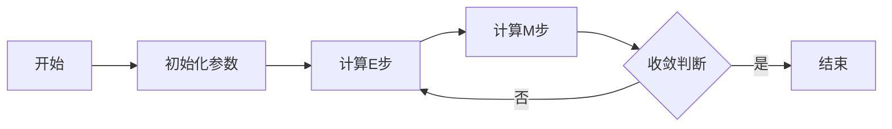

# 高斯混合模型(GMM)原理与代码实战案例讲解

## 1. 背景介绍
在机器学习领域，高斯混合模型（Gaussian Mixture Model，简称GMM）是一种常用的概率模型，用于表示具有多个子群体的数据集。它是一种软聚类方法，可以提供数据点属于各个子群体的概率。GMM在模式识别、图像处理、语音识别等领域有着广泛的应用。

## 2. 核心概念与联系
GMM是由多个高斯分布组成的混合分布。每个高斯分布称为一个组件，每个组件代表数据中的一个子群体。GMM的核心在于使用期望最大化（Expectation-Maximization，简称EM）算法来估计模型参数，即各个高斯分布的均值、协方差以及混合系数。

## 3. 核心算法原理具体操作步骤
EM算法是一种迭代算法，包含两个步骤：E步（Expectation）和M步（Maximization）。E步计算数据点属于各个组件的概率（即责任度），M步则更新模型参数。这两个步骤交替进行，直到收敛。



## 4. 数学模型和公式详细讲解举例说明
GMM的概率密度函数为：
$$
p(x) = \sum_{k=1}^{K} \pi_k \mathcal{N}(x | \mu_k, \Sigma_k)
$$
其中，$x$ 是数据点，$K$ 是组件的数量，$\pi_k$ 是第$k$个组件的混合系数，$\mu_k$ 和 $\Sigma_k$ 分别是第$k$个高斯分布的均值和协方差矩阵，$\mathcal{N}$ 是高斯分布的概率密度函数。

## 5. 项目实践：代码实例和详细解释说明
在Python中，可以使用`sklearn.mixture.GaussianMixture`类来实现GMM。以下是一个简单的代码示例：

```python
from sklearn.mixture import GaussianMixture
import numpy as np

# 生成模拟数据
data = np.random.randn(100, 2)

# 创建GMM模型
gmm = GaussianMixture(n_components=2)

# 训练模型
gmm.fit(data)

# 预测数据点的组件
labels = gmm.predict(data)
```

## 6. 实际应用场景
GMM在许多领域都有应用，例如在图像处理中用于图像分割，在语音识别中用于特征提取，在金融领域用于风险管理和市场分析等。

## 7. 工具和资源推荐
- `sklearn.mixture.GaussianMixture`：一个强大的Python库，用于GMM的建模和预测。
- `GMM在MATLAB中的实现`：MATLAB也提供了GMM的工具箱，适合进行数学建模和仿真。

## 8. 总结：未来发展趋势与挑战
GMM作为一种经典的机器学习算法，其理论基础已经相当成熟。未来的发展趋势可能会集中在提高算法的计算效率、处理高维数据的能力，以及在特定应用领域的定制化改进上。

## 9. 附录：常见问题与解答
- Q1: GMM与K-means聚类有什么区别？
- A1: GMM提供的是软聚类，可以得到数据点属于各个聚类的概率；而K-means是硬聚类，每个数据点只属于一个聚类。

- Q2: 如何选择GMM的组件数量？
- A2: 可以使用模型选择准则，如贝叶斯信息准则（BIC）或赤池信息准则（AIC）来选择组件数量。

- Q3: EM算法是否总是能找到全局最优解？
- A3: 不是，EM算法可能会收敛到局部最优解，因此有时需要多次运行算法，从不同的初始值开始。

作者：禅与计算机程序设计艺术 / Zen and the Art of Computer Programming