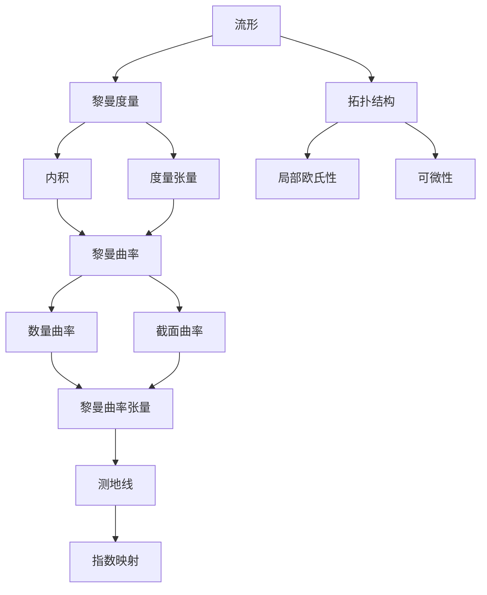

# 黎曼几何引论：定义和例子

## 1.背景介绍
### 1.1 黎曼几何的历史渊源
#### 1.1.1 欧几里得几何与非欧几何
#### 1.1.2 高斯和黎曼的开创性工作
#### 1.1.3 黎曼几何的诞生与发展
### 1.2 黎曼几何的重要性
#### 1.2.1 在数学领域的重要地位
#### 1.2.2 在物理学中的广泛应用
#### 1.2.3 在计算机科学中的潜在价值

## 2.核心概念与联系
### 2.1 流形的概念
#### 2.1.1 拓扑流形的定义
#### 2.1.2 微分流形的定义
#### 2.1.3 流形的例子
### 2.2 黎曼度量
#### 2.2.1 内积与度量的概念
#### 2.2.2 黎曼度量的定义
#### 2.2.3 黎曼度量的性质
### 2.3 联络
#### 2.3.1 导数的推广
#### 2.3.2 联络的定义
#### 2.3.3 克氏符号与黎维-奇维塔联络
### 2.4 曲率
#### 2.4.1 曲率的直观理解
#### 2.4.2 黎曼曲率张量的定义
#### 2.4.3 截面曲率与数量曲率

## 3.核心算法原理具体操作步骤
### 3.1 测地线方程的推导
#### 3.1.1 变分法的基本原理
#### 3.1.2 测地线的变分推导
#### 3.1.3 测地线方程
### 3.2 黎曼指数映射的计算
#### 3.2.1 指数映射的定义
#### 3.2.2 指数映射的计算步骤
#### 3.2.3 指数映射的性质与应用
### 3.3 曲率计算的实现
#### 3.3.1 克氏符号的计算
#### 3.3.2 黎曼曲率张量分量的计算
#### 3.3.3 数量曲率与截面曲率的计算

## 4.数学模型和公式详细讲解举例说明 
### 4.1 流形上的微积分基础
#### 4.1.1 外微分与外代数
#### 4.1.2 流形上的积分
#### 4.1.3 Stokes定理与Gauss-Bonnet定理
### 4.2 黎曼几何中的重要公式
#### 4.2.1 黎曼度量的表达式
#### 4.2.2 克氏符号的表达式
#### 4.2.3 黎曼曲率张量的表达式
### 4.3 具体计算实例
#### 4.3.1 球面上的黎曼度量计算
#### 4.3.2 双曲面上的测地线方程求解
#### 4.3.3 托鲁斯的高斯曲率计算

## 5.项目实践：代码实例和详细解释说明
### 5.1 流形数据结构的实现
#### 5.1.1 流形的离散表示
#### 5.1.2 黎曼度量的存储
#### 5.1.3 联络系数的计算与存储
### 5.2 测地线追踪算法
#### 5.2.1 数值积分方法概述
#### 5.2.2 龙格-库塔法求解测地线方程
#### 5.2.3 测地线追踪的完整代码实现
### 5.3 曲率计算程序
#### 5.3.1 克氏符号的计算程序
#### 5.3.2 黎曼曲率张量分量的计算程序
#### 5.3.3 数量曲率与截面曲率的计算程序

## 6.实际应用场景
### 6.1 计算机视觉中的应用
#### 6.1.1 人脸识别中的黎曼流形学习
#### 6.1.2 图像配准中的测地线方法
#### 6.1.3 三维重建中的黎曼几何技术
### 6.2 医学影像分析中的应用 
#### 6.2.1 脑部MRI图像的流形表示
#### 6.2.2 心脏CT图像的测地线分割
#### 6.2.3 肿瘤分割中的黎曼几何方法
### 6.3 机器人运动规划中的应用
#### 6.3.1 机器人构型空间的流形表示
#### 6.3.2 最优路径规划中的测地线方法
#### 6.3.3 运动规划中的黎曼度量学习

## 7.工具和资源推荐
### 7.1 理论学习资源
#### 7.1.1 经典教材推荐
#### 7.1.2 在线课程资源
#### 7.1.3 学术论文与综述
### 7.2 编程工具与库
#### 7.2.1 流形学习工具包 
#### 7.2.2 几何处理库
#### 7.2.3 符号计算软件
### 7.3 开源项目与代码示例
#### 7.3.1 流形学习与黎曼几何相关项目
#### 7.3.2 测地线追踪与最短路径搜索代码
#### 7.3.3 曲率计算与可视化程序

## 8.总结：未来发展趋势与挑战
### 8.1 黎曼几何的前沿研究方向
#### 8.1.1 黎曼几何与机器学习的结合
#### 8.1.2 黎曼几何在大数据分析中的应用
#### 8.1.3 黎曼几何与量子计算的交叉
### 8.2 黎曼几何面临的挑战
#### 8.2.1 高维流形的有效处理
#### 8.2.2 黎曼度量学习的可扩展性问题
#### 8.2.3 黎曼几何算法的计算复杂度
### 8.3 黎曼几何的发展前景展望
#### 8.3.1 黎曼几何在人工智能中的广阔应用前景
#### 8.3.2 黎曼几何与其他数学分支的交叉融合
#### 8.3.3 黎曼几何推动科学与工程领域的创新发展

## 9.附录：常见问题与解答
### 9.1 黎曼几何的入门学习路线是什么?
### 9.2 黎曼流形与欧氏空间有何本质区别?
### 9.3 如何直观理解黎曼曲率?
### 9.4 测地线与最短路径有何联系与区别?
### 9.5 黎曼几何在机器学习中主要应用于哪些问题?

黎曼几何是数学的一个分支,研究流形上的几何性质。流形是一类特殊的拓扑空间,局部具有欧氏空间的性质。黎曼几何的核心概念是黎曼度量,它在流形的每一点赋予一个内积结构,从而定义了流形上的距离和角度。

黎曼度量由度量张量给出,度量张量是一个对称正定的二阶协变张量场。有了度量张量,就可以定义流形上的曲率。黎曼曲率包括数量曲率和截面曲率,它们分别刻画了流形在不同方向上的弯曲程度。黎曼曲率张量是数量曲率和截面曲率的一个综合表达。

流形上的测地线是黎曼几何中的重要概念,它是两点之间的局部最短路径。测地线方程可以用变分法推导得到。指数映射将测地线与黎曼曲率联系起来,在黎曼几何的理论和应用中扮演着重要角色。

黎曼几何不仅在数学领域有着重要地位,在物理学和计算机科学中也有广泛应用。广义相对论的数学基础就是黎曼几何。在计算机视觉、医学影像分析、机器人运动规划等领域,黎曼几何为数据分析和算法设计提供了新的视角和工具。

黎曼几何的研究正在不断深入,前沿方向包括黎曼几何与机器学习的结合、高维流形的处理、黎曼度量学习等。黎曼几何也面临着计算复杂度高、算法可扩展性差等挑战。尽管如此,黎曼几何在人工智能和交叉学科中展现出了广阔的应用前景,有望推动科学与工程领域的创新发展。

对于初学者来说,学习黎曼几何需要扎实的数学基础,特别是微积分、线性代数和拓扑学的知识。经典教材如 do Carmo 的《黎曼几何》是很好的入门读物。在学习过程中,要注重对概念的直观理解和实际应用的把握。

总之,黎曼几何以其深刻的数学理论和广泛的实际应用,成为现代数学和科学研究的重要工具。对黎曼几何的学习和研究,不仅能够拓展我们对几何的认识,也为解决实际问题提供了新的思路和方法。相信随着黎曼几何研究的不断深入,它必将在更多领域绽放异彩。

作者：禅与计算机程序设计艺术 / Zen and the Art of Computer Programming